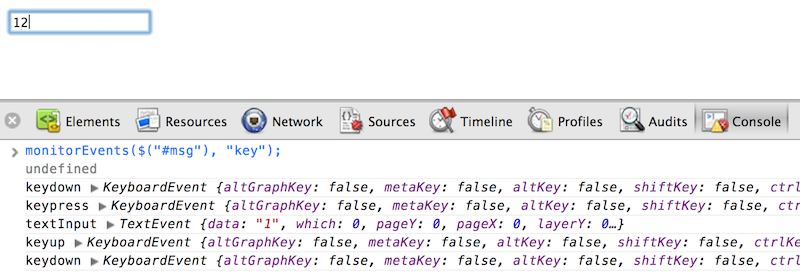

# 命令行 API 参考

命令行 API 用 Chrome DevToos 执行常见任务的方法集合。这些集合包含了选择和检查 DOM 元素、停止和启动分析器、监测 DOM 事件的易用方法。这个 API 补充了[控制台 API](https://developer.chrome.com/devtools/docs/console-api.md)，命令行 API 仅可在控制台内使用。


## $_
返回最近一次计算过的表达式的值。在下面的例子中是一个简单的表达式求值。 $_ 属性会被计算，包含了和表达式相同的值：


在下面的例子中，会调用 $$() 方法来进行一个表达式的评估，这个方法会返回一组匹配 CSS 选择器的元素。这之后会给 $.length 评估来获取数组的长度(17),之后会变成最后执行的评估表达式。


## $0 - $4
DevToos 记得你在该选项卡（或 Profiles 面板）已经选定过的最后的 5 个 DOM 元素（或 JavaScript 堆对象）。使得这些可获取的元素赋值给 $0，$1，$2，$3 和 $4。$0 返回最近选择的元素或 JavaScript 对象，$1 返回次近选择的一个对象，以此类推。

在下面的例子中，ID 是 gc-sidebar 的元素在 Elemen 选项卡中被选中。在控制台窗口 $0 被执行计算，显示了相同的元素。


下图显示了在同一个页面中被选中的 `gc-sidebar ` 元素。$0 现在指向新选择的元素，而 $1 现在返回先前选定的那个元素（gc-sidebar）。


## $(selector)

使用特定的 CSS 选择器返回第一个 DOM 元素的引用。这个函数是 <code>document.querySelector()</code> 函数的一个别名函数。
下面的示例保存一个在文档中第一个 img 元素的引用，并调用显示其 <code>src</code> 属性：

```javascript
 $('img').src;
```


## $$(selector)

返回匹配给定 CSS 选择器的元素的数组，该命令等同于调用 <code>document.querySelectorAll()</code> 方法。
下面的示例使用 <code>$$()</code> 创建当前文档中所有 img 元素的数组，并输出每个元素的 <code>src</code> 属性值。

```javascript
 var images = $$('img');for (each in images) {    images[each].src;}
 ```

 

 ```
  注意：按 Shift+ 回车 在控制台输入一行新的脚本，但并立即执行。
 ```


## x(path)
返回匹配给定的 XPath 表达式的 DOM 元素的数组。例如，下面的返回所有包含 a 标签元素的 p 标签元素：

 ```javascript
 $x("//p[a]");
 ```


## clear()
清除控制台的历史记录

```javascript
clear()
```

同见于 [清除控制台](http://developer.chrome.com/devtools/docs/console.md#clearing-the-console-history)


## copy(object)
复制指定对象的字符表示到剪切板

 ```javascript
 copy
 ```


## debuge(function)
当函数被指定调用，调试器进行调试，会在源面板逐个分解函数，让你能够一步一步地调试代码。

 ```javascript
 debuge(getData);
 ```


使用 [undebug(fn)](https://developer.chrome.com/devtools/docs/commandline-api#undebugfunction) 来恢复中断方法的执行，或者用 UI 界面来使断点失效。


## dir(object)

输出指定对象所有属性的对象风格列表。这个方法是控制台 API `console.dir()` 方法的别名。

下面的例子展示了直接在命令行里执行 `document.body` 和使用 <code>dir（）</code>方法来显示元素之间的差异。

 ```javascript
 document.body;dir(document.body);
 ```


更多详情，请见 控制台 API的 [console.dir()](https://developer.chrome.com/devtools/docs/console-api#consoledirobject) 方法。


## dirxml(object)
输出指定对象的 XML  形式，正如在元素选项卡（ `Elements tab` ）中显示所见。这个方法等效于 `console.dirxml()` 方法。

## inspect(object/function)
在恰当的面板中打开并选择指定元素或指定对象: DOM 元素的 Element 面板或者 JavaScript 堆元素的 Profiles 面板。

下面的例子是在元素面板中打开 `document.body` 的第一个子元素；

```javascript
inspect(document.body.firstChild);
```


当传递一个函数作为 inspect() 参数，如果这个函数被调用，就会为你在源面板中打开它让你进行检查。


## getEventListeners(object)
返回注册在指定对象上的注册的事件监听器。返回值是一个包含了每个注册事件类型（例如 `"click"` 或 `"keydown"`)的数组对象。每个数组的成员都是描述每种类型注册监听器的对象。例如，下面命令执行后列出所有在 `document` 对象的上的事件监听器。

 ```javascript
 getEventListeners(document);
 ```


如果在一个指定对象中注册有超过一个监听器，这时这个数组包含了每一个监听器成员。例如在下面的例子里，两个注册在  `#scrollingList` 元素中的关于 "mousedown" 的事件监听器：


你可以进一步拓展这些对象来探索它们的属性：


## keys(object)
返回一个数组，包含了指定对象属性的名字。要获得相同的属性相关联的值，可以使用 `value()`。

例如，设想你的程序定义了下面两个对象：

```javascript
 var player1 = {    "name": "Ted",    "level": 42}
```

如果 player1 在全局空间中定义（为简单起见），在控制台中输入 <code>keys(player1)</code> 和 <code>values(player1)</code>会得到以下输出：


## monitor(function)
当这个方法被调用时，一个消息被输出到控制台，来表示函数名和函数被调用时传入的参数。

```javascript
 function sum(x, y) {    return x + y;}monitor(sum);
```


使用 `unmonitor(function)` 来停止监视

## monitorEvents(object[, events])
当指定的事件之一发生在指定对象上，该事件的对象就被输出到控制台。你可以指定单个事件，到监视器，事件数组，或被映射到通用事件类型中之一，这个集合映射到预定的事件集合。请参见下面的例子。

下面的监视器监视了在` window `对象中所有的 `resize` 事件。

```javascript
 monitorEvents(window, "resize");
```


你也可以指定一个可用的事件 “types”，这些字符串映射到预定义的事件集合。下面的表列出了可用事件类型及其相关的事件映射：

| 时间类型 | 相应的映射事件|
| ------------- |:-------------------------------:|
| mouse      |"click", "dblclick", "mousedown", "mouseeenter", "mouseleave", "mousemove", "mouseout", "mouseover", "mouseup", "mouseleave", "mousewheel"|
| key      |"keydown", "keyup", "keypress", "textInput"   |
| touch   | "touchstart", "touchmove", "touchend", "touchcancel"|
| control | "resize", "scroll", "zoom", "focus", "blur", "select", "change", "submit", "reset"  |


例如，下面使用了 "key" 事件类型在输入文本域中对应的按键事件( "#msg")。
 ```javascript
 monitorEvents($("#msg"), "key");
 ```
下面是在文本框中输入两个字符后输出示例：



## profile([name])
使用可用的文件名开始一个 JavaScript CPU 分析会话。要完成分析调用 [profileEnd()](https://developer.chrome.com/devtools/docs/commandline-api#profileendname) 方法。

开始分析：
 ```javascript
 profile("My profile")
 ```

 停止分析,并在分析面板上展示结果：
 
 ```javascript
 profileEnd("My profile")
 ```
文件也可以嵌套使用，例如，下面的在任何命令下都会工作。

 ```javascript
 profile('A');profile('B');profileEnd('A');profileEnd('B');
 ```
 更多的例子，见 [Controlling the CPU profiler](https://developer.chrome.com/devtools/docs/console.md#controlling-the-cpu-profiler)

## profileEnd([name])
停止当前使用 [profile()](https://developer.chrome.com/devtools/docs/commandline-api#profilename)方法开始的分析会话，并在配置面板上显示结果。


## table(data[, columns])
通过用可选用的列标题传进一个数据对象进来，以表格的形式输出对象数据。例如，用表格形式输出在控制台输入的名字列表：

 ```javascript
 var names = {    0: { firstName: "John", lastName: "Smith" },
 1: { firstName: "Jane", lastName: "Doe" }};table(names);
 ```


## undebug(function)
停止指定函数的调试，使得当被调用的方法不再被调用。
```javascript
undebug(getData);
```

## unmonitor(function)
停止监视指定的方法，与  [monitor(fn)](https://developer.chrome.com/devtools/docs/commandline-api#monitorfunction)  相对使用。

## unmonitorEvents(object[, events])
停止监视指定的对象和指定事件的事件。例如，下面停止窗口对象上的所有的事件监听：

```javascript
unmonitorEvents(window);
```

你也可以选择性地停止对象上的指定事件的监控。例如，下面的代码开始了对当前选中元素上的所有鼠标事件的监控，然后停止监视 "mousemove" 事件（可能是为了减少在控制台输出的噪点）。

```javascript
monitorEvents($0, "mouse");unmonitorEvents($0, "mousemove");
```
同见 [Monitoring events](https://developer.chrome.com/devtools/docs/console.md#monitoring-events).

## values(object)
返回一个数组，包含了指定对象的所有属性值。

```javascript
values(object);
```

## 其他 API （Additional APIs）
Chrome 扩展程序可以注入额外的辅助方法进入命令行 API。例如， [Debug Utils extension (github)](http://https://chrome.google.com/webstore/detail/debug-utils/djailkkojeahmihdpcelmmobkpepmkcl) 提供了在属性访问，事件解除和方法调用中检索断点的方法。
