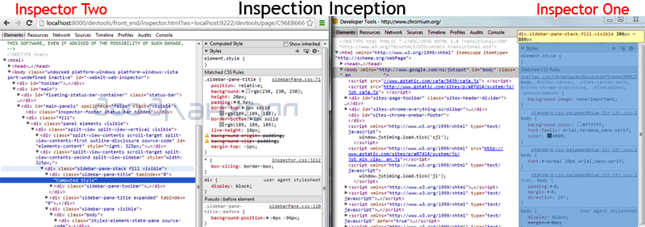

# 对 Chrome 开发工具的贡献
有很多方法可以提高你同事的开发效率。这可能是通过分享你所知道的或是用那些记录功能提供帮助或者写一个补丁来改进我们所使用的工具。

## 你怎么帮助?

除了对源代码的贡献以外，下面的集中方式都可以参与帮助：  

- 文档创作  
 - 为开发工具提供文档[来源](https://github.com/GoogleChrome/devtools-docs)的是 GitHub 上的贡献,并且总是受欢迎的。参考和教程指南受益于您的帮助。  
 - 联系 [@paul_irish](http://twitter.com/paul_irish) 的更多信息，你可以帮助在这里。
 
- 分享你所学到的
 - 通过 GIF，Vines 或注释分享你学到的知识
 - 覆盖新的实验特性  
 - 改进设计的所有部分的 UX 工具  
 - 分析和管理问题  
 - 检查特征或错误
- 新的实验功能覆盖率  
 - 订阅 [devtools-reviews@chromium.org](https://groups.google.com/a/chromium.org/forum/#!forum/devtools-reviews) 中所有评论待编码的邮件列表  
 - 订阅的 RSS 反馈工具。  
 - 按照 [@chromedevtools](http://twitter.com/ChromeDevTools) 和 [@在推特包括反馈计工具](http://twitter.com/DevToolsCommits)  
 - 有足够的行动和开发人员都急于知悉的更新的内容  
- 对于所有部件改进的 UX 设计工具  
 - 你的设计想法在 UX 很受欢迎。  
- 问题分析与管理  
 - 查看所有[打开的工具项目](http://goo.gl/N6OH9)。在适当的时候要求减少或为他们自己提供。  
- 检查特征或错误  
 - JavaScript 的代码库和设置向导可以让你快速入门  

## 保持更新  

开发工具团队将会从使用该工具的开发者那里获取反馈。如果你想保持更新，你可以订阅在 [crbug](https://code.google.com/p/chromium/issues/subscriptions) 下面的频道。请记住标记那些对你也有影响的问题。最后，不要忘记提交的功能请求或你找到的调试报告。不仅是关于开发者工具的，整个 Chrome 的信息都对我们有用。

```
Cr-Platform-DevTools Cr-Platform-DevTools-HTML Cr-Platform-DevTools-Memory Cr-Platform-DevTools-Mobile Cr-Platform-DevTools-Performance Cr-Platform-DevTools-UX

```

## 对开发者工具源代码的贡献

Chrome 开发工具实际上是用 JavaScript 和 CSS 编写的应用。如果你熟悉这些技术，你就知道如何写一个补丁。一些人已经这样做了，于是有了颜色选择器，文件选择器等功能，这些都是由和你一样的开发者贡献的。

[IRC 频道中](http://webchat.freenode.net/?channels=chrome-devtools)：#Chrome 开发工具

>
我们现在正在重新编写这份向导。如果你想跟着已经完成的早期工作继续帮助我们，请阅读 [DevTools Contributing(draft)](https://docs.google.com/document/d/1WNF-KqRSzPLUUfZqQG5AFeU_Ll8TfWYcJasa_XGf7ro/edit?pli=1#) 上的评论


### Step 1: 开始  

要开始为开发工具做出贡献，你需要注意以下几件事：
  
#### 获取代码  

通过克隆 [git](https://chromium.googlesource.com/chromium/blink) 的库 <a href="http://www.chromium.org/blink">Blink</a> 进行源代码下载。这个过程可以在 30 - 60 分钟（取决于你的连接）。

git clone https://chromium.googlesource.com/chromium/blink.git

~~~

git clone https://chromium.googlesource.com/chromium/blink.git

~~~

#### 安装 Canary

当 Blink 下载后，在 Mac OS/Windows 系统上安装 Canary 或[下载最新的浏览器](https://download-chromium.appspot.com/)  

#### DevTools 前端服务

运行本地服务器器。本地 Web 服务器将服务从某些端口（如 8000）来运行来自 blink/Source/devtools 目录下的文件。  

当 Blink 库已经准备好厚，进入 devtools 文件夹：  

```
cd blink/Source/devtools  

```

从那里你可以使用以下命令在 8000 端口运行一个本地服务器：

```

python -m SimpleHTTPServer  

```

然后，用你喜欢的浏览器打开 http：//8000/front_end/inspector.html 就可以开始调试了！

#### 为什么服务器需要从开发工具目录下运行？

当远程调试和开发前端的 Blink 时，InspectorBackengCommands.js 文件是基于 protocal.json 文件的内容生成的，而不是基于 Chromium 构建系统时的反馈。protocol.json 文件放在 /devtools 目录下 front_end 文件夹的父文件夹中。这就是为什么你需要在 devtools 目录下运行 Web 服务器。

>
注意：如果你已经检查过整个 Chromium 源，你将需要从 /src/third_party/WebKit/Source/devtools 目录来运行 web 服务器。

如果你的功能需要对后端代码进行修改，那么你一定要去校验和生成 Chromium。否则，你只需要安装一个前端文件的网络服务器，并使用远程调试选项运行浏览器。

>
注： `protocol.json` 文件描述了前端和后端之间的 API。它在前端和后端的建设阶段会生成 API 存根。当远程调试的 API 的前端时，inspectorbackendcommands.js 是由前端代码生成的。欲了解更多信息，阅读 [Chromium How-tos.](http://www.chromium.org/developers/how-tos)。  

### Step 2: 运行 Chromium 的一个边缘构件

要开始，需要得到一个 Chromium 的 [edge-build](http://www.chromium.org/getting-involved/download-chromium)。这些都是可用于所有平台。

在运行 Chromium 时，需要一对[命令行标记](http://www.chromium.org/developers/how-tos/run-chromium-with-flags)（或开关）。  

[使用标记来运行 Canary](http://www.chromium.org/developers/how-tos/run-chromium-with-flags)：

#### 在 Windows 上  

1. **右键点击**你的“谷歌浏览器”图标  
2. 选择**属性**，并将命令行标记到**目标区域**的结尾部分。  


举个例子:

```

"C:\Users\%username%\AppData\Local\Google\Chrome SxS\Application\chrome.exe" --remote-debugging-port=9222 --no-first-run --user-data-dir=C:\Users\%username%\chrome-dev-profile http://localhost:9222#http://localhost:8000/front_end/inspector.html

```

#### 在 OS X 上

在终端里，在程序目录结尾添加标记来运行 Canary。

```

/Applications/Google\ Chrome\ Canary.app/Contents/MacOS/Google\ Chrome\ Canary --remote-debugging-port=9222 --no-first-run --user-data-dir=~/temp/chrome-dev-profile http://localhost:9222#http://localhost:8000/front_end/inspector.html

```

>
Note: 就像上面一样，你要在任何的一个空格前加一个斜线 "\"。


#### 在 Linux 上

在 chromium-browswer 命令后面加上标记来运行它：

```

chromium-browser --remote-debugging-port=9222 --no-first-run --user-data-dir=~/temp/chrome-dev-profile http://localhost:9222#http://localhost:8000/front_end/inspector.html

```

#### 这些开关用于做什么？

* --user-data-dir=~/temp/chrome-dev-profile </br>
用于说明浏览器将在哪里查看其全部状态。这可以是正在运行的服务器上的一个相对路径。这可以指向任何地方。你可以随时清除你的个人资料。
* --remote-debugging-port=9222 </br>
启用特殊端口上的 HTTP 远程调试，这个端口就是 localhost 所对应的端口。
* --no-first-run</br>
跳过第一次运行任务，不管它实际上是不是第一次运行。
* http://localhost:9222#http://localhost:8000/front_end/inspector.html</br>
我们加载了 9222 端口上的监视表，但我们将开发工具指定到前端的一个哈希 URL 上：http://localhost:9222#<front_end url>。因为我们将 DevTools 前端加载到 8000 端口，所以我们想将那个端口匹配到这里。假设您的 Web 服务器是从源目录运行的，则其路径应该指向 inspector.html 的有效路径。之前的 ——remote-debugging-frontend 标志则不再使用。  

这些标志使得 Chrome 允许 WebSocket 连接到 localhost：9222 并且能够从本地 git repo 运行前端 UI。这里有一个命令行开关的[完整列表](http://peter.sh/experiments/chromium-command-line-switches/)和它们的作用。  

### Step 3: 建立检查

>
如果你没有使用开发工具，检查工具的最简单方法是从你的标签移除它们，这样它就会在一个独立的窗口显示。然后点击你的键盘快捷键开启监视（如 cmd-alt-i）。这会开启一个新的开发工具窗口来监视之前的内容。你也可以按照自己的想法来调整这些窗口。

一旦打开 Canary，就会打开一个新标签，之后可以浏览任何网页，像 chromium.org。

接下来，回到“可视页面”选项卡，[http://localhost:9222.](http://localhost:9222/)

在这里您将看到关于每一个被监视页面的网格菜单。刷新后可以更新数据。


这个网格菜单是的一个小型网络服务器端运行的，该服务器在 Canary 的第一个实例内，而 --remote-debugging-port=9222 参数会传递给该对象。自从Web服务器从您本地的 /blink/Source/devtools 目录下的 git repo 运行时，当点击相关页面时，devtools 文件夹下的全部文件都会被检查。  

点击你打开的标签的缩略图。你将会有一个完整的选项卡用于检查其他的选项卡。  

很好的工作，到目前为止！  

注意，这个工具实例中指向 http://localhost:8000/front_end/inspector.html 的 URL。这是因为监控 URL 的http://localhost:9222#http://localhost:8000/front_end/inspector.html 是作为一个哈希传给“监视页面” URL 的。它通过 websocket 连接到你本地的仓库，你可能会注意到，它是 URL ?ws=localhost:9222/devtools/ 的一部分。（你也可以使用工具来看看这个 WebSocket 帧数据）。接下来继续进行... 

现在，用你的键盘快捷键在窗口中打开工具。你现在已经成功建立检查器了。



做得好。现在你可以开始[构建](http://dev.chromium.org/developers/contributing-code)和发展本地/blink/Source/devtools/front_end.目录下的 DevTools 前端代码了。 

### Step 4: 拿到门票

现在，你准备好深究代码，并开始开发 devtools 源，首先在 [http://crbug.com](http://crbug.com/) 找到你更改所需的门票并留下一个评论说你要为它写一份补丁。如果你还没有决定要改变什么，那么先浏览下公开的问题，选择一个你想做的。如果它被分配给你了，请留下你对它的评论。

另外，如果没有任何需要更改的问题，此时[创建一个新的问题](http://chromiumbugs.appspot.com/?token=3LKZrfbEU7e_Zxic4HVH3gTdvS4%3A1371938055157&role=&continue=https%3A//code.google.com/p/chromium/issues/entry.do)。确保你的描述说清楚了改变是什么以及它为什么需要，然后在底部添加 "patch to follow"。

#### 沟通  

在你开始[贡献](http://dev.chromium.org/developers/contributing-code)一张“票”之前，在[谷歌开发工具组](https://groups.google.com/forum/?fromgroups#!forum/google-chrome-developer-tools)上打开一个新线程的做法是一个好主意，这样你就可以讨论你不确定或不知道的内容，这些东西可能是你以后工作中需要的。记得不要过度沟通了。

### 步骤5：提取、开发、分支、提交
你会发现阅读 [Chromium guide](http://dev.chromium.org/developers/contributing-code) 对编写代码有帮助。 
 
从库中提取出最新的文件，并确保您正在使用最新的代码。    

```
git pull --rebase  

```

然后创建一个新的分支，它可以让你做出自己的更改。  

```
git checkout -b yourbugorfeaturename 
   
```

在你的开发工具中打开工具栏，打开你最喜欢的代码编辑器，开始进入本地库目录 /blink/Source/devtools/front_end。  

>
注：在开发过程中使用的刷新键或按 ALT + R 代替F5，以你使用开发者工具为例，用 `Ctrl` + `R` 或 `Cmd` + `R` 一定会刷新主页。 
 
在终端编译器上运行你做出的更改：

**./devtools/scripts/compile_frontend.py**  

你应该看到“0 error(s), 0 warning(s)”。  

#### 你的代码： 
 
1. 应符合 [Blink 编码风格指南](http://dev.chromium.org/blink/coding-style)  
2. 如果适当的话就[测试](http://www.chromium.org/developers/testing/webkit-layout-tests)  
3. 应通过终止编译器测试    
4. 你应该有一个合理的审查规模（较大的修补程序需要更长的时间） 

 
一旦你做出了改变，就把它提交。在你提交的信息中应包括问题代码和指定它的一个工具补丁。  

```
git commit -m "#175024 DevTools: This describes the Goat Teleporter"  

```

将你上次做出的更改并提交到分支中的内容删除掉是个好方法。

一旦你的补丁完成，你会想编写和运行相关的布局测试。要开始测试工具布局看 [WebKit 布局测试](http://www.chromium.org/developers/testing/webkit-layout-tests)指南。  

>
注意：如果您的补丁需要编写新的单元测试或用户界面测试，则需要将它们应作为补丁的一部分创建。  	

### Step 6: 上传你的补丁

在我们评估你做出的贡献之前，你需要签署并提交一份完整的 [CLA (Contributor License Agreement)](https://developers.google.com/open-source/cla/individual)。

#### 安装depot_tools  

要上传你的补丁，你需要[安装 depot_tools](http://dev.chromium.org/developers/how-tos/install-depot-tools)。[depot_tools](http://dev.chromium.org/developers/how-tos/depottools)。这是一个脚本包，用来管理测试和代码审查，它包括 gclient，GCL，和 Git-CL 命令,这些以后将很有用。你仍然希望同步 Chromium 与它的所有依赖项。  

通过克隆库下载 depot_tools：

```
git clone https://chromium.googlesource.com/chromium/tools/depot_tools.git  

```

然后，你需要将它添加到您的路径。通过添加以下内容到你的 .bashrc，.bash_profile 或等效的 shell 文件中。这样你就不需要在每次你打开一个新的 shell 时手动重置你的路径。  

```
export PATH="$PATH":path/to/the/depot_tools
  
```

>
注：本指南包括 Windows 的步骤，但由于无法添加depot_tools到 Windows 命令行的路径中，所以并没有确认是否有效。然而，你可以用 Cygwin 作为一种替代方案。在这里你可以找到在 Windows [安装depot_tools Cygwin的步骤](http://dev.chromium.org/developers/how-tos/install-depot-tools#TOC-Windows-Cygwin-and-non-Cygwin-)。
  
#### 上传补丁进行审查  
如果您的修补程序完成了，所有的测试都通过，上传您的更改：

```  
git cl upload --bypass-hooks  

```

你的编辑会提示你写补丁说明。详细解释一下你喜欢的改变。保存并退出编辑器以完成补丁提交。

你必须有 [codereview.chromium.org](https://codereview.chromium.org/) 的账户并且之后你需要输入您的凭据。然后，你会得到审查的URL  

```
Issue created. URL: https://codereview.chromium.org/18173008".  

```

记下这个网址，你可以去页面查看它的状态。  

现在你只需要等待你友好的邻居来评论，以检查它是不是有用的。  

#### 清理  

回到 master 分支。  

**git checkout master**

## 故障诊断工作流程    

下面是一些来自某些贡献者的代替观点，他们描述了他们的工作流程和一些建议，也许这些内容对你的工作有利。如果你遇到下列步骤中列出的任何问题，我们有文档能够帮助你诊断问题，而你应该能够自己解决这些问题。  

### 选择工作流 #1  

你要选择两流程中的一个：合并或复位。两者是“数学上等价的”，但是是不同的命令。除非你是个极客超级大师，工作流和思维都有所不同。  

大约一半的Chromium使用复位工作流。  

1. git checkout -b myAwesomeBranch
  - 在该分支上做出更改
2. git commit -是“分支”的一些变化
3. git checkout master
4. gclient sync
5. git checkout my_branch
6. git rebase master
7. 解决任何冲突
8. 如果你结束了对你分支的很多版本的修订，复位可能是很混乱的，因为它适用于每个变化，所以你可能需要不停地解决冲突。你可以使用 git rebase -i master 来把不同分支合并，它会打开一个编辑器并且内容是多行 pick XXXX。除了第一条 pisk._to_squash 之外都要改动，使用 s 来代替 pick。
9. git diff master
 - 确认是你要上传的补丁
10. git CL 上传

合并的工作流程相对来说工作量要小一些，但你最终会将历史版本合并。此外，你可能很难想象你所提交的代码/补丁最终会成为 master 分支中的一员。

### 选择工作流 #2  

1. 在 [https://code.google.com/p/chromium/issues/list](https://code.google.com/p/chromium/issues/list) 上创建一个新的问题，或找到你想修复的问题。
2. 在你本地的 git checkout 为这个问题创建一个分支。就像像 [[verbose-name]-[issue-number]](e.g. "drawer-status-bar-231904")。这使得你更容易找到问题出现在哪个分支中，反之亦然。给自己分配一个问题是很好的，把它标记为“开始”状态，这样别人就不会开始做同样的工作了。
3. 编码并测试该分支的内容。
4. 在那个分支提交变更。您可以把所有的提交合并为一个。这样在有需要的时候使用复位会更加容易。
5. git cl upload。在提交中你需要填写描述以及问题编号，例如“BUG=231904”。稍后你将被要求提供补丁说明，这些说明会被添加到相同的代码问题中。请看 [https://chromiumcodereview.appspot.com/14329024/](https://chromiumcodereview.appspot.com/14329024/) 上的 "Patch Set #1"，"PatchSet #2" 等等。
6. 在更新列表中添加评论，请他们再次审查。你应该从主档案中挑选审稿人，使用 git cl upload 建议审稿人。
7. 收到评论后，如果需要的话可以交流一下。
8. 如果从使用者哪里收到了 LGTM - 请按提交按钮。
9. 否则，在本地修改这一分支的评论，然后跳转到步骤 3。
   
有时你的提交可能没有通过审查，这时候你可能想进行复位。但是有些审核人员不喜欢在审查期间复位，因为这使得整个审核过程更加麻烦了。
    
在等待评论时，你可以切换到另一个分支，并且修复另一个“冻结”的问题，然后等待审查。  

### 运行布局测试  
要建立一个可以运行的布局测试，先了解 https://codereview.chromium.org/ 上的 [layout tests](http://www.chromium.org/developers/testing/webkit-layout-tests)。根据你提交的补丁类型，可能会有些开发工具布局测试是你希望在提交前先运行一下的。  

首先，使用 gclient 来运行 git。你可以遵循 [Git 使用指南](https://code.google.com/p/chromium/wiki/UsingGit)中的步骤来体验这个过程。总之，确保 depot_tools 在你的路径中。在你想存储 Chromium 源的目录中执行 fetch blink --nosvn=True（这将需要一些时间，你可以买点零食，或者在手心中画一个球）。  

当你完成这一过程，你可以通过构建 shell 脚本来加快构建过程。  

在 Mac 或 Linux 机上，你可以简单地执行：  

**ninja -C out/Debug content_shell**

如果你有问题，这一步你可以看看为 Mac 的 [clang](https://code.google.com/p/chromium/wiki/Clang) 帮助和 [Linux 指令](https://code.google.com/p/chromium/wiki/LinuxBuildInstructions)。  

这也将需要一些时间。一旦它完成，你可以从blink/tools/run_layout_tests.sh. 目录中运行布局测试，这个过程中你的电脑可能会有点发热。如果你是在 Windows，用 .bat 代替 .sh。预期中可能会出现一些失败！（不幸）。一个好的方法是在你做出任何改变之前先运行它们，然后在你做出改变后再运行它们。你也可以把目录作为一个参数传递，这样你只需指明 LayoutTests/inspector 目录就可以运行。

### 经常问问题  

*结构是什么?*

DevTools前端和后端的核心/检验员使用线性协议（又名远程调试协议）互动。关于它有一些老的文件（2012）:

* [https://www.webkit.org/blog/1875/announcing-remote-debugging-protocol-v1-0/](https://www.webkit.org/blog/1875/announcing-remote-debugging-protocol-v1-0/)  
* [https://developer.chrome.com/devtools/docs/debugger-protocol](https://developer.chrome.com/devtools/docs/debugger-protocol)  


所有涉及本地的网页 DOM 和其他属性的代码都是原生的。对于和运行中页面的 js 有接触的代码是一定要进行控制的。

*当添加一个新的功能，它应该怎么实现？*

如果它取决于输出信息，你应该添加一个新的方法到协议中（protocol.json），例如到 DOM 代理。这将产生绑定到 inspectordomagent 接口的前端部分和相应的处理函数的 js。然后，你实现他们的后端部分，并呼吁从前端操作。  

看看 [protocol.json](https://code.google.com/p/chromium/codesearch#chromium/src/third_party/WebKit/Source/devtools/protocol.json&q=file:protocol.json&sq=package:chromium&type=cs) 中的方法方法，了解它们是如何使用的。

内容可在 [CC-By 3.0许可证](http://creativecommons.org/licenses/by/3.0/)下使用。
