# 调试 JavaScript 脚本

随着 JavaScript 应用的**复杂性**逐渐提高，开发者需要有力的调试工具来帮助他们快速发现问题的原因，并且能高效地修复它。Chrome DevTools 提供了一系列实用的工具使得**调试** JavaScript 应用不再是一件痛苦的事。

在这个部分，我们会通过调试 [Google Closure hovercard demo](https://rawgit.com/google/closure-library/master/closure/goog/demos/hovercard.html) 以及其他的动态示例来让你了解怎么去使用这些工具。

>注意：如果你是 Web 开发者并且希望获得最新版的 DevTools，你应该使用 [Chrome Canary](https://tools.google.com/dlpage/chromesxs)

## 源面板

**源面板**允许你调试 JavaScript 代码。它提供了 [V8](https://code.google.com/p/v8/) 调试器的图形化接口。请通过以下步骤来使用源面板：

- 打开一个站点，比如 [Google Closure hovercard demo page](https://rawgit.com/google/closure-library/master/closure/goog/demos/hovercard.html) 或者 [TodoMVC](http://todomvc.com/examples/angularjs/) 的应用程序。
- 打开 DevTools 窗口。
- 如果没有选中 **Sources**，则手动选中。


源面板允许你查看正在浏览的页面上所有的脚本。面板底部的图标按钮分别提供了标准的暂停、恢复以及逐条语句运行等操作。窗口底部还有一个按钮，在出现异常时可以强制暂停。在不同选项卡中，Sources 都是可见的，而且只要点击  就可以打开文件定位并且显示全部脚本。

### 执行控制

**执行控制**相关的按钮就在侧面板的顶端，它们使得你能够单步执行代码。可用的按钮有：

-  **Continue**：继续执行代码，直至遇到另一个断点。
-  **Step over（逐语句）**：逐行执行，以了解每一行如何操作当前的变量。当你的代码调用另一个函数的时候，调试器不会跳到那个函数的代码中去，其焦点还是当前的函数，而 Step into 则相反。
-  **Step into（逐过程）**：和逐语句类似，但是点击逐过程会在函数调用时,令调试器将执行转到所调用的函数声明中去。
-  **Step out**：当使用逐过程进入某个函数内部后，点击该按钮会跳过该函数声明的剩余部分，调试器会将执行过程移动到其父函数中。
-  **Toggle breakpoints**：切换断点启用、禁用状态，同时保证各自的启用状态不会受到影响。

在源面板中，有许多相关的快捷键可用：

- Continue：在Mac上使用 `F8` 或者 `Command` + `\`，其他平台上为 `Ctrl`+ `\`。
- Step over：在Mac上为 `F10` 或者 `Command` + `'`，在其他平台上为 `Ctrl` + `'`。
- Step into：在Mac上为 `F11` 或者 `Command` + `;`，在其他平台上为 `Ctrl` + `;`。
- Step out：在Mac上为 `Shift` + `F11` 或者 `Shift` + `Command` + `;`，在其他平台上为 `Shift`+ `Ctrl` + `;`。
- Next call frame：`Ctrl` + `.`。（适用于全平台）
- Previous call frame： `Ctrl` + `,`。（适用于全平台）

如果想要查看其他支持的快捷键，请参考 [Shortcuts](https://developer.chrome.com/devtools/docs/shortcuts.html)。

## 使用断点来调试

**断点**是在脚本中处于某种目的而停止或者暂停代码运行的地方。在 DevTools 中使用断点可以调试 JavaScript 代码， DOM 更新以及网络调用。

### 添加及删除断点

在**源面板**中，打开一份 JavaScript 文件用于调试。在下面的例子中，我们调试了来自 [AngularJS version of TodoMVC](http://todomvc.com/examples/angularjs/) 中的 **todoCtrl.js** 文件。


点击**行号前的空格**来在那一行设置断点。之后一个蓝色的标记将会出现，这说明断点已经被设置好了：

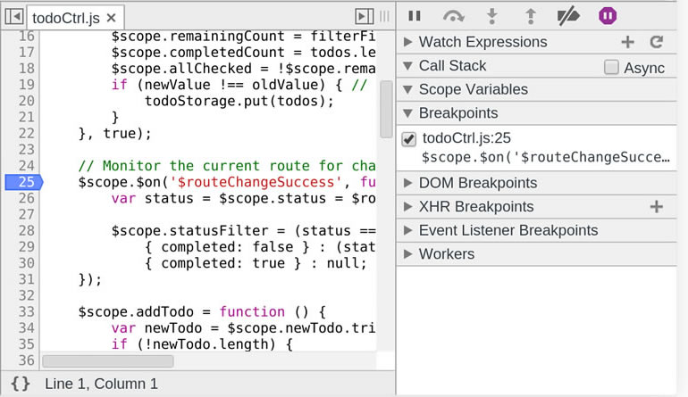

你可以添加多个断点。点击其他行**行号前的空格**就可以继续设置断点，你所设置的全部断点都会在右边的侧栏下 Breakpoints 选项中显示出来。

断点前的复选框可以选择是否启用断点，如果断点被禁用了，那么蓝色的标签会变色。

点击断点的入口可以跳转到源文件中的对应行：


点击蓝色的标签可以删除断点。

右击蓝色标签会打开一个菜单，其中包括：**Continue to Here，Remove Breakpoint，Edit Breakpoint** 以及 **Disable Breakpoint**。


想要设置**条件断点**，选择 **Edit Breakpoint** ，或者，右键点击行号前的空白然后选择 **Add Conditional Breakpoint**。在输入域中，可以输入任何能够返回 true 或者 false 的表达式。当条件返回 true 的时候，断点会中断代码的执行。

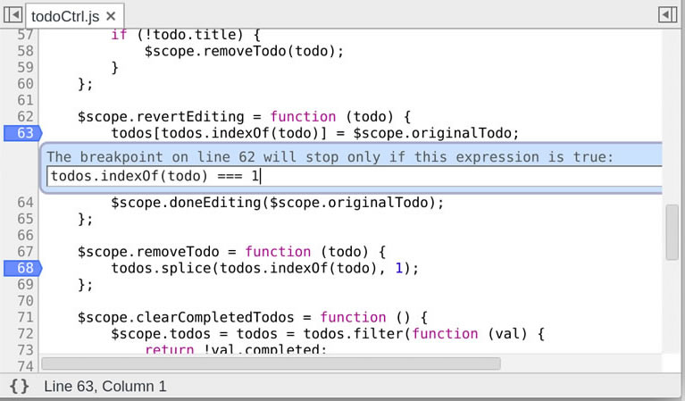

在你想要分析循环或者经常触发的回调事件的代码时，条件断点是非常有用的。

>注意：有时候你可能不需要从 DevTools 接口来设置断点。此时你希望从代码中来启动调试器，那么你可以使用 debugger 关键字来实现这一操作。

### 使用暂停断点

当你设置了一个或多个断点的时候，返回到浏览器窗口并且与页面进行交互。在下面的例子中，我们在 <span style="color:green">removeTodo()</span> 方法中加入了断点。现在任何想要在 TodoMVC 应用中删除 todo 选项的行为都将触发断点：

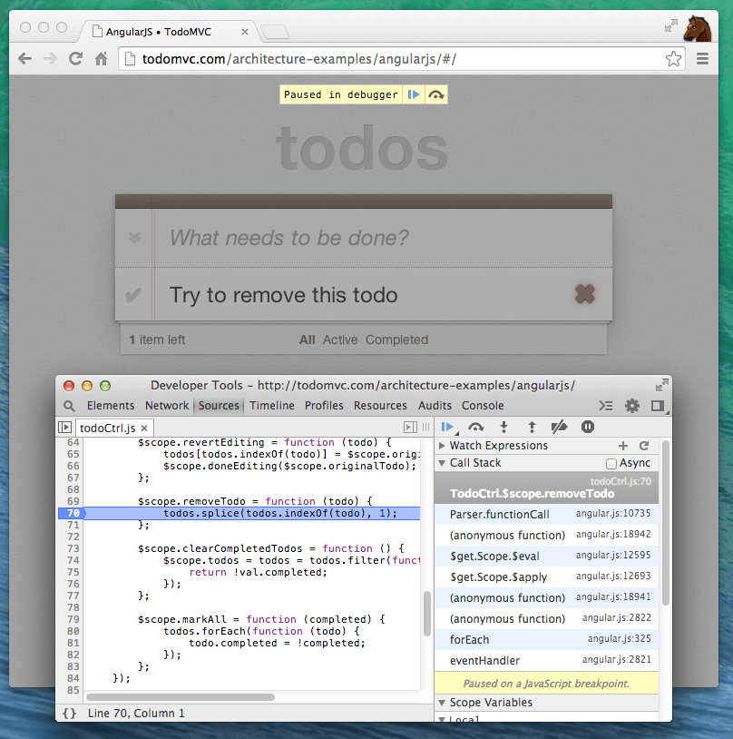

要恢复代码的运行，在 DevTools 窗口中点击 **Continue ** 按钮或者使用 `F8` 键盘快捷键。

当脚本暂停运行的时候，你可以使用右边侧栏中的 **Watch Expressinos**， **Call Stack** 以及 **Scope Variables** 面板。

### 调用栈面板

**调用栈面板**展示了代码到暂停处的完整执行路径，这让我们能够深入代码去找出导致错误的原因。


如果要查看包括计时器和 XHR 事件在内的异步 JavaScript 回调函数的执行路径，请点击 **Async** 复选框。

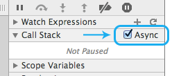

更多关于异步调用栈的信息和示例请参考 HTML5Rocks.com 网页上的 [Debuggin Asynchtonous JavaScript with Chrome DevTools](http://www.html5rocks.com/en/tutorials/developertools/async-call-stack/)

### 将 JavaScript 文件置于黑盒中

当你把一个 JavaScript 源文件放到黑盒中时，你在调试代码的时候无法跳转到那个文件中了。你可以在你感兴趣的代码尝试一下。


你可以使用设置面板来将脚本文件放入黑盒，或者右键点击 sources 面板中的文件然后选择 Blackbox Script。

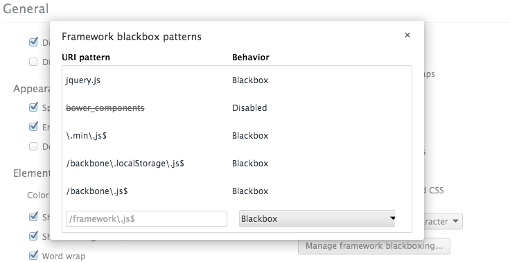

更多关于黑盒的信息请参考 [Blackboxing JavaScript file](https://developer.chrome.com/devtools/docs/blackboxing)

### 控制台

DevTools 中的 **consle drawer** 允许你在调试器当前暂停的位置附近进行试验。点击 <kbd>Esc</kbd> 键在视图中打开控制台，再次按 <kbd>Esc</kbd> 键就会关闭该控制台。

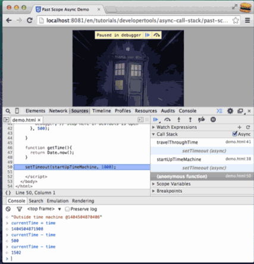

### 动态 JavaScript 中的断点

- <button id="loadDynamicScriptButton" onclick="loadDynamicScript()">Load  dynamic script</button>
- 在 Sources 面板中脚本的下拉选项中找到 "dynamicScript.js" 然后在第二行设置断点。
- <button id="dynamicScriptFunctionButton" onclick="dynamicScriptFunction()" disabled>Call function from dynamic  script</button>
- 此时程序应该在断点处暂停
- 在 DevTools 窗口中点击 **Continue ** 或者按 `F8` 来继续执行

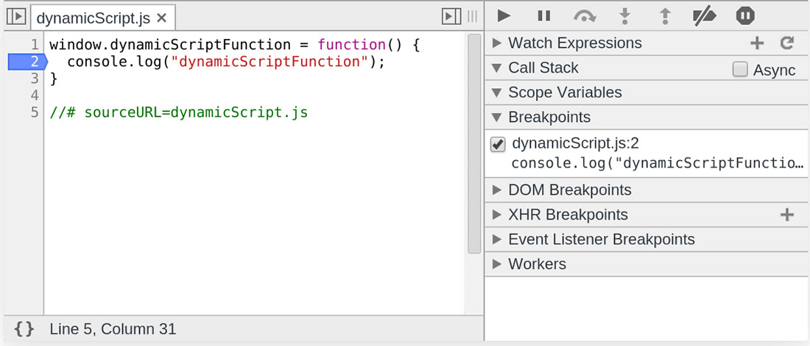

>提示：注意 dynamicScript.js 文件结尾处的 <span style="color:green">"//# sourceURL=dynamicScript.js"</span> 这一行。这种方式可以给由 eval 函数创建的脚本命名，更多的信息会在 [Source Maps](https://developer.chrome.com/devtools/docs/javascript-debugging#source-maps) 这一节中说明。只有当用户为动态的 JavaScript 文件提供了名称时才能为其设置断点。

### 在下一条 JavaScript 语句暂停执行

- 点击 **Pause ** 按钮
- 将你的鼠标移动到下图中的区域
- 你的鼠标应该停在 <span style="color:green">onMouseOver</span> 函数上
- 点击 **Continue  按钮或者按 **F8** 来继续执行


### 在出现异常处暂停

- 点击窗口底部的 **Pause on exceptions ** 按钮来切换到**在异常处暂停**模式
- 勾选 **Pause On Caught Exceptinos** 复选框
- <button onclick="raiseAndCatchException()">Raise exception!</button>
- 程序应该在 raiseAndCatchException 函数中停止
- 点击 **Continue ** 按钮或者按 **F8** 来继续执行


### 在未捕获的异常处暂停

- 点击 **Pause on exceptions ** 按钮
- 取消勾选 **Pause On Caught Exceptions** 复选框
- <button onclick="raiseAndCatchException()">Raise exception!</button>
- 此时若捕获了异常，程序应该不会在 raiseAndCatchExcep 函数处停止
- <button onclick="raiseException()">Raise uncaught exception!</button>
- 此时应该在 <span style="color:green">raiseException</span> 函数处停止
- 点击 **Continue ** 按钮或者按 **F8** 来继续执行


## 在 DOM 变化事件上的断点

- 右键点击下面的 "Parent Element" 并且从文本菜单中选择 **Inspect Element（审查元素）**
<script>
function appendChildButtonClicked() {
  var parentElement = document.getElementById("parent");
  var childElement = document.createElement("div");
  childElement.setAttribute("style",
      "border: 2px solid; padding: 5px; margin: 5px; text-align: center; width: 120px");
  childElement.textContent = "Child Element";
  parentElement.appendChild(childElement);
}
</script>
<div id="parent" style="border: solid 2px; padding: 5px; margin: 5px; text-align: center; width: 140px"> Parent Element </div>

- 右键点击 **Elements** 面板元素然后选择 **Break on Subtree Modifications**
- <button onclick="appendChildButtonClicked()">Append child!</button>
- 此时应该会在 <code>appendChild</code> 函数调用处停止
- 点击 **Continue ** 按钮或者按 **F8** 来继续执行


## XHR 上的断点

- 点击 **Sources**面板右侧的 **XHR Breakpoints** 边栏上的 **Add ** 按钮
- 在文本输入去输入 "data.txt" 然后单击**回车**
- <button onclick="retrieveData()">Retrieve data.txt by XHR</button>
- 此时应该在<code>send</code> 函数调用处停止
- 右键点击新创建的断点然后选择 **Remove Breakpoint**
- 点击Devtools 窗口中的 **Continue ** 按钮或者按 **F8** 来继续执行


提示：要编辑 URL 过滤器，双击 **XHR Breakpoints** 边栏的 XBR 断点，具有空的 URL 过滤器的 XHR 断点会匹配任何 XHR。

## JavaScript 事件监听器上的断点

- 打开右边 **Scripts** 面板的 **Event Listener Breakpoints** 边栏
- 展开 **Mouse** 选项
- 选中 **mouseout** 前的复选框可以设置 mouseout 事件监听器断点

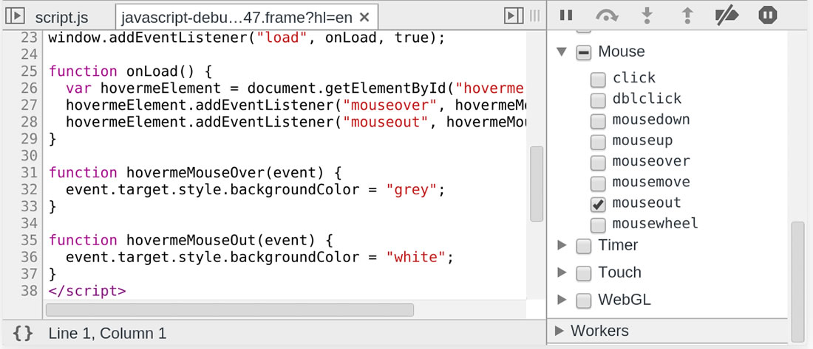

- 将你的鼠标移动到下面的的盒子中
<script>
window.addEventListener("load", onLoad, true);

function onLoad() {
  var hovermeElement = document.getElementById("hoverme");
  hovermeElement.addEventListener("mouseover", hovermeMouseOver, true);
  hovermeElement.addEventListener("mouseout", hovermeMouseOut, true);
}

function hovermeMouseOver(event) {
  event.target.style.backgroundColor = "grey";
}

function hovermeMouseOut(event) {
  event.target.style.backgroundColor = "white";
}
</script>
<div id="hoverme" style="border: 2px solid; padding: 5px; margin: 5px; text-align: center; width: 100px; background-color: white;">
      Hover me!
    </div>

- 此时应该在 <code>mouseout</code> 事件处理器处停止
- 点击 **Continue ** 按钮或者按 **F8** 来继续执行


-
>提示：下列事件是支持的<br>
  &nbsp;**Keyboard**：松开按键，按下按键，输入文字<br>
  &nbsp;**Mouse**：点击，双击，鼠标键按下，鼠标键松开，鼠标悬浮，鼠标移动，鼠标从元素上离开。<br>
  &nbsp;**Control**：重新设置大小，滚动，缩放，焦点，失焦，选择，变化，重置
  &nbsp;**Clipboard**：复制，剪切，粘贴，beforecopy，beforecut，beforepaste
  &nbsp;**Load**：加载，卸载，废除，出错。
  &nbsp;**DOM Mutation**：DOMActivate，DOMFocusin,DOMAttrModified，DOMCharacterDataModified，DOMNodeInserted，DOMNodeInsertedIntoDocument，DOMNodeRemoved，DOMNodeRemovedFromDocument，DOMSubtreeModified，DOMContentLoaded
  &nbsp;**Device**：面向设备，设备运动。
  
-

## 长按恢复执行

当暂停的时候，点击并且不放开恢复按钮可以让 ”所有的暂停都阻塞 500 毫秒后恢复“。这会让所有的断点在半秒内都无法使用，可以使用该方法进入到下一个循环中，这样就可以避免为了退出循环而不断让断点继续执行。

专业建议：当使用 DevTools 启动“刷新”的时候（焦点在 DevTools 的时候使用 Ctrl + R），全部暂停都会被禁用，直到新的页面开始加载（或者作为备用方案，直到用户按下 “Pause” 按钮）。然而，如果你从浏览器的按钮来启动刷新操作的时候（或者当焦点在 DevTools 之外的时候使用 Ctrl + R），将会命中所有剩余的断点。这实际上可对那些对页面卸载过程感兴趣的人非常有用。


## 实时编辑

在**创作和工作流章节中**，我们讨论了怎么通过 **Source** 面板来对脚本进行修改。在断点处，同样也可以通过点击主编辑面板来做出修改，并且能够实时修改脚本文件。

- 定位到 Google Closure hovercard demo
- 在源面板中，打开 “mouse.js” 然后使用 Ctrl/Cmd + Shift + O 来定位到 onMouseOut() 函数

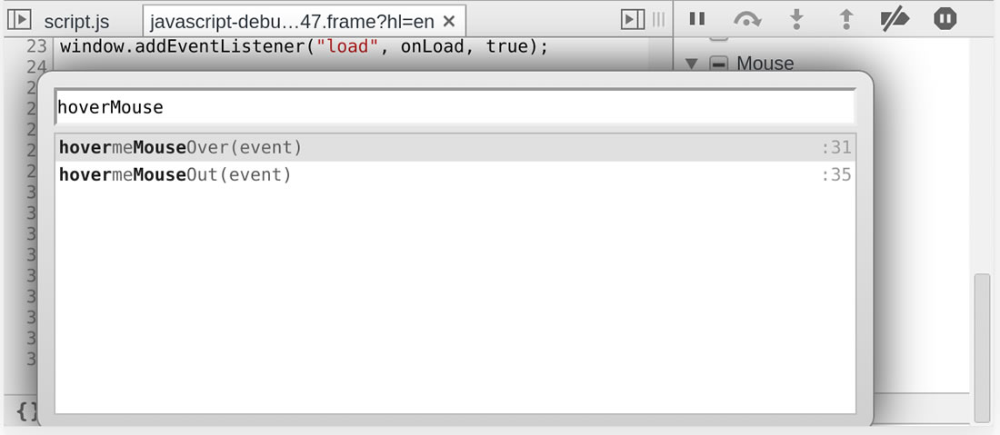

- 点击暂停按钮来暂停调试
- 修改函数，在末尾加入 console.log('Moused out')
- 使用 Cmd + S 或者 Ctrl + S 快捷键可以保存更改，记得确认是否保存
- 点击 pause/resume 按钮来恢复执行
- 当你的鼠标离开相关位置的时候，控制台会输出信息

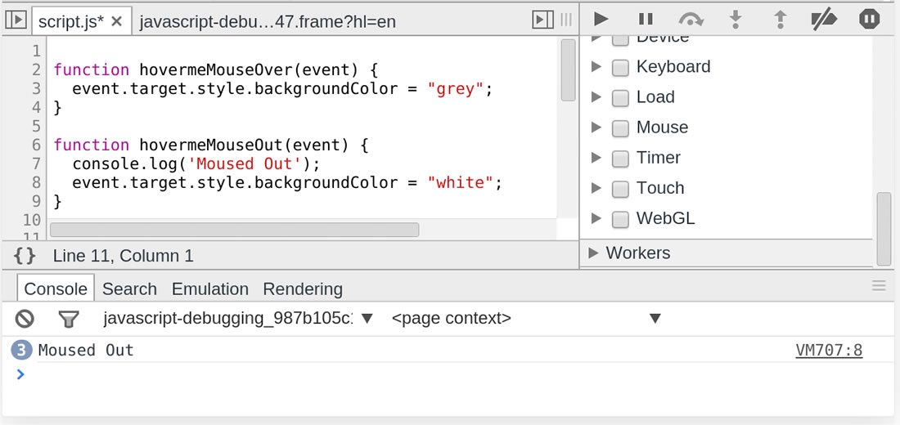

这允许你在不退出浏览器的情况下通过使用 DevTools 来保存修改的内容。

## 异常

让我们现在来看一下怎么处理异常以及如何利用 Chrome 的 DevTools 使用堆栈追踪。
**异常处理**是对于出现的异常的响应 - 除了有些需要特定处理过程的情况 - 并且一般会改变 JavaScript 代码执行的正常流程。

>注意：如果是 Web 开发者并且希望获得最新版的 DevTools，你需要使用 [Chrome Canary](https://tools.google.com/dlpage/chromesxs)

## 追踪异常

当程序出现异常的时候，你可以打开 DevTools 控制台（Ctrl + Shift + J/Cmd + Option + J），然后你会发现有许多 JavaScript 出错信息。每条信息都指出了相应的文件名以及行号，你可以通过这些信息来定位到源代码中的相关位置。


### 查看异常追踪栈

导致出错的执行路径可能会有多条，并且究竟是哪一条出现了错误并不明显。**只要 DevTools 窗口是打开的**，控制台中出现的异常状况都会伴随着完整的 JavaScript 调用堆栈而出现。你可以展开这些控制台信息来查看堆栈信息并定位到代码中的相应位置：

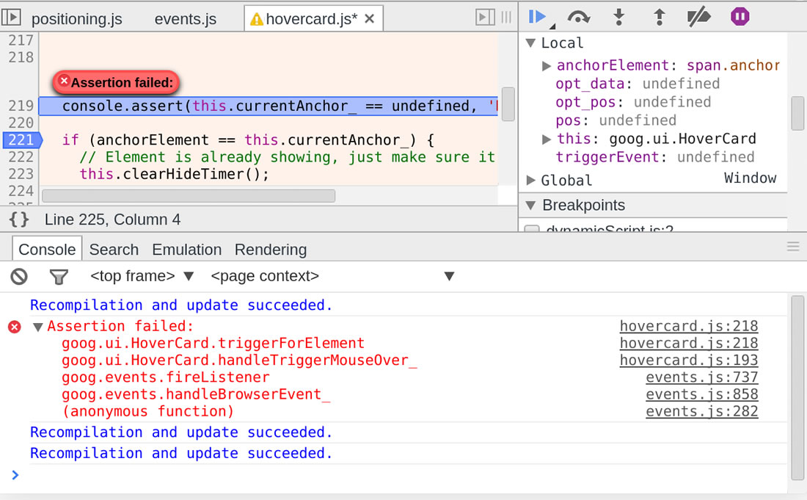

### 在 JavaScript 出现异常时暂停

你可能希望下一次 JavaScript 发生异常的时候能够暂停 JavaScript 的执行并查看它的调用堆栈、范围变量以及应用程序的状态。Script 面板底部的暂停按钮（）允许你在不同的异常处模式之间切换，且该按钮具有三种状态：你可以选择在所有的异常发生时都暂停程序运行或者只是在未捕获的异常发生时暂停程序运行或者是忽视所有的异常。

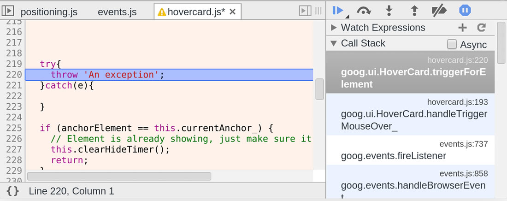

## 打印堆栈信息

在 DevTools 中输出的日志信息对于理解应用程序的执行过程非常有帮助，你可以在日志信息中包括相关联的堆栈跟踪信息来使它更加有用。想要做到这一点有多种方式。

### Error.stack

每个 Error 对象都有一个名为 stack 的字符串属性，该字符串包含了堆栈跟踪信息：


### console.trace()

你可以使用 <code>concole.trace()</code> 方法来输出当前 JavaScript 调用堆栈，这种方法可以用于检测代码：

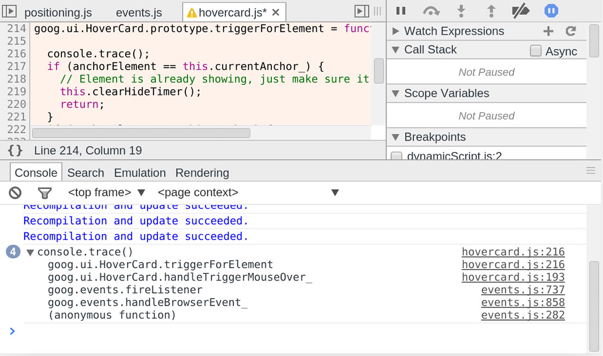

### console.assert()

将 assertion 加入到你的代码中也是一种不错的方法。只要调用 <code>console.assert()</code> 方法并将错误情况作为第一个参数即可，每当表达式的计算结果为 false 时你就会看到相应的控制台记录：


## 在运行时使用 window.onerror 来处理异常

Chrome 支持将一个处理函数设置为 window.onerror。每当一个 JavaScript 异常在窗口上下文中抛出并且没有被任何的 try/catch 块捕获的时候，该方法就会被调用。同时，异常信息、抛出异常的文件 URL 以及出现异常的位置在文件中的行号会按照上面的顺序作为三个参数传给该方法。你可能觉得像这样设置一个能够收集未捕获异常信息并且能将其报告给服务器的错误处理器非常方便。

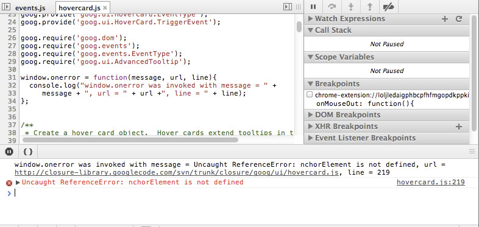

## 美化输出格式

如果你在阅读以及调试某些过于简化的 JavaScript 代码有麻烦的时候，有一个美化输出格式的选项可以让这些过程更轻松。下面是一份简化过头的脚本文件在 DevTools 中可能显示出的样子：

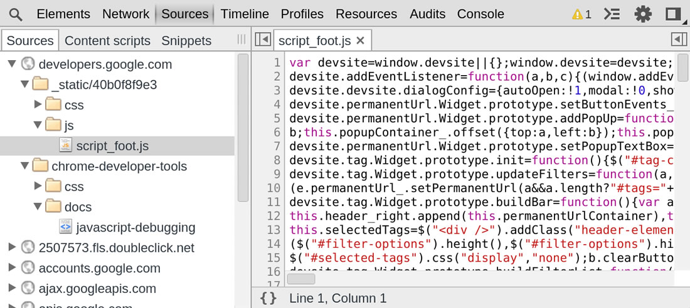

如果点击左边底部的花括号  图标，该 JavaScript 就会转换为更具可读性的格式。这种格式对调试和设置断点也相当方便。

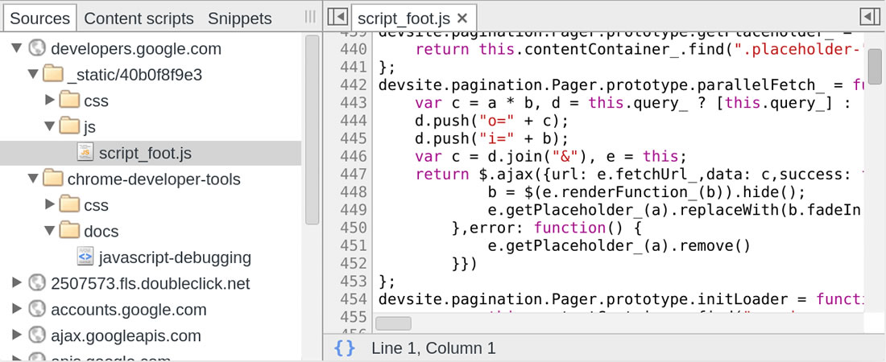

## 源映射（Source Maps）

你是否期望过你的客户端代码能够保持可读性并且适合调试，甚至是你在合并以及缩小代码之后也能这样吗？那么，现在你可以感受源映射的魔力了。

一个基于 JSON 格式的源映射创建了一种缩小后的代码和源代码之间的关系。

下面一种简单的源映射的示例：

```JSON

  {
    version : 3,
    file: "out.min.js",
    sourceRoot : "",
    sources: ["foo.js", "bar.js"],
    names: ["src", "maps", "are", "fun"],
    mappings: "AAgBC,SAAQ,CAAEA"
  }
```

源映射是指，当你为了构建产品而缩小及合并 JavaScript 文件的时候，产生拥有源文件信息的一种映射。源映射会让 DevTools 去加载你的源文件，而不是缩小后的文件。于是你可以使用源文件来设置断点以及调试代码。同时，Chrome 实际运行的是缩小后的代码。这就让你感觉像是在运行源文件一般。

### 使用源映射

#### 使用正确的缩小器

你需要使用能够创建源映射的缩小器来缩小你的代码。Closure 编译器以及 UglifyJS 2.0 就是两款这样的工具，当然，也有其他的很多支持 CoffeeScript， SASS 等源映射的工具。具体可以参考维基百科的页面 [Source maps: languages, tools and other info](https://github.com/ryanseddon/source-map/wiki/Source-maps:-languages,-tools-and-other-info)。

#### 设置 DevTools

默认情况下，资源映射（Sourcemap）是启用的（Chrome 39 就是这样），如果你想仔细检查或者单独启用它，先打开 DevTools 然后点击设置图标 。在 **Sources** 选项下，查看 **Enable javaScript source maps**。你也可以检查 **Enable CSS source maps**，不过在这个例子中你并不需要这么做。


#### 让源映射（Source Map）可访问

如果要让 DevTools 知道某个源映射是可用的，请验证缩小后的文件最后一行的代码是不是下面这样。

```

//# sourceMappingURL=/path/to/file.js.map

```

这一行通常是由生成映射的工具添加的，并且能够让 DevTools 建立缩小后的文件和源文件之间的联系。在 CSS 中，这一行可能是这样的：<code> /*# sourceMappingURL=style.css.map */.</code>

如果你不希望文件中有额外的注释，你可以使用 JavaScript 文件中的 HTTP 头来告诉 DevTools 源文件在哪里。这需要设置或者自定义 web 服务器，并且该内容超出了本篇教程的目标。

```

X-SourceMap: /path/to/file.js.map

```

和注释类似，该代码同样告诉 DevTools 到哪里去寻找源文件并和相应 JavaScript 文件建立关联。这个头部信息也用于解决引用源映射的语言并不支持单行注释的问题。

你也应该检查你的 web 服务器是否设置好了对资源映射的支持。有些服务器，需要对每种文件都做出明确的配置，比如 Google App Engine。在这种情况下，你的源映射应该设置将 MIME 类型设置为 <code>application/json</code>，不过 Chrome 浏览器会[接受任何类型的类容声明](http://stackoverflow.com/questions/19911929/what-mime-type-should-i-use-for-source-map-files)，比如 <code>application/octet-stream</code>。

请看一下 Chrome 中特别构建的 [font dragr tool](http://dev.fontdragr.com/)，当源映射启用的时候，你将会注意到 JavaScript 文件并没有被编译，并且你可以看到所有被引用的 JavaScript 文件。这使用了源映射，但是后台实际运行的是编译后的代码。任何的错误、日志以及断点都会映射到开发代码中，这使得调试变得更为容易。实际上你的感觉就像是你在运行开发中的代码一样。

### 活动中的 @sourceURL 以及 displayName

源映射声明的下列部分，并不会令你在使用 evals 函数来开发时有多轻松。

这个帮助器（@sourceURL）看起来类似于 //# sourceMappingURL 属性，并且实际上是在源映射 V3 规范中提及的。在你的代码中包含下面这些特殊的注释，你可以为 eval 函数及内嵌的脚本和样式命名，这样他们在你的开发工具中显示的时候就可以拥有逻辑名称。

```

//# sourceURL=source.coffee

```

#### 使用 sourceURL

- 定位到 [demo](http://www.thecssninja.com/demo/source_mapping/compile.html)
- 打开 DevTools 并找到 **Sources** 面板
- 输入一个名称来为你的代码命名
- 点击 **compile** 按钮
- CoffeeScript 源文件会计算总值并且通过警告来输出
- 如果你打开 Sources 的子面板，你将会看到一个拥有你之前输入的文件名的新文件。如果你双击该文件来查看详细内容，会发现该文件中含有初始源文件编译后的 JavaScript。在最后一行会有 // @sourceURL 注释，该注释表明了源文件是什么。这在通过语言抽象来调试时具有很大的帮助。


### 更多信息

- Conditional breakpoints
- [Breakpoint actions in JavaScript](http://www.randomthink.net/blog/2012/11/breakpoint-actions-in-javascript/)
- Working With Source Maps
- [The Breakpoint: Source maps spectacular](https://www.youtube.com/watch?feature=player_embedded&v=HijZNR6kc9A)
- [HTML5 Rocks: An Introduction To JavaScript Source maps](http://www.html5rocks.com/en/tutorials/developertools/sourcemaps/)
- [NetTuts: Source Maps 101](http://net.tutsplus.com/tutorials/tools-and-tips/source-maps-101/)
- [Source maps: languages, tools and other info](https://github.com/ryanseddon/source-map/wiki/Source-maps%3A-languages%2C-tools-and-other-info)
- [CSS Ninja: Multi-level Source maps](http://www.thecssninja.com/javascript/multi-level-sourcemaps)
- [Source maps for CoffeeScript](http://www.coffeescriptlove.com/2012/04/source-maps-for-coffeescript.html)

以上内容适用于 [CC-By 3.0 license](http://creativecommons.org/licenses/by/3.0/)

