# 作者以及开发工作流程

开发者工作流程一般来说就是需要通过一些步骤来达到一个**目标**。当作者拥有了开发者工具，这就可以优化工作流程以较少的时间来完成常规任务，比如锁定文件或者函数，持续编写脚本或者样式表，保存经常使用的片段或者仅仅是重新布置一下布局，让其更贴合你得需求。

在这一节中，我们将讲解一些小技巧，让你在使用 DevTools 时的工作流程变得更加高效。

### Dock-To-Right 提供了垂直编辑

你可能发现开发者工具在底部时，提供了一些水平空间，可是垂直方向上留下的空间很少。右边的锚点允许你将开发者工具放到窗口右边。这样你就可以在左边窗口可以查看当前的页面，而将测试的东西放在了屏幕的右侧。

这样的好处在于：

* 你可能在一个宽屏的显示器上工作，而且你希望可以最大化空间去检查和测试你的代码
* 你可以改变并分开你的布局，使其小于 400 px（当前 Chrom 的最小尺寸）并测试调整后的布局。
* 比较长脚本使用垂直空间更方便调试

导航到一个你想要排错的 URL 然后按住位于开发者工具左手边底部布局的按钮。在 *dock-to-right* 和 *dock-to-window* 之间切换，


>
注意：开发者工具将会记住你最后一次的选项，所以你可以自己在两种方式间切换。

这将调整屏幕以显示可用的布局选项。一旦你已经选中了一个偏好，布局将会立刻改变来响应这个更改。


>
注意：每一个选项卡都有它自己相应的布局形式。这就意味着可能某个选项卡工具是在屏幕右侧而另外一个选项卡则在窗口底部。


### 搜索，导航和过滤

#### 过滤一个脚本，样式表或者根据文件名过滤一个片段

对于一个开发者的工作流程来说，能够快速定位一个特殊的文件是非常有必要的。通过使用下面的快捷键，开发者工具可以使你搜索全部的脚本，样式表和文件片段：

* `Ctrl` + ```o``` (windows,Linux)
* `Cmd` + ```o``` (Mac OS X)

这个工具与当前正在使用的控制台无关。对于[**Todo app**](http://todomvc.com/examples/angularjs/#/)，使用下面这些快捷键中的某一个将会带我们进入 *Sources* 面板并且提供一个列出所有可检查文件的搜索框。

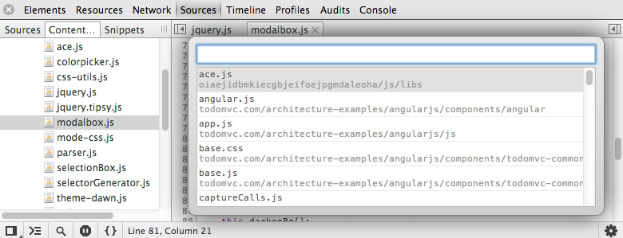

在这里，我们可以过滤出特定的文件（例：文件命中包含script）或者选中一个文件，预览或者编辑。


>
注意:在所有的对话中，我们均提供驼峰匹配。比如：打开FooBarScript.js，你可以只写 FBaSc，这样可以节省时间。


#### 当前文件中的文本搜索

在当前的文件中搜索一个特殊的字符串可以使用以下的快捷键：

* `Ctrl` + `F` (Windows,Linux)
* `Cmd` + `F` (Mac OS X)

一旦已经输入了一个关键字到搜索框中，点击回车会调转到第一个匹配的结果。继续点击回车将会在结果中进行跳转，或者你也可以点击搜索框旁边的 `up` 和 `down` 箭头按钮来进行跳转。


#### 在当前的文件中进行文字替换

开发者工具支持当前文件中定位文字，此外也同样支持用新的值来替换替换单个或者所有文字。选中 “Relpace” 将会出现第二个输入区域来填写用于替换的文本。


#### 在所有文件中搜索文字

如果你希望在所有加载的文件中搜索特定的文字，你可以用下面的快捷键来加载搜索框界面：

* `Ctrl` + `Shift` + `F` (Windows,Linux)
*  `Cmd` + `Opt` + `F` (Mac OS X)

这里同时提供了正则表达式和敏感大小写的搜索方式。


#### 使用正则表达式搜索

使用正则表达式进行搜索，就是在搜索处填入表达式，然后选中 `Regular Expression` 最后点击回车。


在上面的图中我们可以看见如何搜索所有匹配 <div><div> 中内容的例子。

#### 在文件中过滤一个函数或者是一个选择器

你应该还想要更多功能，这样就可以在一个文件中导航到（或者搜索到）特殊的 JavaScript 函数或者是 CSS 规则文件。

要导航到你选中的文件，进入源面板。然后你就可以使用下面的快捷键来打开一个对应函数/特定选择器的一个选择框：

* `Ctrl` + `Shitf` + `O` (Windows,Linux)
*  `Cmd` + `Shitf` + `O` (Mac OS X)

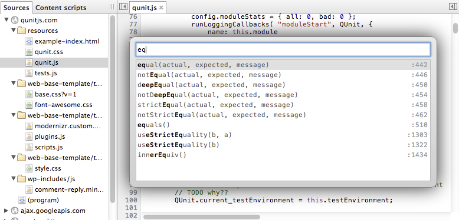

基于选中文件的类型，你将会看见所有的 JavaScript 或者是 CSS 样式定义。开始输入你要搜索的函数名称或者是 CSS 定义时就会过滤出一个列表的结果，或者是直接选择一个结果，进入到定义这个内容的文件中。

#### 跳转到指定行号

开发者工具同时也可以在编辑器中直接跳转到指定行号。要启动行号输入框，只需要选中你要查找的文件，然后使用下面的快捷键来启动：

* `Ctrl` + `L` (Windows)
* `Cmd` + `L`  (Mac OS X)
* `Ctrl` + `G` (Linux)


### 实时编辑脚本和样式

开发工具支持实时编辑脚本和样式，不需要重新加载页面就可以看到效果。这对于测试设计的更改，原生 JavaScript 函数或者代码块很有帮助。

#### 脚本

JavaScript 可以直接在 `Sources` 面板中进行编辑。打开指定的脚本进行编辑，或者：

1. 在元素面板的视图中点击相应脚本的链接（例：\<script src="app.js"></script>）<br><br>

2. 或者从 `Scources` 子面板中选择脚本的文件名：


这会在右边的面板上显示一个新的标签，里面的源文件将会是语法高亮的。

对于脚本的更改只会在评估时间执行，也就是说对代码的修改不是在页面加载后进行的话，将不会产生效果。修改后的代码会在下一个阶段执行，比如鼠标滑过监听或者点击事件的回调更改后可以快速进行测试。

获取更多有关 JavaScript 在 `Sources` 面板进行调试的信息，请关联阅读在 [**JavaScript 排错**](https://developer.chrome.com/devtools/docs/javascript-debugging) 文档。同时也可以查看 [**在线编辑器上的短屏幕截取和断点排错**](https://www.youtube.com/watch?v=WQZio5DlSXM)。

>
提示：工作空间对于本地文件的持续编辑也是支持的。[查看更多](https://developer.chrome.com/devtools/docs/workspaces)


### 样式

下面有一个和编辑样式类似的工作流。打开开发者工具，选择元素面板。在右边，一些子面板将会被显示出来，其中就包括样式面板。检查在页面上的某个元素将会在风格面板上显示一组已经被应用到当前节点的属性，并且会按选择器进行排序。

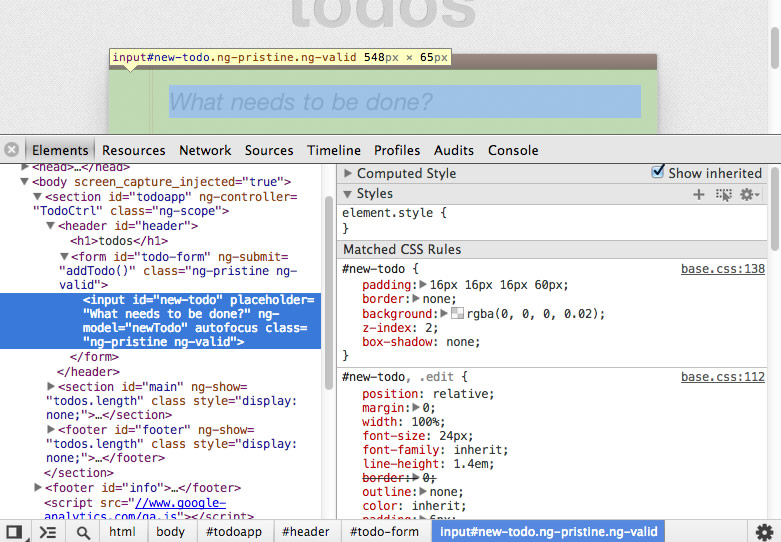


在 "element.style" 部分会显示在页面标记中通过样式属性设置的相关属性。

下一个部分是 ”Matched CSS Rules“，这里会显示匹配相应节点的选择器，他们的属性和值，甚至是其源文件名，以及读取该样式的行号。选择器匹配的节点将会被设置为黑色，其他的将会显示成灰色。这么做最大的好处就是在于我们在阅读时可以更好的区分选择器筛选出来的东西。

在一个子面板中改变任何 CSS 属性，比如一个元素的边界和尺寸，将会将会立刻生效并且在主显示窗口中显示。

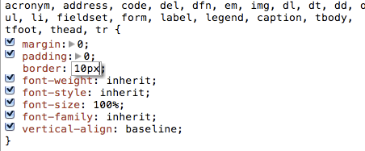


返回 ”Matched CSS Rules“ 面板，点击在规则旁边的样式表的链接也可以引导你进入 "Sources" 面板。这会显示完整的样式表并且会直接定位到相关的 CSS 规则的行号处。


在这里，你可以向使用常规编辑器那样更改文件，并且浏览器会实时显示更改后的效果。

### 另存为

如果你对于做出的更改感到满意，你可以保存文件。

为此，首先要确认你是否源面板下的文本编辑视图中做出的更改：


或者是在 ”Element->Style panle“(for SASS/CSS）中点击文件名称（例如：style.css）。


接下来，右键点击文件名或者直接点击文本编辑器内任意位置，然后选择"Save As"。这将弹出一个允许你保存的菜单。


之后提交的更改（在同样的菜单中保存的或者是使用 `Ctrl`/`Cmd` + `S` 快捷键）都会保存到同一个位置中。


### 本地修改

开发工具同样维护了所有对本地文件做出的历史修改。如果你已经编辑了一段脚本或者样式表并且使用了开发工具进行保存，你可以在 Sources 右键一个文件名（或者在 source 区域）然后选择 ”Local modifications“ 来查看历史记录。

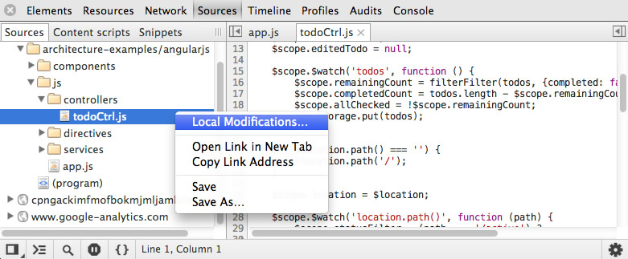

一个*本地修改*面板将会显示：

* 不同的更改
* 更改文件的时间
* 被修改文件所在的域名


此外还有一些链接。*revert* 会将文件上所有的更改回复到它原始的状态，并且移除更改历史。


*Apply original content* 将有效地重复同一操作，但是会维护视图中的修改历史，以免你希望回溯到某个特定更改后。

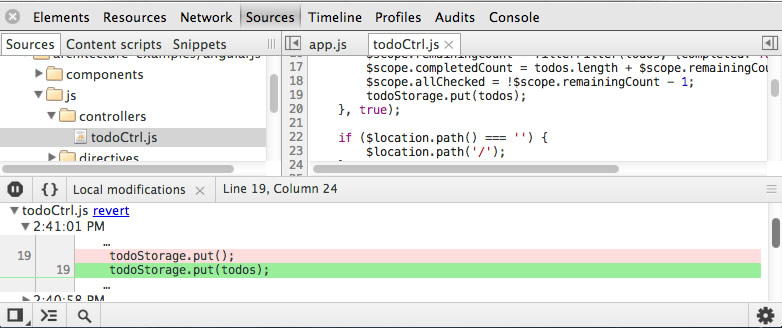

最终，*apply version content* 将会应用全部更改，并提供时间集上的特定修改记录。

### 自定义 JavaScript 片段

有时候你想能够保存小的脚本，书签和实用的工具好让这些工具可以让你在调试的时候可以用的上。***Snippets*** 是一个新的可以在这个开发流程中使用的开发者工具，它允许你在源面板中创建，存储和执行 JavaScript。现在可以在[**Chrome Canary**](https://tools.google.com/dlpage/chromesxs) 中获取。

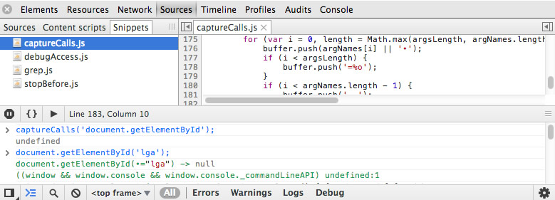

以下是 Snippets 比较有用的情况：

* **书签** 所有你的书签可以作为片段进行存储，特别是那些你可能想编辑的。
* **实用工具** 调试工具可以和当前页面进行交互，并且可以保存和调试。一个社区企划的[列表](https://github.com/paulirish/devtools-addons/wiki/Snippets)已经被提供。
* **Debugging** Snippets 提供了一个语法高亮显示并且可持续的多行控制台，这样使得调试代码比单行要更加便捷。
* **Monkey-patching code** 你想要在运行时修复的代码可以通过 Snipptes 来完成，尽管多数时候你可能只是在源面板中实时编辑代码。

Brian Grinstead 提供了一个存放有用 Snippets 给开发者的地方，就在 [bgrins.github.io/devtools-snippets](http://bgrins.github.io/devtools-snippets/)

#### 开始

用 Snippets 开始，导航到 *Sources* 面板。如果你没有做出任何改动，你将会看到默认的布局，就像下面一样：


点击在上面左边角落的切换键可以显示展开后的面板。这里你应该已经看见了 *Sources*，*Content scripts* 和一个新的标签，*Snippets*。点击它然后进入 *Snippets*。


#### 创建 Snippets

*Snippets* 通过两个面板来工作。左侧的面板（与 *Sources* 相似）是文件列表，选择一个 snippets 文件将会在右边的编辑器中打开它。这和你在源面板中选中脚本或者样式表是类似的。

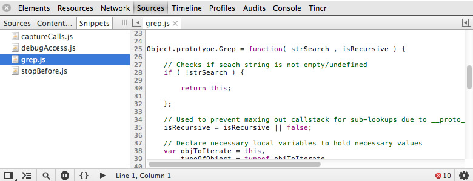

在文件列表中右键点击并选择 "New" 会创建一个新的 snippet 文件。

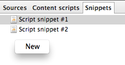

#### Snippet 文件名称

Snippet 文件名称是被自动创建的，但是当 snippets 文件创建之后，你同样也可以自行更改文件名。


这之后只要想再次更改文件名，只需在文件列表中再次右键，选中 “Rename”。如果你需要的话也可以选择 “Remove” 。

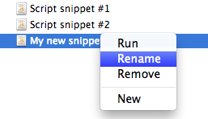

#### 编辑和执行 Snippets

从文件列表中选择一个 Snippets 文件，然后在你的右侧的编辑器中打开。这里你可以写或者粘贴任何 JavaScript 代码（换句话说就是你的 Snippet），包括函数和表达式。


如果一个文件名以 * 结尾，那么就意味着这个文件已经被修改，但是没有保存。

要执行这个 Snippet，在文件列表上右键在该文件，然后选择 ”Run“。或者你可以点击 **Run*（>）* 按钮。


如果这个 snippet 会有控制台输出，编辑器下的控制台会输出相关内容。

>
注意：使用键盘快捷键也可以执行一个 snippet-选中你的 snippet ，之后使用 `Ctr` / `Cmd` + `Enter` 来运行它。这和使用 Run（>）按钮的行为是一样的-当前仅仅在 Source 控制台，但是之后将会跳转到到 debugger 控制台。


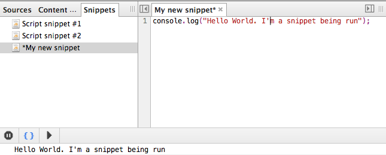

如果你想在控制台中，执行 snippet 的一些特殊行中的代码，你可以在编辑器中选中这些代码，然后右键，选择 "Evaluate in Console" 选项来进行执行。键盘上的快捷键是 `Ctrl` + `Shift` + `E`。


选中 Run 后，输出的表达式将会在编辑器下方的控制台中输出。


#### 本地修改

对于每一个 Source，Snippet 也支持浏览本地更改并回滚到一个特定时间点的更改。

保存更改后在编辑器中右键，然后选择 “Local modifications” 就可以使用该功能。

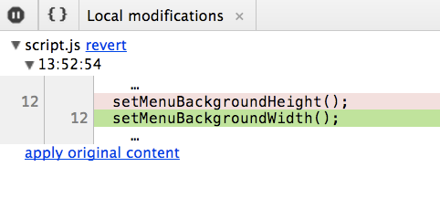

#### 断点，观察表达式以及更多功能

其他你在 Sources 面板中使用的功能，比如添加观察表达式，断点，收起变量和保存文件同样也可以在 *Snippet* 中使用。

请阅读 *Sources* 面板这一章来了解更多关于这些功能的更多内容。


#### 保存 Snippets

Snippets 可以被保存并且之后依旧能够通过开发者工具中的  *Snippets* 选项卡来使用，或者直接导出一个新的文件。在文本编辑中右键打开编辑菜单以获取 Snippet 的保存选项。

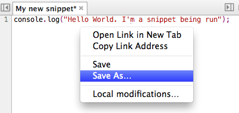

*Save* 会将变更保存到已有的 Snippets 文件中，而 *Save As* 将会允许你将这个 Snippets 保存到新的文件路径中。

>
注意：Snippets 保存在开发者工具的本地存储中。当使用 Sava/Save As的时候，你可以将这个 Snippets 绑定到任何位置的文件中，就像保存其他脚本一样。


#### Snippets 导航

就像在 *Sources* 中的脚本和样式表一样，Snippets 也可以使用我们之前提到的相应的键盘快捷键，比如导航到特定的 Snippets 文件，函数，或者行号。

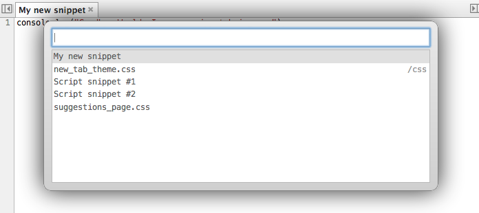

### 资源

- [Chrome DevTools Revolutions 2013:Workspaces](http://www.html5rocks.com/en/tutorials/developertools/revolutions2013/#toc-workspaces)
- [My workflow:Never having to leave the DevTools | remy sharp](http://remysharp.com/2012/12/21/my-workflow-never-having-to-leave-devtools/)
- [The Breakpoint With Addy Osmani And Paul Lewis - Snippets | youtube](http://www.youtube.com/watch?feature=player_detailpage&v=ktwJ-EDiZoU#t=553s)
- [Chrome Dev Tools:JavaScript and Performance | nettus](http://net.tutsplus.com/tutorials/tools-and-tips/chrome-dev-tools-javascript-and-performance/)
- [Iterating with the Chrome DevTools | jeremey kahn](http://www.youtube.com/watch?v=Phw6edMppKg)

以上内容使用于 [CC-By 3.0 license](http://creativecommons.org/licenses/by/3.0/)