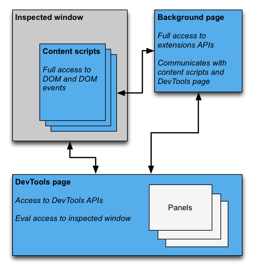
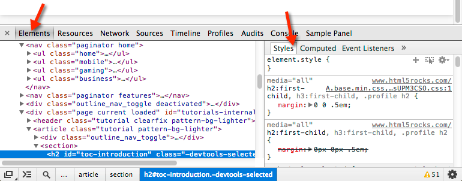

# 扩展 DevTools #
## 总览 ##
一个 DevTools 插件能增加功能到 Chrome DevTools 中来.它能够增加新的 UI 面板和侧边栏，能与被检查的页面进行通信，能获得关于网络请求的信息，以及其他的功能。详见显式的[ DevTools 插件](https://developer.chrome.com/devtools/docs/extensions-gallery)。DevTools 插件能够访问一组额外特定 DevTools 扩展 API:

+ [devtools.inspectedWindow](http://developer.chrome.com/extensions/devtools.inspectedWindow)
+ [devtools.network](http://developer.chrome.com/extensions/devtools.network)
+ [devtools.panels](http://developer.chrome.com/extensions/devtools.panels)

一个 DevTools 插件的结构像其他插件一样 : 它可以有一个后台页面,内容脚本和其他主体。此外,每个 DevTools 插件有一个 DevTools 页面,能访问到它的 DevTools API。



## DevTools 页面 ##
一个插件 DevTools 页面的实例每次随着 DevTools 窗口打开而被创建。DevTools 页面在 DevTools 窗口生命周期内存在。DevTools 页面能访问 DevTools API 和有限的一组扩展 API。具体来说，DevTools 页面可以:

+ 通过 [devtools.panels ](https://developer.chrome.com/extensions/devtools.panels)创建面板并与面板交互。
+ 获取检查窗口的信息、在检查窗口使用 [devtools.inspectedWindow](https://developer.chrome.com/extensions/devtools.inspectedWindow) API 测试代码。
+ 使用 [devtools.network](https://developer.chrome.com/extensions/devtools.network) API 获取。


DevTools 页面不能直接使用大多数的扩展 API。它可以访问扩展并运行着的 API 子集，因为这些 API 的内容脚本可以被访问到。像一个内容脚本一样,一个 DevTools 页面可以使用 [消息传递（Message Passing）](https://developer.chrome.com/extensions/messaging.html)与后台页面交互，详见[注入内容脚本 Message Passing](https://developer.chrome.com/extensions/messaging.html)。


## 创建一个 DevTools 插件 ##
为你的插件创建一个 DevTools 页面，在插件的注册清单文件中添加 <code>devtools_page</code>域：

```
{
  "name": ...
  "version": "1.0",
  "minimum_chrome_version": "10.0",
  "devtools_page": "devtools.html",
  ...
}
```

每个 DevTools 窗口被打开时，在插件清单中指定的 <code>devtools_page</code> 的实例都会被创建。该页面可以使用 [devtools.panels](https://developer.chrome.com/extensions/devtools.panels)  API 添加其它扩展程序的网页，作为面板和侧边栏到 DevTools 窗口。

 >  devtools_page 域必须指向一个 HTML 页面。这与 <code>background</code> 域不同， <code>background</code> 域用来具体一个后台页面，能让你直接指定 JavaScript 文件。

<code>chrome.develop.*</code> API 模型只能在载入了 DevTools 窗口的页面使用。内容脚本和其他扩展页面并没有这些 API 。因此，这些 API 只有在 DevTools 窗口生命周期内才能使用。


也有一些 DevTools 的 API 仍然是在测试状态。请参阅 [chrome.experimental.* API](http://developer.chrome.com/extensions/experimental.html)，例举了用于测试的 API 和如何使用它们的指南。

## DevTools 界面元素：面板和侧边栏窗格##
除了常用扩展 UI 元素，如浏览器的行为，文本菜单和弹出窗口，一个 DevTools 插件可以添加 UI 元素到 DevTools 窗口：

+ 面板是一个顶级标签，像元素（Elements），源（Sources）和网络（Network）板。
+ *侧边栏窗格* 显示补充 UI 相关的面板。固有样式，设定的样式以及元素 (Elements) 面板上的事件监听器窗格的都是侧边栏窗格的实例。目前你的插件只能在元素 (Elements) 面板加侧边栏窗格。 （请注意，侧边栏面板的外观可能与图像不匹配，这取决于你正在使用 Chrome 浏览器的版本和其中 DevTools 窗口停靠的位置。）



每个面板都是其自身的 HTML 文件，可以包括其它资源（JavaScript，CSS，图片，等等）。像这样创建一个基本的面板：

```
chrome.devtools.panels.create("My Panel",
    "MyPanelIcon.png",
    "Panel.html",
    function(panel) {
      // code invoked on panel creation
    }
);
```

在面板上或者在侧边栏窗格中执行的 JavaScript 对象能访问 DevTools 页面有权访问的 API。

如下，为元素面板创建一个基础的侧边窗格，像这样：

```
chrome.devtools.panels.elements.createSidebarPane("My Sidebar",
    function(sidebar) {
        // sidebar initialization code here
        sidebar.setObject({ some_data: "Some data to show" });
});
```

有几种方法来显示一个侧边栏窗格中的内容：

+ 利用HTML 文档。调用 [setPage](https://developer.chrome.com/extensions/devtools.panels#method-ExtensionSidebarPane-setPage) 指定一个 HTML 页面在窗格中显示。

+ 利用 JSON 数据。传递一个JSON 对象给 [setObject](https://developer.chrome.com/extensions/devtools.panels#method-ExtensionSidebarPane-setObject)方法。

+ 利用 JavaScript 表达式。传递一个表达式给 [setExpression](https://developer.chrome.com/extensions/devtools.panels#method-ExtensionSidebarPane-setExpression)方法。 DevTools 在被检查页面的文档中的执行表达，并输出该返回值。


对于这两种方法 <code>setObject</code>和<code>setExpression</code>，当他们它输入进 DevTools 控制台后，窗格会输出该值，但是，<code>setExpression</code>可以显示 DOM 元素和任意 JavaScript 对象，而 <code>setObject</code> 只支持 JSON 对象。


## 插件组件之间的通信 ##
下面的部分描述了 DevTools 插件的不同组件之间通信的一些典型场景。

### 注入脚本内容 ###
该 DevTools 页不能直接调用[tabs.executeScript](https://developer.chrome.com/extensions/tabs#method-executeScript)。为了从 DevTools 页面注入内容脚本，必须使用<code>inspectedWindow.tabId</code>属性检索的检查窗口选项卡的 ID ，并且发送一个消息到后台页面。在后台页面，调用 [tabs.executeScript](https://developer.chrome.com/extensions/tabs#method-executeScript) 注入脚本。

如果内容脚本已经被注入，你可以使用 <code>eval</code>方法来添加其他内容脚本。请参见[传递选定元素为内容脚本（Passing the Selected Element to a Content Script ）](http://https://developer.chrome.com/extensions/devtools#selected-element) 以获取更多信息。

下面的代码片段展示了如何使用 <code>executeScript</code> 注入一个脚本内容：

```
// DevTools page -- devtools.js
// Create a connection to the background page
var backgroundPageConnection = chrome.runtime.connect({
    name: "devtools-page"
});

backgroundPageConnection.onMessage.addListener(function (message) {
    // Handle responses from the background page, if any
});

// Relay the tab ID to the background page
chrome.runtime.sendMessage({
    tabId: chrome.devtools.inspectedWindow.tabId,
    scriptToInject: "content_script.js"
});
```


后台页面的代码：

```javascript
// Background page -- background.js
chrome.runtime.onConnect.addListener(function(devToolsConnection) {
    // assign the listener function to a variable so we can remove it later
    var devToolsListener = function(message, sender, sendResponse) {
        // Inject a content script into the identified tab
        chrome.tabs.executeScript(message.tabId,
            { file: message.scriptToInject });
    }
    // add the listener
    devToolsConnection.onMessage.addListener(devToolsListener);

    devToolsConnection.onDisconnect(function() {
         devToolsConnection.onMessage.removeListener(devToolsListener);
    });
}
```

### 在检查窗口测试 JavaScript 代码
你可以使用[ inspectedWindow.eval ](https://developer.chrome.com/extensions/devtools.inspectedWindow#method-eval) 方法在检查页面的上下文中执行 JavaScript 代码。然后你可以在DevTools页，面板或侧边栏窗格中调用 <code>eval</code> 方法。

默认情况下，表达式在页面的主框架文档中被计算。现在，你可能熟悉 DevTools [命令行API（commandline API)](https://developer.chrome.com/devtools/docs/commandline-api) 功能像元素检查（<code>inspect(elem)</code>）， 函数中断（<code>debug(fn)</code>），复制内容到剪贴板（<code>copy()</code>） ，或许更多。

<code>inspectedWindow.eval()</code> 使用相同的脚本执行上下文,在 DevTools 控制台的选项输入代码，它允许使在测试范围内访问这些 API。例如，[SOAK](https://github.com/RedRibbon/SOAK/blob/ffdfad68ffb6051fa2d4e9db0219b3d234ac1ae8/pages/devtools.js#L6-L8) 使用它来检测一个元素：

```javascript
    chrome.devtools.inspectedWindow.eval(
      "inspect($$('head script[data-soak=main]')[0])",
      function(result, isException) { }
    );
```

或者，使用 <code>inspectedWindow.eval()</code> 的 <code>useContentScriptContext</code>：true 选项，以计算在和内容脚本相同的上下文内容中的表达式。在 <code>useContentScriptContext:true</code> 域调用 <code>eval</code> 不会创建内容脚本的环境，所以你必须在调用 <code>evel</code> 之前，载入内容脚本,或者通过在 manifest.json 文件中指定内容脚本来调用执行脚本（<code>executeScript</code>）。

一旦上下文文脚本内容环境存在，你可以使用此选项来注入额外的内容脚本。

> <code>eval</code>方法是强大的当它在正确的应用情景中使用的时候，但，如果没有被正确使用，它同样也是危险的。如果你不需要获取检查页的 JavaScript 的内容，使用 [tabs.executeScript](https://developer.chrome.com/extensions/tabs#method-executeScript) 方法。有关详细的注意事项和两种方法的比较，请参阅 [inspectedWindow](https://developer.chrome.com/extensions/devtools.inspectedWindow)。

### 传递选定元素到内容脚本

内容脚本不能直接访问当前选中的元素。但是，任何使用 [inspectedWindow.eval](https://developer.chrome.com/extensions/devtools.inspectedWindow#method-eval) 来执行的代码都可以在 DevTools 控制台和命令行的 API 中使用。例如，在测试代码时，你可以使用 <code>$0</code> 访问当前被选定的元素。

要传递选中的元素到内容脚本，可以如下完成：

+ 在内容脚本中，创建一个函数，将选定参数作为这个函数的参数。
+ 在 DevTools 页面中使用在<code>useContentScriptContext:true</code>的选项中的<code>inspectedWindow.eval</code>来该函数方法。

在内容脚本中你的函数代码可能是这个样子：

```
function setSelectedElement(el) {
    // do something with the selected element
}
```

在 DevTools 页面调用这个方法，像这样：

```
chrome.devtools.inspectedWindow.eval("setSelectedElement($0)",
    { useContentScriptContext: true });
```
<code>useContentScriptContext：true</code> 选项限定的是表达必须在相同的上下文中的内容脚本中进行计算，所以它可以使用<code>setSelectedElement</code>方法。

### 获得一个参考板的窗口
从  devtools 面板 <code>postMessage</code> ，你需要它的 <code>window</code>对象的一个参考。获取面板的 iframe 窗口从该 [panel.onShown](http://developer.chrome.com/extensions/devtools.panels.html#event-ExtensionPanel-onShown) 事件处理程序;

```
onShown.addListener(function callback)
extensionPanel.onShown.addListener(function (extPanelWindow) {
    extPanelWindow instanceof Window; // true
    extPanelWindow.postMessage( // …
});
```

### 从内容脚本传递信息到 DevTools 页面

在 DevTools 页面和内容脚本之间传递消息并不是直接的，而是通过后台页面。

当将消息发送到内容脚本，后台页面可以使用 [tabs.sendMessage](https://developer.chrome.com/extensions/tabs#method-sendMessage) 方法，该方法在指定的选项卡中发送消息到内容脚本，就如同[注入一个内容脚本](https://developer.chrome.com/extensions/devtools#injecting)。

当从内容脚本发送消息出来，也没有现成的方法来传递消息到与当前选项卡相关联的确切的 DevTools 页面的实例。作为一种变通方法，你可以让 DevTools 页面与后台页面建立长生命周期的连接，并让后台页持有 ID 选项卡到连接的映射，这样它可以路由的每条消息到正确连接处。

```
// background.js
var connections = {};

chrome.runtime.onConnect.addListener(function (port) {

    var extensionListener = function (message, sender, sendResponse) {

        // The original connection event doesn't include the tab ID of the
        // DevTools page, so we need to send it explicitly.
        if (message.name == "init") {
          connections[message.tabId] = port;
          return;
        }

	// other message handling
    }

    // Listen to messages sent from the DevTools page
    port.onMessage.addListener(extensionListener);

    port.onDisconnect.addListener(function(port) {
        port.onMessage.removeListener(extensionListener);

        var tabs = Object.keys(connections);
        for (var i=0, len=tabs.length; i < len; i++) {
          if (connections[tabs[i]] == port) {
            delete connections[tabs[i]]
            break;
          }
        }
    });
});

// Receive message from content script and relay to the devTools page for the
// current tab
chrome.runtime.onMessage.addListener(function(request, sender, sendResponse) {
    // Messages from content scripts should have sender.tab set
    if (sender.tab) {
      var tabId = sender.tab.id;
      if (tabId in connections) {
        connections[tabId].postMessage(request);
      } else {
        console.log("Tab not found in connection list.");
      }
    } else {
      console.log("sender.tab not defined.");
    }
    return true;
});
```

DevTools 页面(面板或侧边栏窗格)像这样建立连接：

```
// Create a connection to the background page
var backgroundPageConnection = chrome.runtime.connect({
    name: "panel"
});

backgroundPageConnection.postMessage({
    name: 'init',
    tabId: chrome.devtools.inspectedWindow.tabId
});
```

### 从注入脚本到 DevTools 页通信
虽然上述的解决方案适用于内容脚本，即直接注入页面代码（例如通过附加一个 script 标签或通过 <code>inspectedWindow.eval</code>）需要一个不同的策略。在这方面，<code>runtime.sendMessage</code> 不会如预期一样向后台脚本传递消息。

作为一种变通方法，你可以将内容脚本和注入脚本结合起来。将消息传递给内容脚本，你可以使用 API <code>window.postMessage</code>。这里有一个例子，假设后台脚本是上一节中的：

```
// injected-script.js

window.postMessage({
  greeting: 'hello there!',
  source: 'my-devtools-extension'
}, '*');
```

```
// content-script.js

window.addEventListener('message', function(event) {
  // Only accept messages from the same frame
  if (event.source !== window) {
    return;
  }

  var message = event.data;

  // Only accept messages that we know are ours
  if (typeof message !== 'object' || message === null ||
      !message.source === 'my-devtools-extension') {
    return;
  }

  chrome.runtime.sendMessage(message);
});
```

你的信息现在将从注入脚本，传递到内容脚本，再传递到后台脚本，最后传到 DevTools 页。


你也可以在这里参考[两种备选消息传递技术。](https://github.com/GoogleChrome/devtools-docs/issues/143)

### 检测 DevTools 打开和关闭状态
如果你的插件需要跟踪 DevTools 窗口是否打开，你可以添加一个 [onConnect](https://developer.chrome.com/extensions/runtime#event-onConnect) 的监听器到后台页面中，并在 DevTools 页调用 [connect](https://developer.chrome.com/extensions/runtime#method-connect) 方法。由于每个标签可以让它自己的 DevTools 窗口打开，你可能会收到多个连接的事件。要跟踪 DevTools 窗口何时打开，你需要计算连接事件和断开事件，如下所示：

```
// background.js
var openCount = 0;
chrome.runtime.onConnect.addListener(function (port) {
    if (port.name == "devtools-page") {
      if (openCount == 0) {
        alert("DevTools window opening.");
      }
      openCount++;

      port.onDisconnect.addListener(function(port) {
          openCount--;
          if (openCount == 0) {
            alert("Last DevTools window closing.");
          }
      });
    }
});
```

在 DevTools 页面建立连接，如下：

```
// devtools.js

// Create a connection to the background page
var backgroundPageConnection = chrome.runtime.connect({
    name: "devtools-page"
});
```

## DevTools 插件的例子
浏览这些 DevTools 示例源代码：

+ [Polymer Devtools Extension](https://github.com/PolymerLabs/polymer-devtools-extension)- 使用在主机页运行的许多助手，来查询并获取 DOM/ JS 状态，发送回自定义面板。
+ [React DevTools Extension](https://github.com/facebook/react-devtools)  - 使用 Bink 的一个子模块来重用 DevTools UI 组件。
+ [Ember Inspector](https://github.com/emberjs/ember-inspector) - 与 Chrome 和 Firefox 上的适配器，共享插件核心。
+ [Coquette-inspect](https://github.com/thomasboyt/coquette-inspect)  - 一个干净的基于 rect 的插件，调试器被注入到 host 页面。
+ 我们的 [DevTools Extension Gallery](https://developer.chrome.com/devtools/docs/extensions-gallery)和[Sample Extensions](https://developer.chrome.com/devtools/docs/sample-extensions)是值得安装，试用，并从学习更多的应用程序。


## 更多信息
插件能够使用的更多标准 API 信息，见  [chrome.* APIs](http://developer.chrome.com/extensions/api_index.html)和  [Other APIs.](http://developer.chrome.com/extensions/api_other.html)

关注我们的 facebook！你的评价和建议能够帮助我们提高 API 性能。

实例
你可以在 [Samples](http://developer.chrome.com/extensions/samples.html#devtools) 中找到使用 DevTools API 的使用实例。


