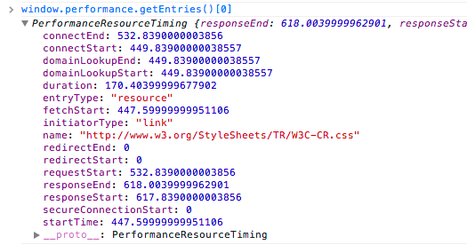
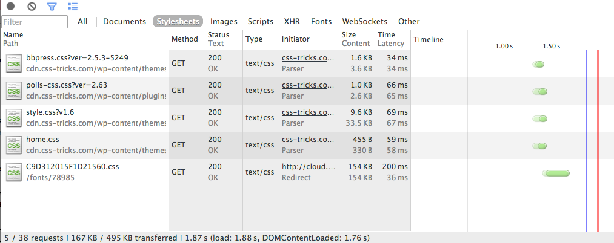
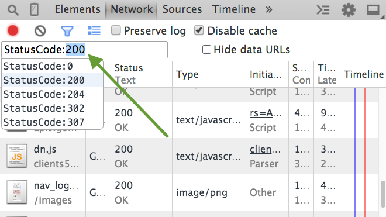
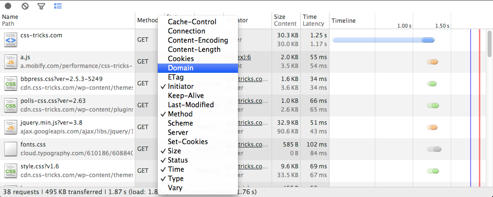
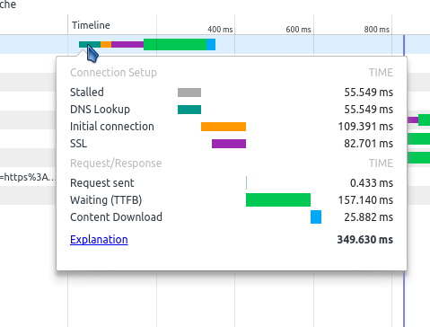
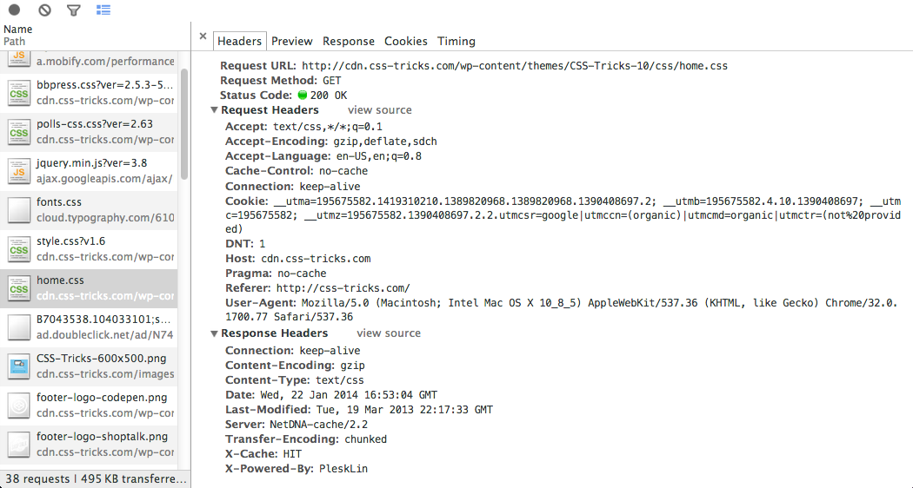
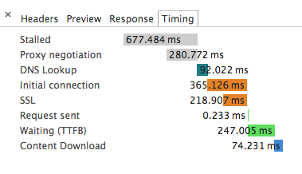

# 评估网络性能
关于您的每个应用程序的网络运营，包括详细的时序数据，HTTP请求和响应头，cookies，WebSocket的数据，以及更多的网络小组记录的信息。网络面板可帮助你解答您的Web应用程序的网络性能问题，如：
+ 其中资源最慢时间第一个字节？
+ 哪些资源加载（持续时间）的时间最长？
+ 是谁发起的特定网络请求？
+ 多少时间花费在各种网络阶段的特定资源？

##关于资源定时API

网络面板使用[资源计时API](http://www.w3.org/TR/resource-timing)，一个JavaScript API，提供详细的网络定时数据为每个加载的资源。例如，该API可以告诉你准确的图像HTTP请求启动时，被接收的图像的最后一个字节时。下图显示了资源定时API提供了网络定时的数据点。


该API可用于任何网页，而不仅仅是DevTools。在Chrome浏览器，它暴露了全球<code>window.performance</code>对象的方法。该<code>performance.getEntries（）</code>方法返回“资源定时对象”，一个页面上的每个请求的资源的数组。

试试这个：打开JavaScript控制台当前页面，输入以下的提示，并回车：
```javascript
window.performance.getEntries()[0]
```

试试这个：打开JavaScript控制台当前页面，输入以下的提示，并回车：





每个时间戳是微秒，即[ResolutionTime](http://www.w3.org/TR/hr-time/#sec-high-resolution-time)规范。此API可inChrome作为<code>window.performance.now（）</code>方法。

## 网络面板概述

网络面板会自动记录所有的网络活动，而DevTools是开放的。当你第一次打开面板时可能为空。刷新页面开始记录，或者干脆等待网络活动发生在你的应用程序中。


每个请求的资源被添加作为行到网络表，其中包含下面列出的列。请注意以下有关网络表：

+ 未在下面列出的所有列在默认情况下可见;您可以轻松地[显示或隐藏列](https://developer.chrome.com/devtools/docs/network#adding-and-removing-table-columns)。
+ 某些列包含主字段和次级领域（例如：时间和等待时间）。当观看网络表的[大资源行](https://developer.chrome.com/devtools/docs/network#changing-resource-row-sizes/)这两个领域都显示;使用小的资源行时只有主域显示。
+ 你可以通过单击列标题由列的值[排序](https://developer.chrome.com/devtools/docs/network#sorting-and-filtering)表。在[时间轴中列](https://developer.chrome.com/devtools/docs/network#timeline-view)的行为有所不同：单击其列标题显示的其他排序字段的菜单。见[瀑布景色](https://developer.chrome.com/devtools/docs/network#timeline-view)，[排序和过滤](https://developer.chrome.com/devtools/docs/network#sorting-and-filtering)的更多信息。

|||
|---|---|
|名称和路径|    该资源的名称和URL路径分别|
|方法|  用于请求的HTTP方法。例如：GET或POST|
|状态和文本|   HTTP状态代码和文本消息。|
|域名|    资源请求的域名。|
|类型|    MIME类型所请求资源的。|
|启动器|的对象或过程发起请求。它可以有以下值之一： |

>>|||
|---|---|
|分析器|   Chrome的HTML解析器发出请求|
|重定向|   一个HTTP重定向发起请求。|
|脚本|    脚本发起请求。|
|其他|   一些其他过程或动作发起的请求，例如用户通过链接导航到网页，或通过在地址栏中输入URL。 |

|||
|---|---|
|Cookies|    在请求传送Cookies数目。这些对应于Cookies标签查看细节对于给定的资源时显示的Cookies。
|Set-Cookies|    在HTTP请求中设置的Cookie的数目。|
|大小和内容|    大小是响应头（通常为几百个字节）加上响应主体的组合大小，作为交付服务器。内容是资源的解码的内容的大小。如果资源是从浏览器的缓存，而不是在网络上加载，这个字段包含文本（从缓存）。
|时间和等待时间|   时间是总的持续时间，从请求到收到响应中的最后一个字节的开始。延迟是加载的第一个字节中的响应的时间|
|时间表|   时间轴栏显示所有的网络请求的[视觉瀑布](hhttps://developer.chrome.com/devtools/docs/network#timeline-view)。单击该列的标题揭示了额外的[排序字段](https://developer.chrome.com/devtools/docs/network#sorting-and-filtering)的菜单。 |

## 在保存导航网络日志

默认情况下，当前的网络日志记录时，会导航到另一个页面，或者刷新当前页面丢弃。要保留日志记录在这些情况下，单击黑色 
保留日志在导航键不要在导航在网络面板底部保存日志;新记录被追加到表的底部。再次单击该按钮（红色
 保留在导航资源）来禁用日志保存。


## 排序和过滤


默认情况下，在网络表的资源是由每个请求（在网络“瀑布”）的开始时间进行排序。您可以通过单击列标题排序表由另一列值。再次单击该标题更改排序顺序（升序或降序）。


时间轴列是别人的独特之处，点击后，会显示额外的排序字段的菜单。


该菜单包含以下排序选项：

+ **时间轴** - 排序由每个网络请求的开始时间。这是默认的排序，并且是相同的开始时间选项排序）。
+ **开始时间** - 由每个网络请求的开始时间排序（同样如由时间轴选项排序）。
+ **响应时间** - 通过排序每个请求的响应时间。
+ **结束时间** - 通过排序时，每个请求完成的时间。
+ **持续时间** - 排序由每个请求的总时间。
+ **延迟** - 排序由请求的开始和响应的开始之间的时间（也被称为“时间到第一个字节”）。

要过滤的网络表，只显示某些类型的资源，单击内容类型之一沿着面板的底部：**文档，样式表，图片，脚本，XHR，字体的WebSockets和其他**。在下面的截图只CSS资源显示。要查看所有内容类型，单击全部过滤器按钮。





## 高级过滤

除了资源类型过滤，可以过滤查询缩小资源。在过滤器输入字段200：例如，要查找其中有200状态码的**所有资源**，你可以输入查询的StatusCode。



请注意以下行为：过滤器查询包含一个类型（的StatusCode）和价值（200）。过滤器查询是不区分大小写，所以你可以键入大写或小写。该过滤器类型为您提供了自动完成建议。使用箭头键来形成一个选择，然后按<code>Tab</code>键选择它。该过滤器值具有自动完成这表明你重视存在于当前的网络记录。快速预览您的查询的结果，使用<code>Up</code>/<code>Down</code>箭头键循环通过自动完成建议。结果立即出现，即使你不按Enter键或选项卡来完成选择。否定过滤器的查询，在前面加上一个破折号查询（ - ），例如-StatusCode：200。

可用过滤器类型：

|||
|---|---|
|域|    从资源的URL的域部分。例如www.google-analytics.com。
|具有响应头|   检查资源都有一个响应头，无论该值的。例如访问 - 控制 - 允许原产地。|
|是|    显示在当前时间点运行的请求。当前可用值：运行|
|降幅高于|    示出了具有传输大小比规定量更大的请求。假设单位以字节为单位，但千字节（K）和兆（M）的单位也被允许：例如：较大比：50，降幅高于：150K，降幅高于：20M |
|方法|    HTTP方法使用。例如GET。|
| MIME类型|    也被称为内容类型 - 的标识符的资源的类型。例如text / html的。|
|方案|    在URL方案部分。例如HTTPS。
|设置cookie的名称|   Cookie的名称服务器设置。例如的loggedIn（假设类似的loggedIn = TRUE一个cookie）。|
|设置cookie的值|   该cookie由服务器设置的值。例如真正的（假定喜欢的loggedIn = TRUE一个cookie）。|
|设置Cookie域|   cookie的域名服务器设置为。例如foo.com（假设类似的loggedIn =cookie真;域= foo.com;路径= /;过期=周三，2021年1月13日22时23分01秒格林尼治标准​​时间;仅Http）。|
|状态代码|    在HTTP响应中的状态代码。例如200 |

使用上面列表中显示的查询，构建它的格式为：<过滤器类型>：<说明>。你几乎总是要使用自动完成建议可确保您的查询有效。

## 添加和删除表中的列

您可以通过改变网络表显示的列的默认设置。要显示或隐藏列，右键+单击或控制+单击（仅限Mac）在表头，然后选择或从列表中取消选择列名。



## 改变资源行大小

你可以用较大的资源行（默认），或小的资源行查看网络表。点击蓝色的

 用小资源行切换按钮，小行的资源在面板底部，查看小行。点击该按钮（现灰色的

大资源行）再次查看大资源行。大型行启用一些列，以显示两个文本字段：一次场和二次场（时间和等待时间，例如）。当观看小行只有主域显示。


## 瀑布视图

在网络面板瀑布查看图形花加载每个resource.From HTTP请求到接收到响应的最后一个字节的开始的时间。

每个资源加载时间被表示为一栏。这具有与每个资源颜色编码的信息。每种颜色指定收到资源需要不同的步骤。Bar增长较大的代表正在为trasmitted请求更多的数据。

该网络的时间表一个简单的网页。


将鼠标悬停在该栏本身会呈现完整的时序数据。这就是会呈现在[时序的详细信息](https://developer.chrome.com/devtools/docs/network#resource-network-timing)选项卡给定资源的相同信息。



网络定时信息披露上徘徊

你可以使在网络设置，以查看时间表作为颜色编码的由资源类型。如果你做网络定时信息仍然是通过提示访问。瀑布杆被颜色编码，如下所示：

<table>
<tr>
<td style="background: rgba(47, 102, 236, 0.6) none repeat scroll 0% 0%;">
</td>
<td>文件</td>
</tr>
<tr><td style="background: rgba(157, 231, 119, 0.6) none repeat scroll 0% 0%;"></td><td>样式表</td>
</tr>
<tr><td style="background: rgba(164, 60, 255, 0.6) none repeat scroll 0% 0%;"></td><td>图片</td></tr>
<tr><td style="background: rgba(255, 121, 0, 0.6) none repeat scroll 0% 0%;"></td><td>
脚本</td></tr>
<tr><td style="background: rgba(231, 231, 10, 0.6) none repeat scroll 0% 0%;"></td><td>XHR</td></tr>
<tr><td style="background: rgba(255, 82, 62, 0.6) none repeat scroll 0% 0%;"></td><td>字体</td></tr>
<tr><td style="background: rgba(187, 187, 188, 0.6) none repeat scroll 0% 0%;"></td><td>其他</td></tr>
<\table>

|||
|---|----|
|||

## 保存和复制网络信息

<code>右键单击</code>或<code>Ctrl+单击（仅限Mac）</code>上下文菜单出现的几个动作网络表内。鼠标点击其中的一些动作适用于资源区（如[复制HTTP请求头](https://developer.chrome.com/devtools/docs/network#copying_requests_as_curl_commands)），而另一些适用于整个网络的记录（如保存[网络记录作为一个HAR文件](https://developer.chrome.com/devtools/docs/network#saving_network_data)）。


下面的菜单操作应用到选定的资源：


+ **打开链接在新标签页** - 在打开新标签页中的资源。您也可以双击网络表中的资源名称。
+ **复制链接地址** - 复制资源URL到系统剪贴板。
+ **复制请求头** - 复制HTTP请求头到系统剪贴板。
+ **复制响应头** - 复制HTTP响应头到系统剪贴板。
+ **复制为卷曲** - 复制网络请求作为一个[cURL](http://curl.haxx.se/)命令字符串到系统剪贴板。请参阅[复制请求作为卷曲的命令](https://developer.chrome.com/devtools/docs/network#copying-requests-as-curl-commands)。
+ **重播XHR** - 如果相关请求是一个XMLHttpRequest，重新发送原始XHR。

## 复制请求作为卷曲的命令


[cURL](http://curl.haxx.se/)是一个命令行工具，用于对HTTP事务。网络面板的复制为卷曲命令创建一个HTTP请求（包括HTTP头，SSL证书和查询字符串参数），并将其副本卷曲命令字符串复制到剪贴板。然后，您可以粘贴串入一个终端窗口（与卷曲的系统上）执行相同的请求。

下面是来自谷歌新闻主页上XHR请求采取的一个例子cURL命令行字符串。

```javascript
curl 'http://news.google.com/news/xhrd=us' -H 'Accept-Encoding: gzip,deflate,:sdch' -H 'Host: news.google.com' -H 'Accept-Language: en-US,en;q=0.8' -H 'User-Agent: Mozilla/5.0 (Macintosh; Intel Mac OS X 10_8_3) AppleWebKit/537.36 (KHTML, like Gecko) Chrome/29.0.1510.0 Safari/537.36' -H 'Accept: */*' -H 'Referer: http://news.google.com/nwshp?hl=en&tab=wn' -H 'Cookie: NID=67=eruHSUtoIQA-HldQn7U7G5meGuvZOcY32ixQktdgU1qSz7StUDIjC_Knit2xEcWRa-e8CuvmADminmn6h2_IRpk9rWgWMdRj4np3-DM_ssgfeshItriiKsiEXJVfra4n; PREF=ID=a38f960566524d92:U=af866b8c07132db6:FF=0:TM=1369068317:LM=1369068321:S=vVkfXySFmOcAom1K' -H 'Connection: keep-alive' --compressed
```

## 节省网络数据

您可以从网络记录作为HAR（[HTTP Archive](http://www.softwareishard.com/blog/har-12-spec/)）文件保存数据，或记录复制为HAR数据结构到剪贴板。一个HAR文件包含一个JSON数据结构，描述了网络的“瀑布”。一些[第三方工具](http://ericduran.github.io/chromeHAR/)可以从HAR文件中的数据重建网络的瀑布。

**要保存记录：**

1. 右键+单击或控制+单击网络表。
2.  在出现的快捷菜单中，选择下列操作之一：
       + 所有的复制为HAR - 复制网络记录在HAR格式的系统剪贴板。
       + 另存为HAR与内容 - 保存所有网络数据到HAR文件以及每个页面资源。二进制资源，包括图像，编码为Base64编码的文本。


欲了解更多信息，[Web性能电动工具：HTTP存档（HAR）](http://www.igvita.com/2012/08/28/web-performance-power-tool-http-archive-har/)。

## 网络资源的详细信息

当您单击网络表的资源名称出现一个选项卡式窗口，其中包含以下其他详细信息：

+ [ HTTP请求和响应头](https://developer.chrome.com/devtools/docs/network#http-headers)
+  [资源预览](https://developer.chrome.com/devtools/docs/network#resource-previews)
+  [HTTP响应](https://developer.chrome.com/devtools/docs/network#http-response)
+  [Cookie的名称和值](https://developer.chrome.com/devtools/docs/network#cookies)
+  [WebSocket的消息](https://developer.chrome.com/devtools/docs/network#websocket-frames)
+  [资源网络定时](https://developer.chrome.com/devtools/docs/network#resource-network-timing)


## HTTP头

标题标签显示资源的请求的URL，HTTP方法和响应状态代码。此外，它列出了HTTP响应和请求头和它们的值，以及任何查询字符串参数。您可以查看HTTP标头解析和格式化，或者点击查看解析/查看源代码切换按钮，分别毗邻每个标题的一节他们的源代码形式。您还可以查看自己的解码或URL编码形式的参数值，点击查看解码/查看URL编码切换按钮旁边的每个查询字符串部分。



您也可以[请求和响应头复制](https://developer.chrome.com/devtools/docs/network#saving-network-data)到剪贴板。

## 资源预览

预览选项卡显示资源，当可用的预览。预览当前显示图像和JSON资源，如下所示。


您可以查看该资源的上[Responseta](https://developer.chrome.com/devtools/docs/network#http-response)b格式化响应。

## HTTP响应


响应选项卡包含资源的未格式化的内容。下面是被返回作为用于请求的响应，一个JSON数据结构的屏幕截图。


您还可以查看一些资源类型[格式预览](https://developer.chrome.com/devtools/docs/network#resource-previews)，包括JSON数据结构和图像。

## Cookies

Cookies标签显示所有在theresource的HTTP请求和响应头发送的cookie的表。您也可以清除所有的cookies。


Cookie表包含以下几列：

|||
|----|----|
|Name|    cookie的名称。|
|Value|   该cookie的值。|
|Domain|    该域的cookie属于。|
|Path|   该URL路径的cookie是从哪里来的。|
|Expires / Max-Age|    cookie的值届满或者max-age的性能。|
|Size|    以字节为饼干的大小。|
| HTTP|    这表明，该cookie应仅由在HTTP请求的浏览器进行设置，并且不能用JavaScript访问。|
|Secure|    此属性的存在表明该cookie只应通过安全连接被发送。|

## WebSocket的框架


帧标签显示发送或接收通过WebSocket连接的消息。此选项卡才可见当选定的资源发起的WebSocket连接。该表包含以下几列：

|||
|---|---|
|Data| 消息负载。如果消息是纯文本，它显示在这里。对于二进制操作码，这个字段显示操作码的名称和代码。下面的操作码的支持：|
|| 延续架|
|| 二元框架|
|| 连接关闭框架|
||平架|
||傍框架|
|Length|以字节为单位的消息的有效载荷的长度|
|Time|  时间戳时创建的消息|


消息是彩色编码根据其类型。即将离任的文本信息颜色编码浅绿色;收到的短信均为白色：


WebSocket的操作码是浅黄色：


错误是浅红色。


**关于当前实施的注意事项：**

 +   要刷新的帧数表中的新邮件到达后，点击左侧的资源名称。
 +   只有最后100的WebSocket消息由帧表保留。

## 资源网络定时

定时图表选项卡上度过涉及加载资源的各种网络阶段的时间。这显示了相同的数据，当您在在[瀑布](https://developer.chrome.com/devtools/docs/network#timeline-view)查看资源吧悬停。



|||
|---|---|
|Stalled/Blocking|时间请求花在等待它可以被发送之前。这一次是包容的代理谈判花费任何时间。此外，这一次将包括当浏览器正在等待一个已经建立的连接，成为可再利用，服从Chrome的[最高每产地来源规则](https://code.google.com/p/chromium/issues/detail?id=12066)TCP连接。|
|Proxy Negotiation|花费的时间与代理服务器的连接进行谈判。|
|DNS Lookup|花费的时间进行DNS查询。页面上的每一个新的领域，需要一个完整的往返做DNS查找。|
|Initial Connection / Connecting|花费的时间来建立连接，包括TCP握手/重试和谈判中的SSL。|
|SSL|花费的时间完成SSL握手。|
|Request Sent / Sending|花费的时间发出网络请求。通常一毫秒的一小部分。|
|Waiting (TTFB)|花费的时间等待的初始响应，也被称为时间至第一字节。此时捕获往返于除时间服务器的等待时间花费等待服务器提供的响应。|
|Content Download / Downloading|花费的时间接收响应数据。|

##其他资源

要了解更多信息优化应用程序的网络性能，请参阅以下资源：

+  使用[PageSpeed洞察](https://developers.google.com/speed/pagespeed/insights)，以确定可以应用到你的[网站PageSpeed优化工具](https://developers.google.com/speed/pagespeed/optimization)性能的最佳实践，并自动将这些最佳实践的过程。
+  [在谷歌Chrome浏览器的高性能网络讨论](http://www.igvita.com/posa/high-performance-networking-in-google-chrome/)的Chrome网络内部以及如何利用它们来使您的网站更快。
+  [如何gzip压缩的工作](https://developers.google.com/speed/articles/gzip)提供了一个高层次的概述gzip压缩和为什么它是一个好主意。
+  [Web性能最佳实践](https://developers.google.com/speed/docs/best-practices/rules_intro)提供了优化您的网页或应用程序的网络性能的其他提示。


