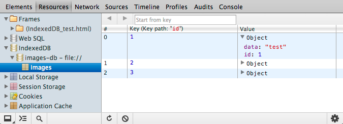
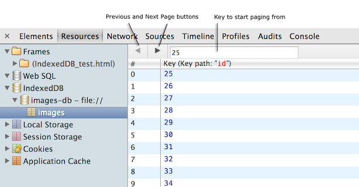
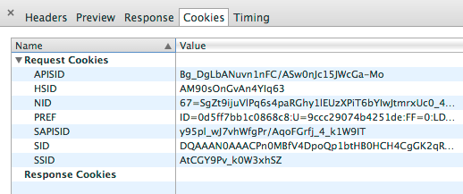
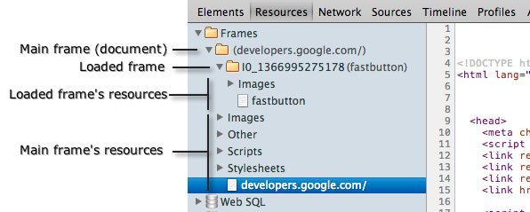
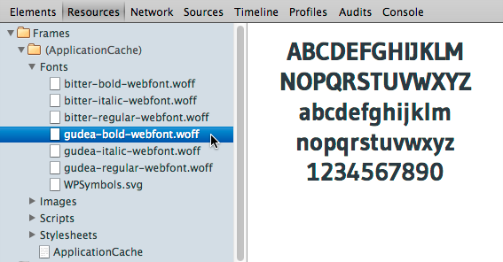
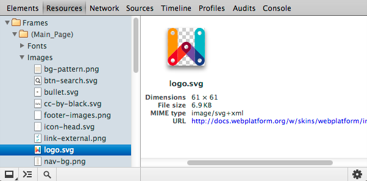
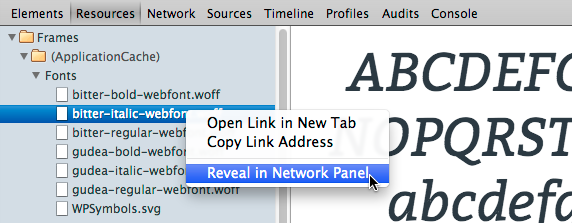

# 管理应用存储空间

Resources 面板允许你检查应用程序的本地资源，包括 IndexedDB， Web SQL 数据库，本地和会话(session)存储，cookies，以及应用缓存资源。你也可以快速可视化检查应用资源，包括图片、字体、以及样式表。

## IndexedDB

你可以通过一个对象存储记录来审查你的 IndexedDB 数据库和对象的存储状况及相关页面，并且能够清除对象存储的记录。

- **要查看可用的数据库列表**，请展开 IndexedDB 目录。
- **要查看数据库对象的存储状况**，在可用的数据库列表中选中它。

**如果以页面的方式查看对象存储状况**，点击 <button>Previous</button> 或者 <button>Next Page</button> 按钮。你也可以通过指定记录的键来选定记录的起始分页。

**如果要清除对象存储区**，下面有两个方法：
- 使用面板底部的按钮。
- 右键点击或者按住 <kbd>Control</kbd> 键然后点击对象存储区然后在 Context （上下文） 菜单中选择 **Clear** 。

**要查看数据库的属性**，在数据库列表中选中它即可。

## Web SQL

你可以检查 Web SQL 数据库的内容，并且对其使用 SQL 命令。

- **要浏览可用的 Web SQL 数据库**，以树形结构展开 Web SQL 选项。
- **要浏览数据库中可用的表**，展开数据库子树即可。
- **要浏览表的记录**，选中表。它的属性会在右边的面板中显示。
- **要刷新数据库的视图**，点击面板底部的刷新按钮。

你可以使用 SQL 命令来执行查询 Web SQL 数据库，并且能以表格格式查看查询结果。当你输入一条命令或者表名的时候， DevTools 会提供代码提示来告诉你支持的 SQL 命令和语句，以及数据库中含有的全部表的名称。

**如果要在数据库上执行 SQL 命令**：

1. 选择包含你想查询的表的数据库。
2. 在右侧面板中显示的提示符下，输入你想执行的 SQL 语句。

## Cookies

cookies 资源选项卡允许你查看由 HTTP 头或者 JavaScript 所创建的 cookies 的详细信息。你可以清除特定域名下的个别 cookies，或者全部 cookies。

当你展开 Cookies 目录的时候，它会显示主文档下域名的列表以及全部加载的框架。选中“框架组”中的一条会显示其全部的 cookies，包括那个框架下的全部资源。这种分组有两个需要注意的地方：

- 源自不同域名的 cookies 可能显示在一个组中。
- 相同的 cookie 可能出现在几个组中。

选定组中的 cookie 会显示下列字段：

- Name - cookie 的名称。
- Value - cookie 的值。
- Domain - cookie 使用的域名。
- Path - cookie 对应的路径。
- Expires / Maximum Age - cookie 的过期时间，或者说是最大生命周期。对于会话 cookie，这个字段始终是 “Session”。
- Size - cookie 包含的数据的大小，以字节为单位。
- HTTP - 如果显示了，就表示 cookies 应该只通过 HTTP 来使用，并且 JavaScript 不能对其做出修改。
- Secure - 如果显示了，表明该 cookie 的通信唯有加密时才能传输。

你可以清除（删除）单个 cookie，选定组中的全部 cookie，或者某一个特定域名下的全部 cookie。如果给定的一个域名下的同一个 cookie 被两个组引用，删除该域名下所有的 cookie 会影响到这两个组。

**要清除单个 cookie**，可以选择下列两种方式之一：

- 选择表中的一个 cookie，然后点击面板底部的删除按钮。
- 右键点击某个 cookie 并选择 Delete。

**要清除特定组中的全部 cookie** 有以下几种方式：

- 点击资源面板底部的清除按钮。
- 右键点击框架组并在菜单中选择 **Clear**。
- 右键点击表中某行 cookie 然后选择 **Clear All**。

**要清除特定域名下的全部 cookie**：

- 键盘右键 + 点击（或者 Ctrl + 点击）特定域名的表中的一条 cookie。
- 在上下文菜单中，选择 **Clear All from domain**，domain 指的是目标域名。

对于该操作请注意以下事项：

- 只有在完全相同的域名下的 cookie 会被删除的；子域名或者顶级域名是不受影响的。
- 这只适用于 cookies 表中可见的域名。

你也可以刷新表来查看页面 cookie 的变化。

**要刷新 cookie 表**，点击资源面板底部的刷新按钮。

## 应用缓存

你可以检查 Chrome 已经缓存的资源，这些资源由当前文档指明的的应用缓存清单文件来决定。你可以查看程序应用缓存的当前状态（比如，空闲状态或者下载状态），以及浏览器的连接状态。（联机或者脱机）

已加载的资源会以表的形式显示，表中每个资源都包含以下属性：

- Resource - 资源的 URL。
- Type - 已加载的资源类型，可能含有下列值：

  - Master - 由于该资源的 [配置]( The resource was added to the cache because its manifest attribute indicated that this was its cache.) 属性表明它是缓存所以将该资源放到缓存中。
  - Explici - 该资源是显式列在应用缓存清单上的。
  - Network - 该资源是作为一个网络接入点列在应用缓存清单上的。
  - Fallback - 如果该资源无法访问则被指定为 fallback（回退）。

- Size - 缓存资源的大小。

Resources 面板上利用不同颜色的图标（绿，黄，红）来显示应用缓存的当前[状态](http://www.whatwg.org/specs/web-apps/current-work/#dom-appcache-status)。下面试可能出现的状态值以及相应的描述：

| 状态 | 描述 |
| --- | ---- |
|  空闲 | 应用缓存处于空闲状态 |
|  检查 | 正在载入配置文件并且检查更新 |
|  下载 | 资源清单发生改变，新的资源正在下载并添加到缓存中 |
|  更新准备 | 新版本的应用缓存已经可以使用了 |
|  过期 | 应用缓存组已经过期 |

### 本地以及会话存储

本地以及会话存储面板允许你浏览、编辑、创建和删除使用 [Web Storage API](http://www.w3.org/TR/webstorage/) 创建的本地和会话存储键值对。

**要删除键值对**，可采用下列方式之一：

- 选中表中的数据，然后执行下列操作之一：

  1. 点击 Delete 按钮。
  2. 按键盘的删除键。

- 右键点击或者按住 Control 再点击数据项然后选择 Delete。

**要添加键值对**：

- 双击键表中的空行然后输入键的名称。
- 双击该行中相应的值然后输入键对应的值。

**要编辑已有的键值对**，采取下列操作之一：

- 双击你要编辑的位置。
- 右键点击或者按住 Control 再点击你想要编辑的数据然后选择 Edit。

**要刷新表中的数据**，点击面板底部的刷新按钮。

## 检查页面资源

你可以查看主文档的资源，包括图片、脚本、字体以及所有加载项。页面资源的顶级目录是文档项，包括主要的文档，以及嵌套的项。

你可以展开某一项来查看按类型组织的资源，展开某个类型来查看该类型的所有资源，以及选中某一资源在右边面板中预览其状态。下面是一个字体资源的预览：

图片预览包括了维度、文件大小、MIME 类型以及图片 URL 等信息。

小提示：

- **要打开网络面板中的资源**，右键点击或者按住 Control 再点击相应资源然后选择 **Reveal In Resources Panel**。在该菜单中你就可以将资源的 URL 复制到系统的剪贴板中，或者是在新的选项卡中打开它。

- **要查看嵌套项中对应的盒子模型的边界**，将鼠标悬停在资源面板的某一项之上即可。

以上内容适用于 [CC-By 3.0 license](http://creativecommons.org/licenses/by/3.0/)