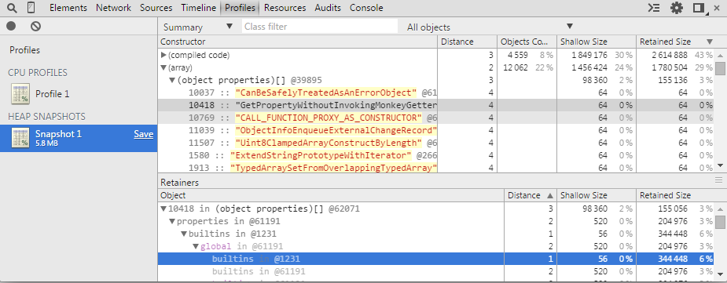
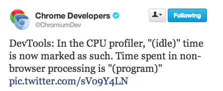
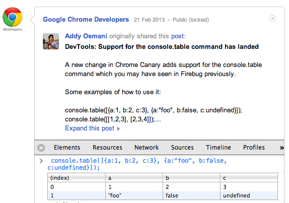
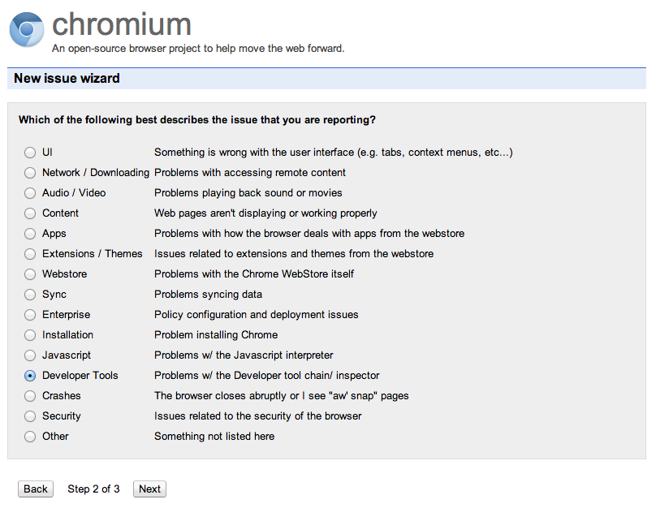

# 谷歌浏览器开发工具综述
谷歌开发工具(以下用开发者工具简称），是基于谷歌浏览器内含的一套网页制作和调试工具。开发者工具允许网页开发者深入浏览器和网页应用程序的内部。该工具可以有效地追踪布局问题，设置 JavaScript 断点并可深入理解代码的最优化策略。

>
注意：如果你是一个网页开发者同时想要获得最新版本的开发工具，那么你应该使用[谷歌浏览器（金丝雀）Canary 版](https://www.google.com/
intl/en/chrome/browser/canary.html)。

## 使用开发工具

要使用开发工具，直接打开一个网页或者谷歌浏览器的一个网页应用。另一种方式：

* 选择浏览器位于浏览器窗口右上方的菜单栏的**工具目录**，选择**开发者工具选项**。

* 右击页面任何位置并选择**审查元素**。

开发工具将会在浏览器的下方打开。

有一些快捷键也可以用来打开开发工具：
`Ctrl` + `Shift` + `I` ( 或在 Mac 上使用 `Cmd` + `Opt`+ `I`)。

`Ctrl` + `Shift` + `J` ( 或在 Mac 上使用 `Cmd` + `Opt` + `J`) 打开开发者工具同时集中焦点于控制台。

`Ctrl` + `Shift` + `C` (或在 Mac 上使用 `Cmd` + `Shift` + `C`) 在审查模式下打开开发者工具或是在开发者工具已经打开的情况下开启查阅选项。

[学习使用快捷键](https://developer.chrome.com/devtools/docs/shortcuts)可以为你每天的工作流节省时间。

## 开发者工具窗口
开发者工具窗口的顶部工具栏中排列着任务相关的组。每个工具栏项目和相应的面板让你能够使用网页或应用程序的特定信息来工作，包括 DOM 元素，资源，和源。

图为开发者工具中的颜色选择器。

总体而言，有八个主要的工具可供查看开发工具：

- [元素](https://developer.chrome.com/devtools/docs/dom-and-styles)

- [资源](https://developer.chrome.com/devtools/docs/resource-panel)

- [网络](https://developer.chrome.com/devtools/docs/network)

- 源

- [时间表](https://developer.chrome.com/devtools/docs/timeline)

- [简介](https://developer.chrome.com/devtools/docs/profiles)

- 审核

- [控制台](https://developer.chrome.com/devtools/docs/console)

你可以使用 `Ctrl` + `[` 和 `Ctrl` + `]` 快捷键在面板之间移动。

## 查阅 DOM 和格式
[元素面板](https://developer.chrome.com/devtools/docs/dom-and-styles)让你看到一个 DOM 树的全部相关信息，并允许你检查以及在传输过程中编辑 DOM 元素。当你需要确认页面某些方面的 HTML 代码段时，你会经常访问元素标签。例如，你对图像的 HTML id 属性和值是什么感到好奇的时候。

在 DOM 中查看标题元素。

[阅读更多关于查阅DOM和格式](https://developer.chrome.com/devtools/docs/dom-and-styles)

## 利用控制台进行工作

[JavaScript 控制台](https://developer.chrome.com/devtools/docs/console)为开发者提供了测试 Web 页面和应用程序两个主要功能,其中包括：

* 在开发过程中记录诊断信息。

* 一个可与文档和工具交互的 shell 提示符。

您可以使用控制台编程接口提供的[方法](https://developer.chrome.com/devtools/docs/console-api)来记录诊断信息。如 [Console.log()](https://developer.chrome.com/devtools/docs/console-api#consolelogobject-object) 或 [Console.profile()](https://developer.chrome.com/devtools/docs/console-api#consoleprofilelabel)。

您可以直接在控制台中评估表达式，并使用[命令行提供的方法](https://developer.chrome.com/devtools/docs/commandline-api)。这些包括使用 [$()](https://developer.chrome.com/devtools/docs/commandline-api#selector) 命令选择元素或通过 [profile()](https://developer.chrome.com/devtools/docs/commandline-api#profilename) 方法启动 CPU 分析器命令。

在 JS 控制台上评估一些命令。

[阅读更多关于工作的控制台](https://developer.chrome.com/devtools/docs/console)

## JavaScript 的调试
由于 JavaScript 应用程序**复杂性**的增加，开发商需要强大的调试工具来帮助开发者快速发现问题的原因和并找出有效的解决方法。Chrome 开发工具包含了一些有用的工具来使得**调试** JavaScript 更加轻松。

一个在控制台输出日志的条件断点。

[阅读更多关于如何应用调试工具调试JavaScript](https://developer.chrome.com/devtools/docs/javascript-debugging)

## 提高网络性能
**网络**面板提供了有关已经下载和加载过的资源的详细分析。在优化页面的基本过程中，确定和找到那些请求这一步通常要比预花费更多时间。

网络请求的上下文菜单。

[想了解更多关于如何提高你的网络性能的知识，请点击](https://developer.chrome.com/devtools/docs/network)

## 审核
审计面板可以像加载页面时那样分析一个页面。然后提供关于减少页面加载时间的建议和优化，以此提高感知（和真实）的响应。要进一步的了解该功能，我们推荐使用 [pagespeed](https://developers.google.com/speed/pagespeed/insights/) 。

审计的建议。

## 提高渲染性能
在加载和使用你的网页应用程序或网页时，**时间轴**面板给你关于时间开销的完整概述。包括从加载资源到解析 JavaScript，以及计算方式在内的所有事件，都会重新绘制在一个时间表中。

一个有着多种时间的时间轴示例。

[阅读更多关于如何提高渲染性能](https://developer.chrome.com/devtools/docs/timeline)

## JavaScript 和 CSS 的性能
**配置**面板允许您为网络应用程序或页面配置执行时间和内存使用量。这些有助于你理解资源的消耗，以帮助你优化你的代码。提供的分析器有：

* **CPU 分析器**会显示你页面上的 JavaScript 函数的执行时间
* **堆内存分配器** 显示页面的 JavaScript 对象和 DOM 节点。
* **JavaScript** 配置文件会显示脚本的执行时间。

堆快照的示例。

[阅读更多关于使用JavaScript和CSS如何提高性能](https://developer.chrome.com/devtools/docs/profiles)

## 监视存储
**资源**面板允许你监视页面中加载的资源。它可以让你使用 HTML5 的本地存储，数据库，缓存，appcache，等。

[Web Starter Kit](https://developers.google.com/web/tools/starter-kit/) 的 JavaScript 文件会显示在资源面板中。

[要阅读更多关于监视存储的内容，请点击](https://developer.chrome.com/devtools/docs/resource-panel)

## 进一步阅读
还有一些其他的开发工具文档内容，这些内容会有对你有用的东西。具体包括：

* [堆分析](https://developer.chrome.com/devtools/docs/heap-profiling)
* [中央处理器](https://developer.chrome.com/devtools/docs/cpu-profiling)
* [设备模式与移动仿真](https://developer.chrome.com/devtools/docs/device-mode)
* [远程调试](https://developer.chrome.com/devtools/docs/remote-debugging)
* [视频工具](https://developer.chrome.com/devtools/docs/videos)

## 更多资源

### 获得更多

您也可以在 [@chromiumdev](https://twitter.com/ChromiumDev) 上寻求我们的帮助或使用[论坛](https://groups.google.com/forum/?fromgroups#!forum/google-chrome-developer-tools)问个问题。

在控制台中的样式输出。

确定在 [Google+](https://plus.google.com/+GoogleChromeDevelopers/posts) 上检查谷歌浏览器开发页面。

### 参与

提交一个bug错误或工具的特征请求，请在 [http://crbug.com](https://code.google.com/p/chromium/issues/list) 使用问题追踪。请同时提到“工具”的错误总结中。

[crbug.com](https://code.google.com/p/chromium/issues/list) 的错误报告类选择器。

请直接[回馈](https://developer.chrome.com/devtools/docs/contributing)给我们以让开发者工具变得更好。

### 调试扩展

想使用工具来调试 Chrome 扩展插件？观看[开发和调试扩展插件](http://www.youtube.com/watch?v=IP0nMv_NI1s)。该教程也可以用于[调试](https://developer.chrome.com/extensions/tut_debugging)。

以上内容可在 [CC-By 3.0](http://creativecommons.org/licenses/by/3.0/) 许可证下使用。

