# 在安卓设备上使用 Chrome 远程调试功能

你的网页内容在移动设备上的体验可能和电脑上完全不同。Chrome DevTools 提供了远程调试功能，这让你可以在安卓设备上实时调试开发的内容。

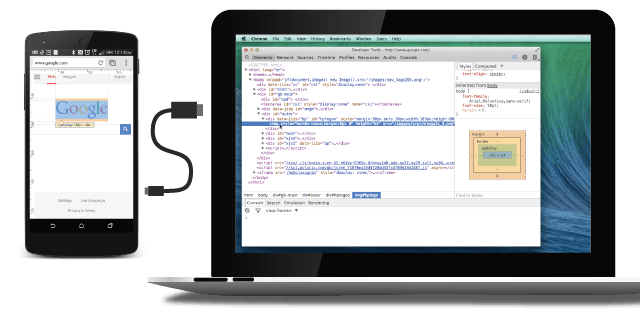

安卓远程调试支持：

- 在[浏览器选项卡](#debugging-tabs)中调试网站。
- 在原生安卓应用中调试[网页内容](#debugging-webviews)。
- 将屏幕从你的安卓设备上[投影](#screencasting)到你的开发机器上。
- 使用[端口转发](#port-forwarding)和[虚拟主机映射](#virtual-host-mapping)来让安卓设备访问开发使用的服务器。

## 需求

要开始远程调试，你需要：

- 安装 Chrome 32 或者之后的版本。
- 连接安卓设备用的 USB 线缆。
- 对于**通过浏览器调试**：安卓 4.0 以上并且安装了 [Chrome for Android](https://play.google.com/store/apps/details?id=com.android.chrome&hl=en)。
- 对于**通过应用调试**：安卓 4.4 以上并且应用包括[可用于调试的](https://developer.chrome.com/devtools/docs/remote-debugging#debugging-webviews) WenView 组件。

>**提示**：远程调试需要你电脑端的 Chrome 版本要高于安卓端的版本。想更好地使用此功能，请使用电脑端的 [Chrome Canary](https://www.google.com/intl/en/chrome/browser/canary.html) （Mac/Windows） 或者 [Dev channel](http://www.chromium.org/getting-involved/dev-channel) 发行版（Linux）。

如果使用远程调试的时候出现了问题，请参考 [Troubleshootling](https://developer.chrome.com/devtools/docs/remote-debugging#troubleshooting)。

## 设置安卓设备

请按照以下说明来设置安卓设备：

### 1. 打开 USB 调试选项

在安卓设备上，进入设置>开发者选项。

 <br>
<span style="color:gray">设置页面的开发者选项</span>

>**注意**：在安卓 4.2 及以后的版本中，默认情况下开发者选项是隐藏的。要启用开发者选项，选择**设置**>**关于手机**然后点击版本号7次。


-

在**开发者选项**中，选中 **USB 调试**复选框。

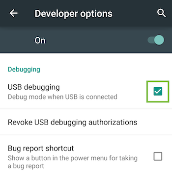<br>
<span style="color:gray">在安卓上启用 USB 调试</span>

之后会有一个警告，提示你是否要开启 USB 调试模式。选择 **OK**。

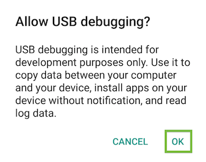

### 2. 连接你的设备

将你的安卓设备和电脑用 USB 线连接起来。

>**注意**：如果你在 Windows 下进行开发，那么你需要为你的安卓设备安装驱动。具体可以参考安卓开发者网站上的 [OEM USB Drivers](http://developer.android.com/tools/extras/oem-usb.html)


## 在 Chrome 中找到设备

在安卓设备上设置好远程调试后，在 Chrome 中找到你的设备。

在电脑端的 Chrome 里，在地址栏输入 **chrome://inspect**。进入后确认 **Discover USB devices** 已经勾选了：

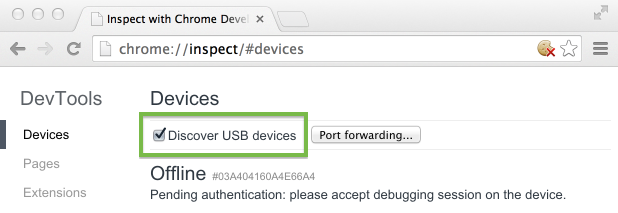<br>
<figcaption>**提示**：你也可以从 Chrome menu > More tools > Inspect Devices 来进入 chrome://inspect</figcaption>

在你的设备上，会跳出一个警告，告诉你是否要允许在电脑端进行 USB 调试。选择 **OK**。

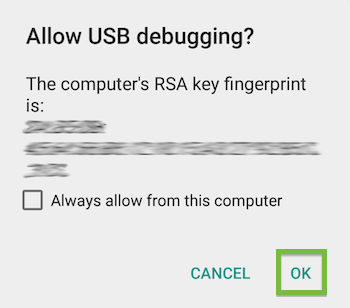<br>
<span style="color:gray">**提示**：如果希望以后不再弹出系那个管提示，勾选 **Always allow from this computer**</span>

>**注意**：在远程调试时， Chrome 会阻止你的设备进入休眠状态。该特性对于调试相当有用，但在安全性上有所欠缺。所以在调试的时候要注意看好你的手机！

在电脑端，打开选项卡并启用 WebViews 调试后，**chrome://inspect** 页面会显示全部已连接的设备。

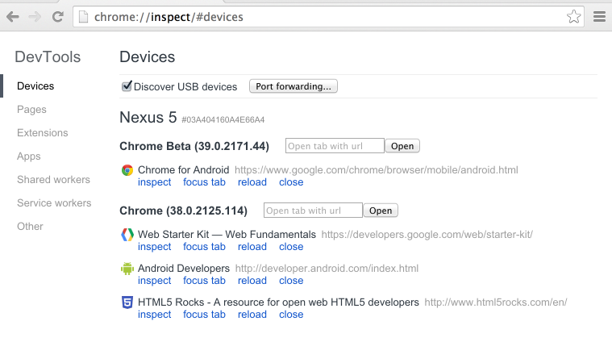<br>
<span style="color:gray">从 chrome://inspect 也卖弄查看已连接的设备</span>

如果从 chrome://inspect 页面查找设备时遇到了问题，请参考 [Troubleshooting](https://developer.chrome.com/devtools/docs/remote-debugging#troubleshooting) 章节。


<a name="debugging-tabs"></a>
## 调试远程浏览器

在页面 **chrome://inspect** 上，你可以加载 DevTools 并且调试你的远程浏览器。

要开始调试，请点击你希望调试的浏览器选项卡下面的 **inspect**。

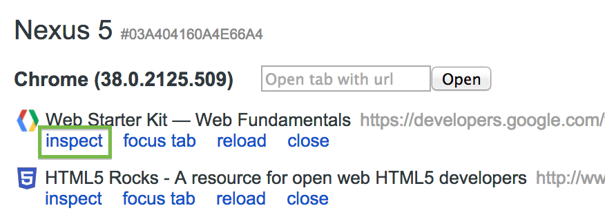

接着你的电脑会加载新的 DevTools。在新的 DevTools 上，你可以在你的安卓设备上和选中的浏览器实时交互。

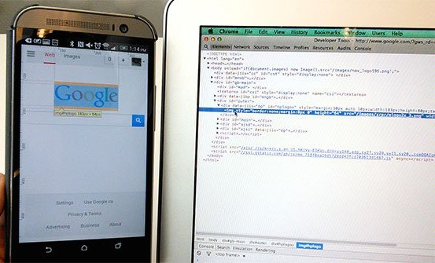<br>
<span style="color:gray">通过电脑上的 DevTools 来调试安卓手机上的网页</span>

比如，你可以在你的设备上使用 DevTools 来监审查网页元素：

- 当你的鼠标悬浮在 **Elements** 面板中的某个元素上时，DevTools 会在你的设备上高亮显示相关元素。
- 你也可以点击 **审查元素 ** 然后点击设备的屏幕，DevTools 就会在 **Elements** 面板中让选中的元素高亮显示。

>**注意**：你设备的 Chrome 版本将会决定远程调试中 DevTools 的版本。由于这个原因，你在远程调试时使用的 DevTools 可能和你平常使用的不大一样。

### 调试提示

下面是使用远程调试功能的一些提示：

- 按 <kbd>F5</kbd>（或者在Mac上 <kbd>Cmd</kbd> + <kbd>r</kbd>）来重新加载远程页面。
- 让设备的网络处于打开状态。使用 [Network](https://developer.chrome.com/devtools/docs/network) 面板来查看实际移动设备的网络流状态。
- 使用 [Timeline](https://developer.chrome.com/devtools/docs/timeline) 面板来分析提交数据和 CPU 使用状态。在移动设备上运行的程序通常会比在开发机器上运行的要慢一些。
- 如果你是在本地的 web 服务器上运行的，使用[端口转发](https://developer.chrome.com/devtools/docs/remote-debugging#port-forwarding)或者[虚拟主机映射](https://developer.chrome.com/devtools/docs/remote-debugging#virtual-host-mapping) 技术来让设备访问你的站点。

<a name="debugging-webviews"></a>
## 调试 WebViews

在安卓 4.4 及后续版本中，你可以使用 DevTools 来调试原生安卓应用中的 WebView 的内容。

### 将 WebViews 配置为可调试状态

你的应用程序必须允许调试 WebView。要开启 WebView 调试，在 WebView 类里面调用静态函数 setWebContentsDebuggingEnabled。

```javascript

if (Build.VERSION.SDK_INT >= Build.VERSION_CODES.KITKAT) {
     WebView.setWebContentsDebuggingEnabled(true);
}

```

该设置对该应用中所有的 WebView 都会生效。

**提示**： WebView 的调试并不会受到应用中 manifest 文件的 debuggable 标签状态的影响。如果你想只有在 debuggable 为 true 时启用 WebView 调试，请在运行的时候测试该标签的状态。

```javascript

if (Build.VERSION.SDK_INT >= Build.VERSION_CODES.KITKAT) {
    if (0 != (getApplicationInfo().flags &= ApplicationInfo.FLAG_DEBUGGABLE))
    { WebView.setWebContentsDebuggingEnabled(true); }

}

```

### 在 DevTools 中打开 WebView

**chrome://inspect** 页面会显示设备中所有可调试的 WebView.

要开始调试，点击你想调试的 WebView 下面的 **inspect**。接下来就像使用[远程浏览器选项卡](https://developer.chrome.com/devtools/docs/remote-debugging#debugging-tabs)一样使用 DevTools。

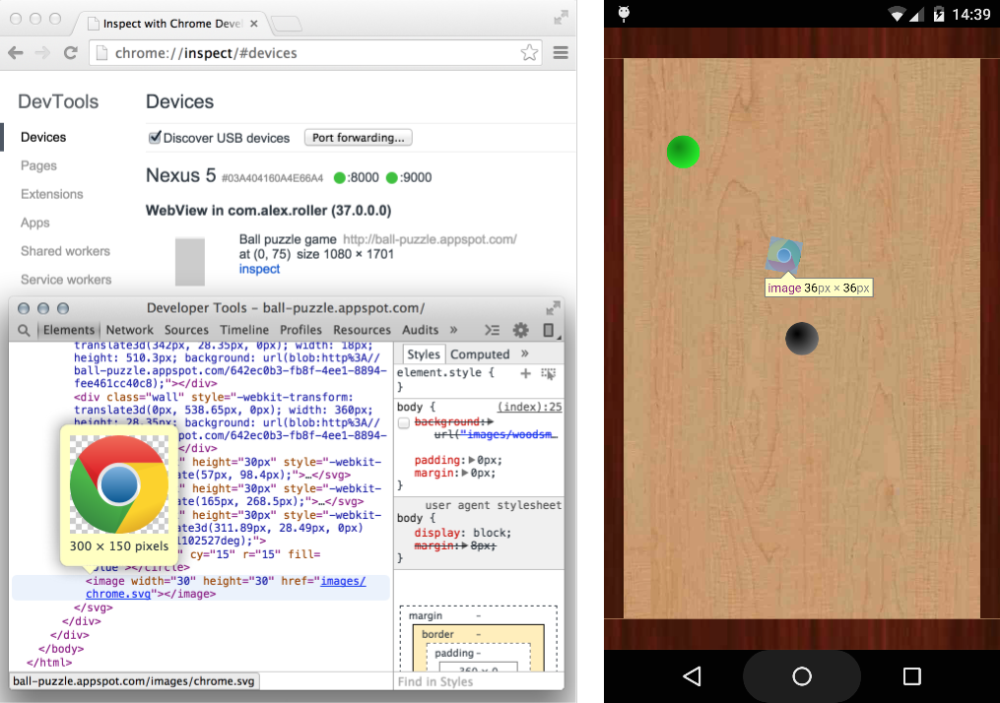<br>
<figcaption>使用 Chrome DevTools 来调试远程安卓 Webview</figcaption>

在 WebView 中列出的灰色图片表示其大小以及相对设备屏幕的大小。如果你的 WebView 有设置名称，那么其名称也会列出来。

<a name="screencasting"></a>
## 实时截屏

要在两个屏幕间不断转移注意力是相当不方便的。Screencast 将你设备的屏幕显示在开发机上的 DevTools 右侧。你也可以在 screencast 中与你的设备进行交互。

在 KitKat 4.4.3，screencast 既可以给浏览器选项卡使用也可以给安卓 WebView 使用。

### 开启截屏会话

要开启 screecast，点击远程调试窗口右侧上方的 **Screencast ** 图标。

<br>
<span style="color:pray">Screecast 图标</span>

**Screencast** 面板在左侧打开并且显示设备屏幕的实时状况。

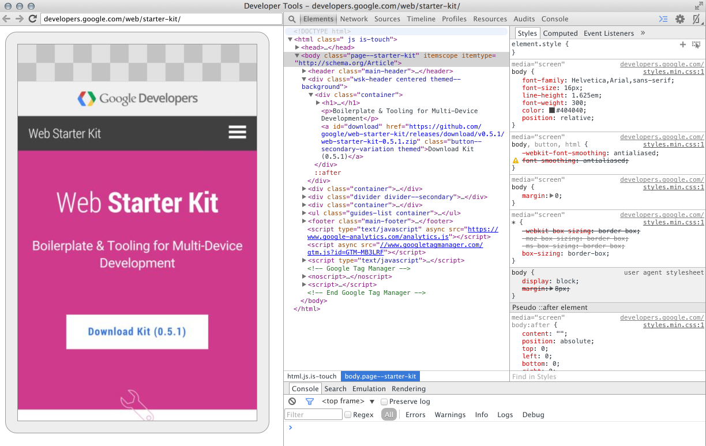<br>
<span style="color:gray">在你的电脑上与你的安卓设备实时进行交互</span>

截屏只会显示网页内容。该截屏的透明部分涵盖了多功能框、设备键盘以及其他设备接口。

>**注意**：由于截屏会连续捕获帧，会造成不小的性能开销。如果你的测试是对帧速率敏感的，最好禁用截屏。

### 使用截屏来与设备交互

当你使用截屏来互动的时候，点击会被转换为触屏，会在设备上触发适当的触控事件。电脑端的按键会发送到设备，这样就可以避免使用大拇指来打字。

其他的 DevTools 工作也可以在截屏上使用。例如，要检查元素，点击 **Inspect Element ** 然后在截屏内点击就可以查看网页源码中对应部分。

<br>
<span style="color:gray">要模拟一个缩放手势，拖动鼠标的时候按住 `Shift`。要在页面上滚动，使用你的触控板或者鼠标滚轮，也可以拖动鼠标指针。</span>

<a name="port-forwarding"></a>
## 端口转发

你的手机不一定所有时候都能直接连接到你开发用的服务器。他们可能处于不同的网络环境下，此外，你也可能在一个受限的企业网络下进行开发。

Chrome for Android 上的端口转发使得在移动设备上测试你所开发的站点变得轻松很多。其工作原理是在你的移动设备上创建一个监听 TCP 端口，该端口映射到你的开发机器上的一个指定 TCP 端口。这些端口之间的流量通过 USB 来传输，因此该连接不需要依赖于你的网络环境。

要启用端口转发：

1. 在你开发用的机器上打开 **chrome://inspect**。
2. 点击 **Port Forwarding**。下面是端口转发的设置页面。<br>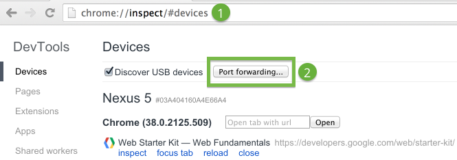
3. 在 **Device port** 后面输入你的安卓设备希望监听的端口号（默认是8080）。
4. 在 **Host** 后面输入你的 web 应用运行环境的 IP 地址（或者主机名称）以及端口号。
5. 检查 **Enable port forwarding** 是否已经勾选。
6. 点击 **Done** 来完成设置。

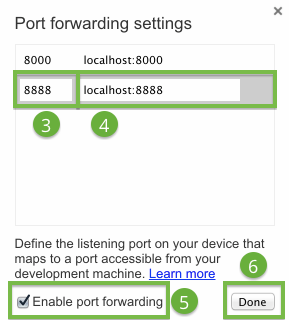<br>
<figcaption>端口转发设置</figcaption>

当端口转发开启成功时，**chrome://inspect** 页面的端口状态将会显示为绿色。

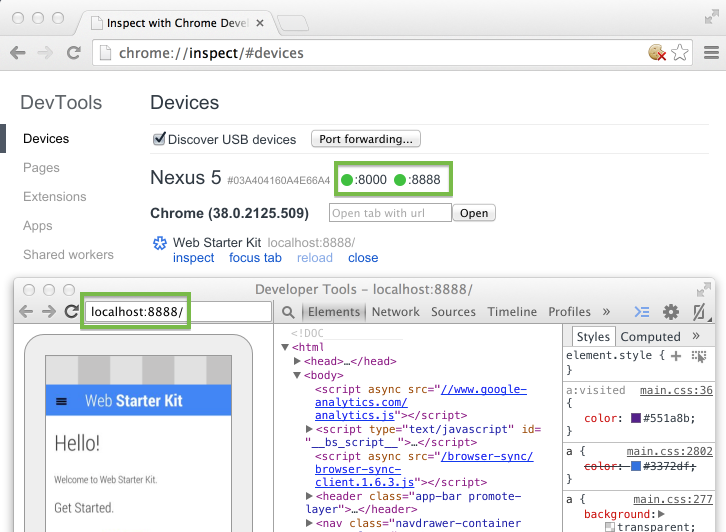<br>
<span style="color:gray">使用端口转发来在你的安卓设备上查看本地网页</span>

现在你可以打开一个新的 Chrome for Android 选项卡并且在你的设备上查看本地服务器的内容。

<a name="virtual-host-mapping"></a>
## 虚拟主机映射

当你在 localhost 域名上进行开发的时候，端口转发非常有效。但是有些情况下你可能需要是哟高自定义的本地域名。

例如，假设你正在使用的第三方 JavaScript SDk 只有在白名单上的域名中才能运行。所以你需要在你的端口文件中加入一个进入点，比如 127.0.0.1 production.com。又或者你需要在你的 web 服务器上通过虚拟主机来设置特定的域名。

如果你想让你的手机能够访问到你自定域名上的内容，你可以结合端口转发和代理服务器技术。代理会把来自设备上的请求映射到主机上的相应位置。

### 在代理上使用端口转发

虚拟主机映射要求你在主机上开启一个代理服务器。所有来自你的安卓设备的请求都会发送到这个代理上。

要在代理上使用端口转发：

1. 在主机上安装代理软件，比如 [Charles Proxy](http://www.charlesproxy.com/) 或者 [Squid](http://www.squid-cache.org/)。
2. 运行代理服务器，要记住该服务器使用的端口号。<br> <hr>**注意**：代理服务器和你开发用的服务器必须在不同的端口上运行.<hr>
3. 在 Chrome 浏览器中，进入 **chrome://inspect**。
4. 点击 **Port forwarding**。下面是端口转发设置页面。<br> 
5. 在 **Device port** 后面输入你的安卓设备希望监听的端口号。使用安卓允许的端口，比如 9000.
6. 在 **Host** 处输入 **localhost:XXXX**，其中 **XXXX** 是你的代理服务器占用的端口号。
7. 检查 **Enable port forwarding** 是否已经勾选。
8. 点击 **Done** 来完成设置。

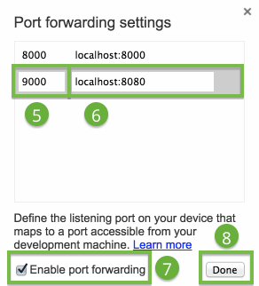<br>
<span style="color:gray">代理服务器的端口转发</span>

### 在你的设备上设置代理

你的安卓设备需要和主机上的代理服务器交互。

要在你的设备上设置代理：

1. 选择 **设置 > WiFi**。
2. 长按你当前连接的网络。<br><hr>**注意**：代理设置适用于所有网络.<hr>
3. 点击**修改网络**。
4. 选择**高级设置**。<br>代理设置页面如下：<br> 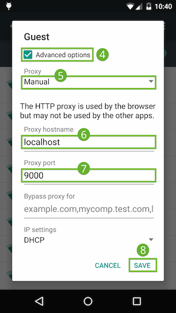
5. 点击**代理**菜单并选择**手动**。
6. 在**代理主机名**处输入 **localhost**。
7. 在**代理端口号**处输入 9000。
8. 点击**保存**。

通过这些设定，你的设备会将它所有的请求都发给代理服务器。该代理代表你的设备发出新的请求，故而对你本地特定域名的请求会被合理地解析。

现在你就可以像在主机上那样在 Chrome for Android 上加载本地域名了。

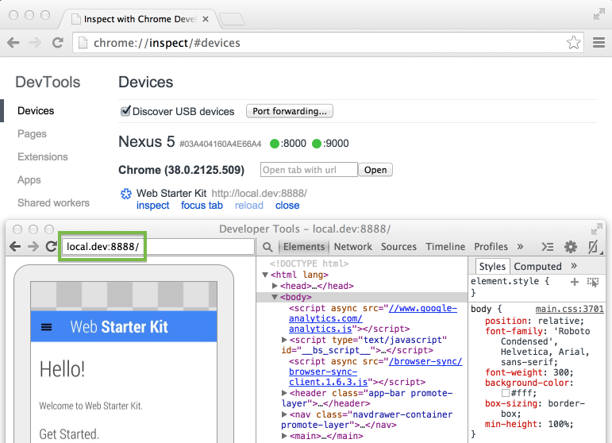<br>
<span style="color:gray">使用虚拟主机映射技术来在安卓设备上访问特定的本地域名</span>

**提示**：要恢复正常的浏览模式，在断开连接后将设备上的代理设置还原就可以了。

## 常见问题

### 我在 chrome://inspect 页面无法看到我的设备

- 如果你在 **Windows** 下进行开发，请确认你是否安装好了你的设备所对应的驱动。安卓开发者网站上的 [OEM USB Drivers](http://developer.android.com/tools/extras/oem-usb.html) 可供参考。
- 确认你的设备是否直接或者通过集线器连接到了你的主机上。
- 确认设备上 **USB 调试模式** 有没有打开。记得在提示是否允许 USB 调试的时候选择是。
- 在电脑上打开 **chrome://inspect** 并确认 **Discover USB devices** 有没有勾选。
- 远程调试要求你电脑上的 Chrome 版本高于安卓设备的。尽量使用 [Chrome Canary](https://www.google.com/intl/en/chrome/browser/canary.html)（Mac/Windows）或者 [Dev channel](http://www.chromium.org/getting-involved/dev-channel) 发行版（Linux）。

如果你仍然无法看到你的设备，请断开设备与主机的连接。然后在你的设备上，打开 **设置 > 开发者选项**。选择**撤销 USB 调试授权**。然后重新尝试[设置设备](https://developer.chrome.com/devtools/docs/remote-debugging#setting-up-device)以及[在 Chrome 中查找设备](https://developer.chrome.com/devtools/docs/remote-debugging#discovering-devices)。

### 在 chrome://inspect 页面中我无法看到我的浏览器选项卡

- 在你的设备中，打开 Chrome 浏览器并进入到你想调试的页面。然后刷新 **chrome://inspect** 页面。

### 我无法在 chrome://inspect 页面中看到我的 WebView

- 确认[WebView 调试模式](https://developer.chrome.com/devtools/docs/remote-debugging#debugging-webviews)在你的应用中已经启用。
- 在你的设备上，启动应用并打开你想调试的 WebView。然后，刷新 **chrome://inspect** 页面。

### 在我的安卓设备上我无法访问 web 服务器

- 如果是网络限制条件导致你的设备无法连接到开发用的服务器，请尝试[端口转发](https://developer.chrome.com/devtools/docs/remote-debugging#port-forwarding)或者[虚拟主机映射](https://developer.chrome.com/devtools/docs/remote-debugging#virtual-host-mapping)。

最后，如果远程调试仍然无法工作，你可以使用 Android SDK 中的 adb 二进制包将你的工作流恢复到最近的状态。

## 更多信息

### 远程调试和 ADB

在远程调试浏览器选项卡以及 WebView 的时候你不要设置 ADB 或者 ADB 插件。Android 上的远程调试现在是标准 Chrome DevTools 的一部分。在所有的操作系统上它都可以使用：Windows，Mac，Linux 以及 Chrome OS。

如果你在使用远程调试的时候遇到了问题，你可以尝试通过 Android SDK 提供的 adb 二进制包来使用[传统工作流](https://developer.chrome.com/devtools/docs/remote-debugging-legacy)。

<hr>
**注意**：你的安卓设备和 Chrome 之间的连接可能会中断 adb 连接。在建立 adb 连接前，取消 **chrome://inspect** 上对 **Discover USB devices** 的勾选。
<hr>

### 远程调试工具的扩展

想知道关于远程调试交互协议的内容，参考 [Debugger Protocal](https://developer.chrome.com/devtools/docs/debugger-protocol) 文档以及 [chrome.debugger](https://developer.chrome.com/extensions/debugger)。

以上内容适用于 [CC-By 3.0 license](http://creativecommons.org/licenses/by/3.0/)