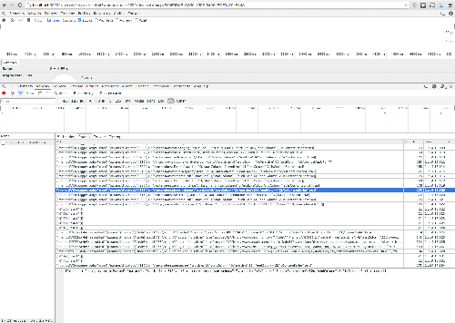

# 远程调试协议
在底层，Chrome 开发者工具是用 HTML，JavaScript 和 CSS 写的 Web 应用程序。在 Javascript 运行时，它提供一个特殊的绑定，这允许它与 chrome 网页进行交互并且容许装载它们。交互协议包括被发送到页面的命令，和该页面生成的事件。尽管 Chrome 开发者工具是该协议的主要客户，其中包括[远程调试（remote debugging](https://developer.chrome.com/devtools/docs/remote-debugging.html)，但有很多办法可以让第三方能够使用它，并进行浏览器页面准确装载。我们将它描述在下面：

## 定义协议（Protocol）
交互协议包括发送到页面到 JSON 数据格式的命令和页面生成的事件。我们在 <code>Bink("upstream")</code> 中定义这个协议，这样，基于 Blink 的浏览器都能支持它。

### 稳定版本（Stable）
[调试协议1.1版（Debugger protocol version 1.1）](https://developer.chrome.com/devtools/docs/protocol/1.1/index.html)是目前协议发布版本中最稳定的版本

对于谷歌 Chrome 31，我们致力于支持 V1.1 版本。该协议的所有后续1.* 版本将是 1.1 向后兼容。我们的协议向后兼容性的规范是：

+ 没有命令或事件从协议中删除。
+ 无需参数被添加到命令。
+ 无需参数从命令响应或事件中删除。

以前的版本：[Protocol v1.0](https://developer.chrome.com/devtools/docs/protocol/1.0/index.html) 针对 Chrome 18 发布和支持的。[Protocol v0.1](https://developer.chrome.com/devtools/docs/protocol/0.1/index.html) Chrome 16 发布和支持的。

### Alpha
[tip-of-tree protocol](https://code.google.com/p/chromium/codesearch#chromium/src/third_party/WebKit/Source/devtools/protocol.json&q=protocol.json&sq=package:chromium&type=cs) 是易变的的，可能在任何时候都会中断。然而，它有着协议的全部功能，稳定的发布版本是他的一个子集。它没有支持保证它引入的功能的向后兼容性。你可以自己使用它与 [Google Canary](http://tools.google.com/dlpage/chromesxs) 建立连接。

 tip-of-tree 协议是[在调试协议视图中 debugger protocol viewer](http://chromedevtools.github.io/debugger-protocol-viewer/) 更具有可读性。


### 监测协议通信（Sniffing the protocol）
你可以检查 Chrome DevTools 如何使用该协议。探索新功能时，这是特别方便。首先，在调试端口开启状态运行 Chrome 浏览器：

```
/Applications/Google\ Chrome\ Canary.app/Contents/MacOS/Google\ Chrome\ Canary --remote-debugging-port=9222 http://localhost:9222 http://chromium.org
```

然后，选择在视察*页面( Inspectable Pages )列表*中的选取 Chromium Projects 子项目。既然 DevTools 开启，处于全屏状态，打开 DevTools 来对其进行监测。 CMD-R 在新的检测器中，作第一次重启。现在前往 Network 面板，通过 WebSocket 的过滤器，选择连接，然后单击框架选项卡。现在你可以很容易地看到 WebSocket 活动的框架，是你使用的 DevTools 的第一个实例。




## 调试过线（Debugging over the wire）

开发者工具前段可以连接到远程运行的 Chrome 实例进行调试。为了让此方案起作用，你应该使用远程调试端口命令行切换来启动你主机的 Chrome 实例：

```
chrome.exe --remote-debugging-port=9222
```

然后，你就可以开始一个客户端 Chrome 实例，使用单独的用户配置文件：

```
chrome.exe --user-data-dir=<some directory>
```

现在，你可以从客户端导向指定的端口，获取任何调试的选项卡：[http://localhost:9222](http://localhost:9222/)

你会发现开发者工具交互界面与内嵌式的是相同的，这是为什么：

+ 当你从客户端浏览器导向到远程的 Chrome 端口，开发者工具前端都是被主机 Chrome 服务着的，就如同 Web 服务器服务 Web 应用程序。
+ 它通过 HTTP 通信获取 HTML，JavaScript 和 CSS 文件
+ 一旦加载，开发者工具建立一个 Web Socket 连接至主机，并开始交换 JSON 数据。

在这种情况下，你可以用你自己的实现替代开发者工具前端。与导向在 http://localhost:9222 端口的 HTML 页面不同，你的应用程序可以发现可用的页面通过请求：

[http://localhost:9222/json](http://localhost:9222/json)

并得到一个 JSON 对象和关于有着 WebSocket 地址的可检测网页的信息，你可以把他们装载到页面中。

调试浏览器远程实例或附着到嵌入式设备时，远程调试是特别有用的。Blink 端口业主负责暴露调试连接给外部用户。

## 调试协议客户端
许多应用程序和库已经使用该协议。一些用来收集性能数据，其他一些用来在另一个编辑器中进行断点调试。Node.js 和 Python 中有包含着原始协议的库。

许多客户端展示在这里：[Showcased Debugging Protocol Clients](https://developer.chrome.com/devtools/docs/debugging-clients)。

## 使用调试器扩展 API

为了允许第三方用此协议进行交互，我们介绍了 [chrome.debugger](https://developer.chrome.com/extensions/debugger.html) 扩展 API，来暴露这个 JSON 消息传输接口。其结果是，你不仅可以获取远程运行的 Chrome 实例，而且可以用自己的插件它装载它。

Chrome 调试器扩展 API 在命令域提供了一个高等级的 API，name 和 body 在 <code>SendCommand</code> 调用中显式设置。这个API 隐藏了请求 ID ，应答处理其响应，因此它允许 <code>SendCommand</code> 在回调函数中提交结果报告。也可以和其他扩展 API 结合着使用。

如果你正在开发一个基于 Web 的 IDE ，你应该实现一个扩展功能，暴露你的网页调试功能，你的 IDE 就能够打开目标应用的页面，设置断点，在控制台计算表达式，实时编辑 JavaScript 和 CSS ，显示活动 DOM ，网络交互和任何其他任何开发者工具正在提交的方面。

开放嵌入式开发工具将[终止 (terminate)](https://developer.chrome.com/devtools/docs/debugger-protocol#simultaneous) 远程连接，从而分离扩展。

## 并发协议客户

我们目前不支持多个客户端同时连接到协议。这包括打开工具时而另一个客户端处于连接状态。在 bug 跟踪系统中，[crbug.com/129539](https://code.google.com/p/chromium/issues/detail?id=129539) 有如下条件；你可以为电子邮件更新标记。

当处于 disconnnection 状态下，即将下线的客户将获得一个 **detached** 事件。例如：
<code>{"method":"Inspector.detached","params":</code>
<code>{"reason":"replaced_with_devtools"}}</code>
[可能原因的列举](https://code.google.com/p/chromium/codesearch#chromium/src/out/Debug/gen/chrome/common/extensions/api/debugger.cc & q=file:debugger.cc%20Reason%20ParseReason&sq=package:chromium&type=cs &)。（供参考：[原始补丁](https://chromiumcodereview.appspot.com/11361034/)）。断开连接后，一些应用程序选择暂停他们的状态，并提供一个重新连接按钮。

