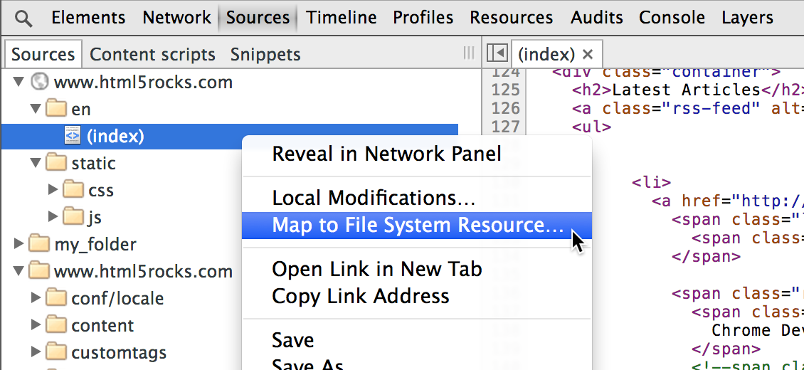
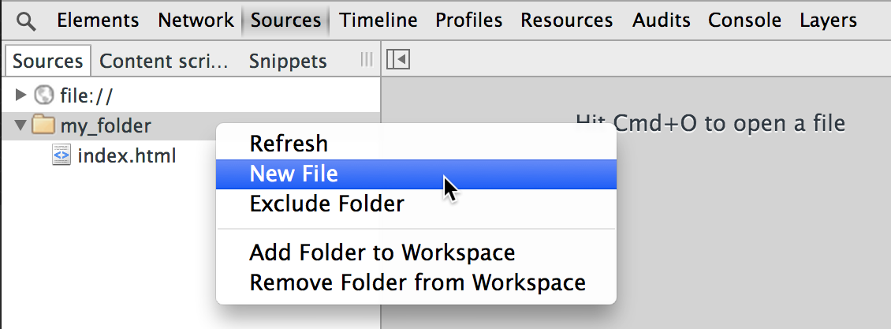
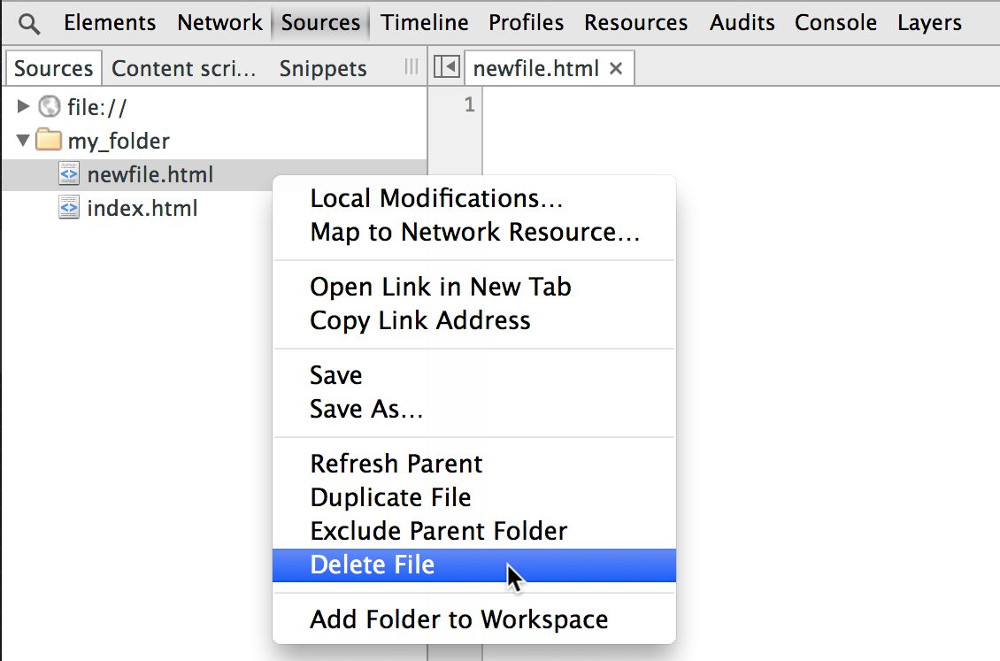

# 工作空间 - 在 DevTools 中连续开发

## 简介

Chrome DevTools 允许你对页面或者 CSS 做出更改，并且可以实时查看更改效果。但是如果你需要复制外部编辑器中更改的内容并粘贴到 DevTools 时，什么对你才是更加重要的呢？工作空间可以让这些更改暂时存储在硬盘上而不需要离开 Chrome DevTools 界面。

通过工作空间，你可以在 Sources 面板中编辑任何类型的源文件并且将改动保存到硬盘上。并且你可以将资源从本地服务器映射到磁盘上的文件中，当你修改该文件并保存了之后，他们可以照常运行。并且，如果你对映射的设置是正确的，你在 Elements 面板上修改也会自动储存到磁盘上。

## 将项目放进工作空间（Workspace）中

要在 Sources 面板中编辑本地的源文件，右键点击 Sources 面板的左部并选择 **Add Folder to Workspace**。该操作会启动一个文件选择框，你可以选择需要的文件夹添加到工作空间中（这并不会将当前高亮显示的文件夹加入到你的工作空间中）。

当 Chrome 顶部出现黄色的提示 "DevTools requests full acess to [path to your folder]" 时，选择 ***Allow**。

在 Chrome 中，你可以编辑该文件夹下的任何文件以及子文件夹。在这种情况下，“源文件”并只是 HTML、CSS 以及 JavaScript，其指的是任意类型的文件，包括 markdown 以及 JSON。

## 映射网络资源

工作空间真正有用的地方在于它可以将一个本地文件映射到一个 URL 上（或者是网络资源上）。当 Chrome 加载一个被映射的 URL 时，网络文件夹的内容会被工作空间的文件夹取代。这就好像这些文件是放在网络上一样，但是你可以通过 DevTools 来修改本地文件并保存。

要将你的网站映射到本地工作空间文件夹：

1. 在 Sources 面板中，右键点击或按住 Control 再点击网站上的文件。
2. 选择 **Map to File System Resource**。
3. 在出现的列表中选择相应的文件（你可以输入文件名或者关键字来找到你想要的文件）。
4. 在 Chrome 中重新加载页面。

现在 Source 面板中显示的将会是本地工作空间的文件夹，而不是服务器上的内容了。

你可以将该功能用于其他地方，比如将工作空间文件夹映射到 URL 上，或者对网络资源进行映射。要注意，并不是所有从本地映射的网络资源都会载入到浏览器中，但是你的本地文件必须都是可以映射到 URL 的。在工作空间中映射一个文件时应该将该文件映射到该工作空间的大多数站点。

## 注意事项

工作空间使得你的很多工作变得简单了，并且不需要在 Chrome 和外部编辑器之间切换了。然而，有些东西你需要注意：

- 只有在 Elements 中改变的样式会被保存。对 DOM 文档做出的修改是不会保存的。
- 在 Elements 面板中改动的样式会立即保存，该效果就和把 CSS 文件映射到本地的备份文件一样（也就是说，源自 Elements 面板的更改不需要手动保存）。
- 如果你从远程服务器上将文件映射到本地，当你刷新页面的时候 Chrome 从远程服务器上再次加载文件。你做出的改动保存在硬盘上，并且当你继续在工作空间内对文件进行编辑的时候就会生效。

## 工作空间的文件管理

使用工作空间的时候，除了编辑已有的文件，你也可以在本地目录中添加或者删除文件。

### 添加文件

右键点击左边的文件夹并选择 **New File**。

### 删除文件

右键点击左边的文件并选择 **Delete File**。

你也可以选择 **Duplicate File** 来复制文件。新文件会在 Sources 面板中出现，并且你可以为它输入一个新名称（默认情况下是 “Copy of mufile.txt”）。

### 刷新

现在你已经在工作空间中直接创建（删除）了文件，源目录会自动刷新并且显示出这些新文件。如果没有显示出来，你可以右键点击一个文件夹然后选择 **Refresh** 来刷新。

当你在其他的编辑器中对文件做出更改并保存时候，这个方法可以帮助你在 DevTools 刷新文件。一般情况下 DevTools 会自动刷新，即使文件是在外部编辑器中保存的，但是如果你需要重新编译 HTML 或者 CSS 文件，那就需要手动刷新。

### 搜索文件

如果要在 DevTools 中搜索文件，按`Ctrl` + `O`（或者在 Mac 上使用 `Cmd` + `O`）来打开一个文件搜索选项框。在工作空间中你也可以这么做，不过它除了会搜索本地文件外，还会搜索工作空间中远程加载的文件。

文件的搜索机制是有很多种的，所以你既可以搜索工作空间中的文件，也可以搜索其他加载到 DevTools 的文件。甚至你可以通过一个字符串或者一个正则表达式来进行搜索，而 Chrome 会找到相匹配的任何文件或者页面。

要通过工作区间中的多个文件来搜索文本：

1. 按住 Esc 键打开控制台，然后选择控制台旁边的 Search 选项卡来打开搜索窗口。或者按 <kbd>Ctrl</kbd> + <kbd>Shift</kbd> + <kbd>F</kbd>（在 Mac 上使用 <kbd>Cmd</kbd> + <kbd>Opt</kbd> + <kbd>F</kbd>）来打开搜索窗口。
2. 在搜索框中输入你想搜索的内容，然后按下回车键。如果你查询的是一个常规表达式或者是大小写敏感的内容，请勾选相应的复选框。

工作空间是 DevTools 的新特性，故本文可能没法涵盖到其全部特性，关于工作空间的详细内容请参考[开发文档](https://github.com/GoogleChrome/devtools-docs/issues/30)。

以上内容适用于 [CC-By 3.0 license](http://creativecommons.org/licenses/by/3.0/)