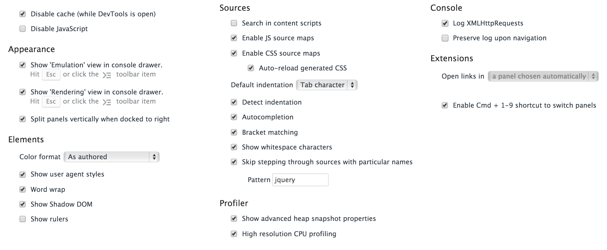
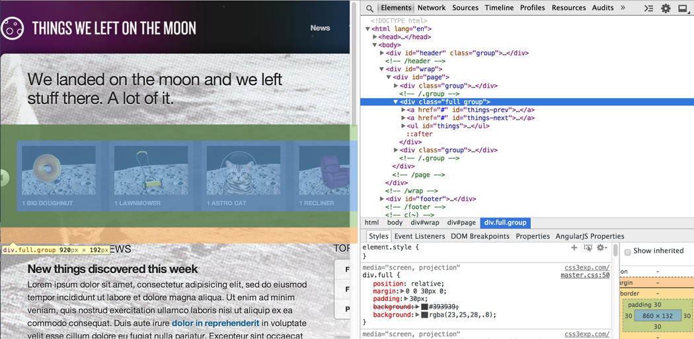
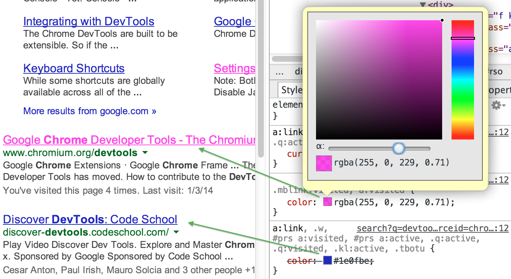
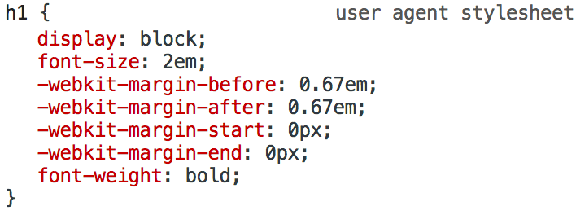
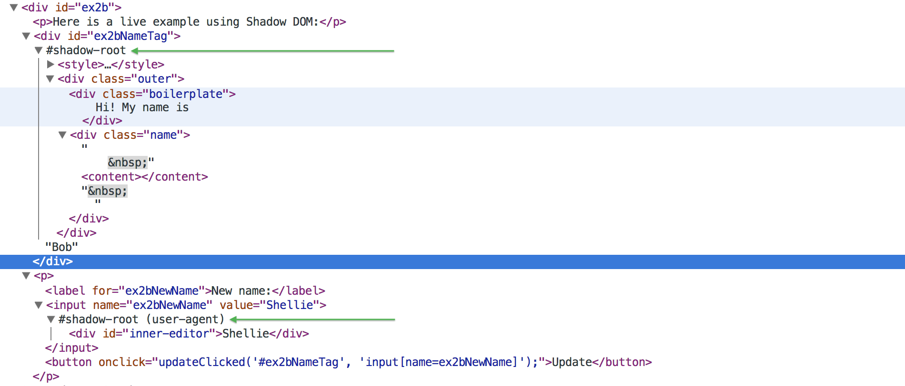
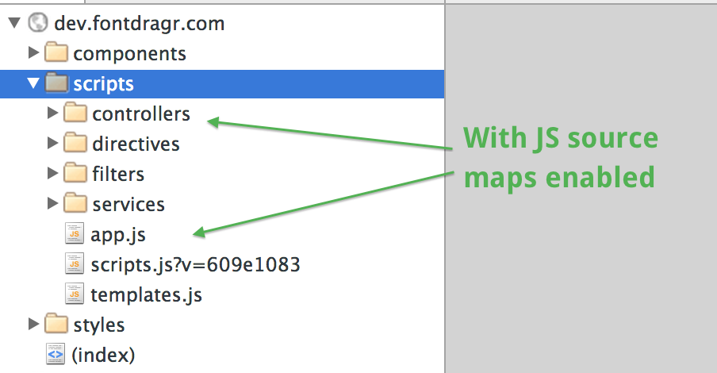
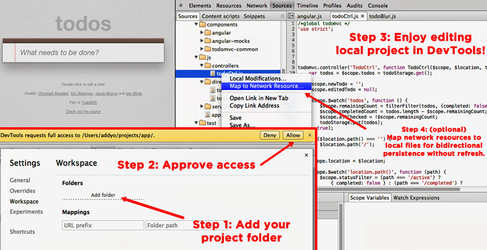

# 设置
修改 DevTools 中的设置

+ 点击设置齿轮 ，打开 General Settings 面板进行修改。或者，也可以使用快捷键 <kbd>？</kbd> 打开 Setting 窗格。

## 通用设置
#### 禁用缓存
只对打开了 DevTools 的网页禁止资源缓存。如果 DevTools 关闭，就会停止作用。

#### 禁用 JavaScript
当使用这个检查，立即暂停所有注入在有 DevTools 实例的标签上的JavaScript 代码。

> 注意：无论是禁用缓存和禁用 JavaScript 的设置都只适用于在DevTools 是打开的情况下。当它被打开后，对于网页来说就是它的 DevTools 是开启状态。

#### 使用 Ctr + 1-9 快捷键来切换面板

当多个选项卡打开状态，若多于 9 个，则有标签 1-8 和 9 作为最后一个选项卡，你可以使用 <kbd>Ctrl</kbd> + <kbd>1-9</kbd> 快捷键跳转到 Chrome 浏览器中指定的标签。此设置将使 DevTools 以同样的方式运作，因此你可以快速在面板之间进行切换。

> 注意：启用这个可能会导致与其他应用程序的快捷键发生冲突。

### 界面（Appearance)
#### 当它停向右边垂直拆分面板
使用这个会改变面板的布局，使主部分被堆叠在侧栏部分的顶部。你会发现这是有用的，当他们并排侧栏是小屏幕的情况下是没有足够的水平空间的。

### 元素（Elements）
#### 颜色格式
+ As authored 官方定义 - （颜色代码如何写在样式表）
+ HEX: <code>#DAC0DE</code>
+ RGB: <code>rgb(128, 255, 255)</code>
+ HSL: <code>hsl(300, 80%, 90%)</code>

**颜色格式（color format）**设置，可以让你控制颜色代码如何显示在元素面板的**样式边栏 （Styles Sidebar）**。除了为控制颜色代码格式设置选项，你还可以点击样式栏顶部的齿轮图标，来改变颜色代码的格式。

选择 **As authored** 将为样式表中定义的属性使用颜色格式。

#### 显示用户代理样式（user agent styles)
你可能会发现在元素面板的样式边栏显示的 **user agent style** 很有用。

**用户代理 (user agent)** 是指浏览器。每个浏览器实现了一个默认的样式表，包括基本的风格规则，在页面中应用到 DOM 元素。如果你曾经很难去除两个元素之间的空白，例如，它可能是因为用户代理样式表添加了默认 margin 或 padding 指向特定类型的元素的。

#### 自动换行
正如任何文本编辑器，你可以在元素面板中选择性的对长行的代码进行换行。

#### 显示阴影（Shadow) DOM
有了[影子 DOM](http://www.html5rocks.com/en/tutorials/webcomponents/shadowdom/)，元素可以得到一个与它们相关联的新节点。这个新节点被称为**阴影根（shadow root)**。具有与其相关联的阴影的根元素被称为阴影主机。阴影主机的子节点不会呈现;用阴影根的内容代替呈现。

+ [Shadow DOM 201](http://www.html5rocks.com/en/tutorials/webcomponents/shadowdom-201/)
+ [Shadow DOM 301](http://www.html5rocks.com/en/tutorials/webcomponents/shadowdom-301/)
+ [Shadow DOM Polyfill](http://www.polymer-project.org/platform/shadow-dom.html)
+ [Visualizing Shadow DOM Concepts（可视化阴影 DOM 概念）](http://updates.html5rocks.com/2013/03/Visualizing-Shadow-DOM-Concepts)
+ [Define presentational boxes using shadow DOM（定义使用阴影 DOM 表象盒）](http://blogs.adobe.com/webplatform/2013/04/03/defining-presentational-boxes-with-shadow-dom/)

####显示直尺
这将显示一个沿着顶部，左侧和底部覆盖视口的标尺。

### 源面板（Sources）
#### 内容脚本搜索
[内容脚本 (Content script)](http://developer.chrome.com/extensions/content_scripts.html) 是一些 JavaScript 文件，在 Chrome 插件中，插件运行在网页主体，但与普通网页的 JavaScript 是完全分离的，处于一个受保护的范围。这样，内容的脚本和页面脚本彼此不能以一个普通的方式进行交互。

当在 Sources 面板中观察内容脚本的标签，你会看到两个不同的脚本都是通过插件模块（或通过**用户脚本 User Script** 被编译成 Chrome 里的插件）被添加的，同样，内容脚本也被内置成为浏览器的一部分，特别是插件能够使用的 API 。

> 注意：在开发 Chrome 应用或插件时启用此设置，以便你可以在这些原生 API 的脚本中搜索，否则启用它是没有用的。

#### 启用 JS 源映射（source maps）
如果你的代码是级联的、简洁的，当你需要调试很难讲什么文件中的一段代码可能被调用。启用此设置，对于[调试 JavaScript](javascript-debugging.html#source-maps) 和与[一般的源映射活动](http://www.youtube.com/watch?v=HijZNR6kc9A#t=1m32s)是有用的。

#### 启用 CSS 源映射（source maps）
式源映射用于使用预处理器（例 Sass）生成CSS文件。

有关详细信息，请参阅[使用CSS预处理程序](https://developer.chrome.com/devtools/docs/css-preprocessors.html)。

#### 自动重装产生CSS
只有启用了 CSS 源映射才被使用。当源文件被保存时，确定生成 CSS 文件是否应该被重新加载。

#### 检测缩进
指定如何在DevTools编辑代码时缩进：

+ 2 spaces
+ 4 spaces
+ 8 spaces
+ Tab character

#### 显示空白字符
这将在 Source 面板将空格和制表符显示为点。

### Profiler
#### 高分辨率 CPU 性能分析
使你在 Flame charts 中可以放大到 0.1 ms 进行查看。

### Console
#### XMLHttpRequests 日志
在扩展显示具体的要求控制台中显示 XHR 请求的对象。

####  Preserve log upon Navigation

当通过一个站点的多页导航，你可以选择不清除控制台日志而在每个页面载入，所以你可以观察在网页的历史输出。

> 注意：这两种设置都可以通过右键点击控制台上进行更改。

### 扩展

打开链接：<code>a panel chosen automatically</code>

## 工作空间 Workspace
[Workspaces](https://developer.chrome.com/devtools/docs/workspaces.html) 允许你选择**自定义目录（custom directories )** 中的文件系统，它始终为你提供的 Sources 面板中的编辑。这可以是一个特定的项目目录或包含在其内多个不同项目在内的目录。

要使用此功能，在设置面板中打开工作**空间选项卡 Workspaces tab**。在这里你会看到一个**添加文件夹链接 Add Folder**，允许你添加本地目录来编辑（如：项目根目录）。

一旦你添加一个文件夹目录，你就可以查看，编辑和保存任何时候你在 Sources 面板上编辑的文件。所有的文件更改将持续保存到包含在路径里的本地文件。

除了为你的工作空间增加一个文件系统，你也能单独添加文件映射到该文件在本地计算机上的路径。

