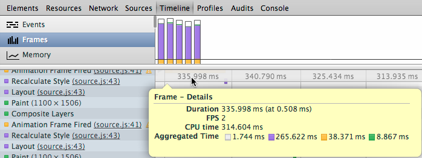
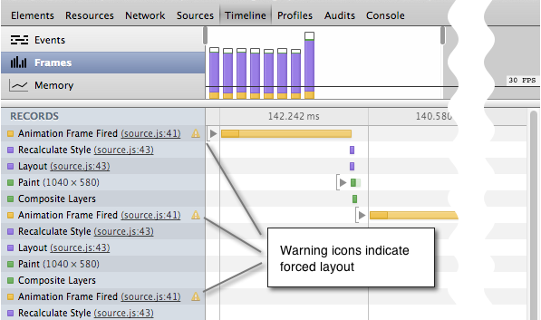
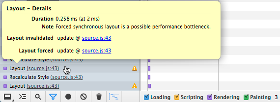
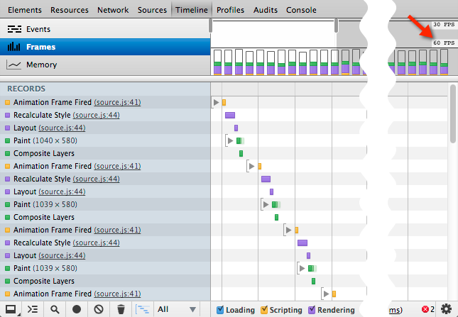

# 时间轴示例：强制同步布局的诊断

该示例展示了怎么使用时间轴找出一种被称为“强制同步布局”的性能瓶颈。示例应用程序循环演示了几张图片并且强制使用了在执行基于帧的动画时所[推荐](http://updates.html5rocks.com/2012/05/requestAnimationFrame-API-now-with-sub-millisecond-precision)的 [requestAnimationFrame()](http://docs.webplatform.org/wiki/apis/timing/methods/requestAnimationFrame) 方法。但是在动画运行的时候仍然会出现不大理想的状况，我们将使用时间轴来诊断发生了什么问题。

如果想要了解更多关于帧模式以及强制同步布局的内容，请参考 [使用时间轴](https://developer.chrome.com/devtools/docs/demos/using-timeline) 章节中的 [Locating forced synchronous layouts](https://developer.chrome.com/devtools/docs/demos/using-timeline.html#locating_forced_synchronous_layouts)。

## 制作记录

首先，你需要制作关于动画的记录：

1. 点击 **Start** 来启动动画。
2. 打开时间轴面板，然后找到帧视图。
3. 点击时间轴上的 **Record** 按钮。
4. 在一到两秒后（记录了大概十到十二帧）停止记录并且点击 **Stop** 来停止动画。

<button id="toggle">Start</button>

## 分析记录

查看记录中的前几帧，每一帧的完整时间都在 300毫秒左右。如果你将你的鼠标停在其中一帧的上面，浏览器会显示出该帧的详细信息。

选中记录中的某个动画帧，在它的旁边有个黄色的警告标志，此标志说明它是一个强制同步布局。颜色较暗的图标表明其子记录中存在有问题的代码，而不是记录本身有问题，此时可以展开 Animation Frame 字段来查看其子记录。

子记录显示了 **Recalculate Style** 和 **Layout** 记录的长度以及重复模式。每个布局记录都是重新计算布局得到的结果，相应地，也就是 requestAnimatinoFrame() 处理器请求页面上的每张图片的 **offsetTop** 值时所获得的结果。将你的鼠标停留在其中一条记录上，然后点击 **Layout Forced** 属性旁边的 source.js 连接。

Sources 面板会打开源文件第43行的 update() 方法，也就是 requestAnimationCallback() 方法的回调处理器。该处理器会计算图片 offsetTop 上的 left CSS 样式属性。这就使得修改布局后 Chrome 会立即将其展示出来，以确保它提供的值是正确的。

~~~

// 动画循环
function update(timestamp) {
    for(var m = 0; m < movers.length; m++) {
        movers[m].style.left = ((Math.sin(movers[m].offsetTop + timestamp/1000)+1) * 500) + 'px';
    }
    raf = window.requestAnimationFrame(update);
};

~~~

在每个动画帧中都强制载入页面布局会使得运行速度变慢，现在我们可以尝试直接使用 DevTools 来修复这个问题。

## DevTools 内的应用修复

既然我们已经知道了造成性能问题的原因，我们就可以直接在 Sources 面板中修改 JavaScript 文件然后立即测试更改的效果。

<ol>
<li>在之前打开的 Sources 面板中，用以下代码替换43行代码。</li>

</ol>

## 通过其他记录来验证

该动画显然比以前更快、更流畅，但是衡量一下调整后的记录和其他记录的差异将会是一种很好的做法。具体的情况应该像下面的记录这样：

以上内容适用于 [CC-By 3.0 license](http://creativecommons.org/licenses/by/3.0/)