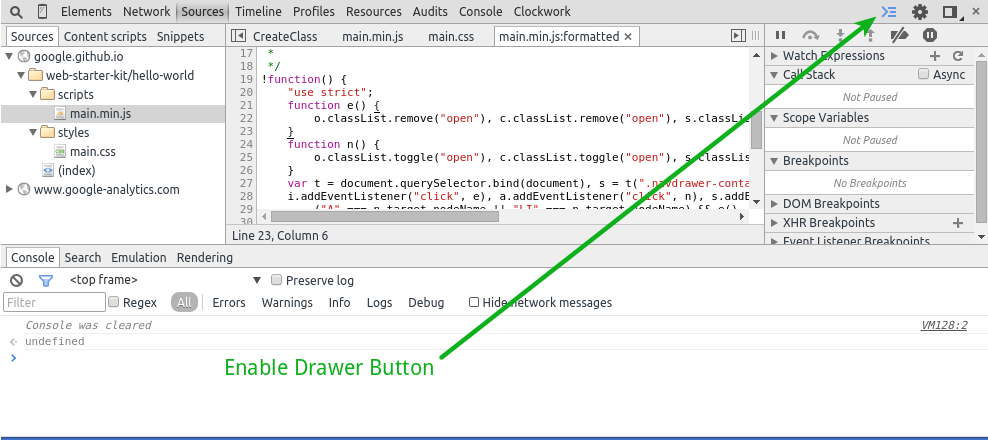
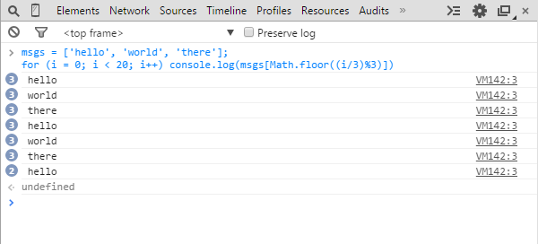
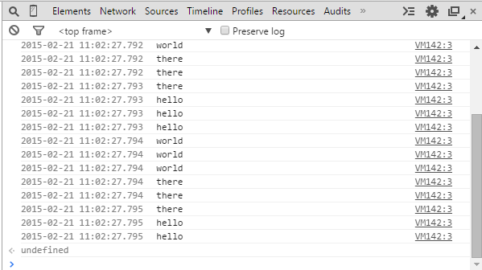
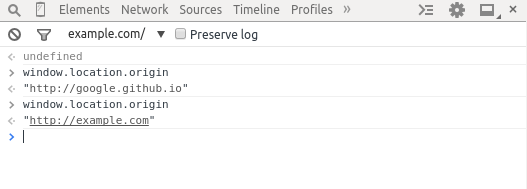
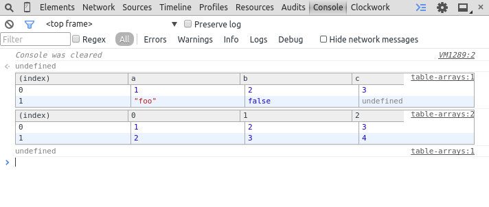
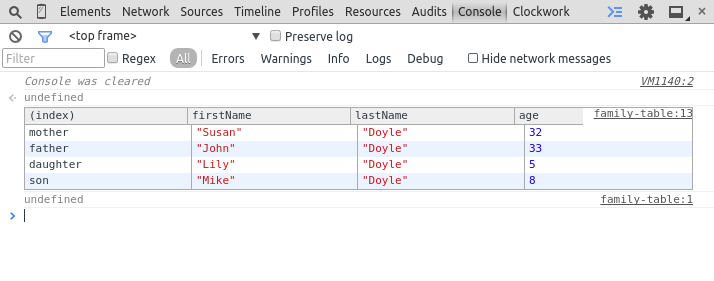
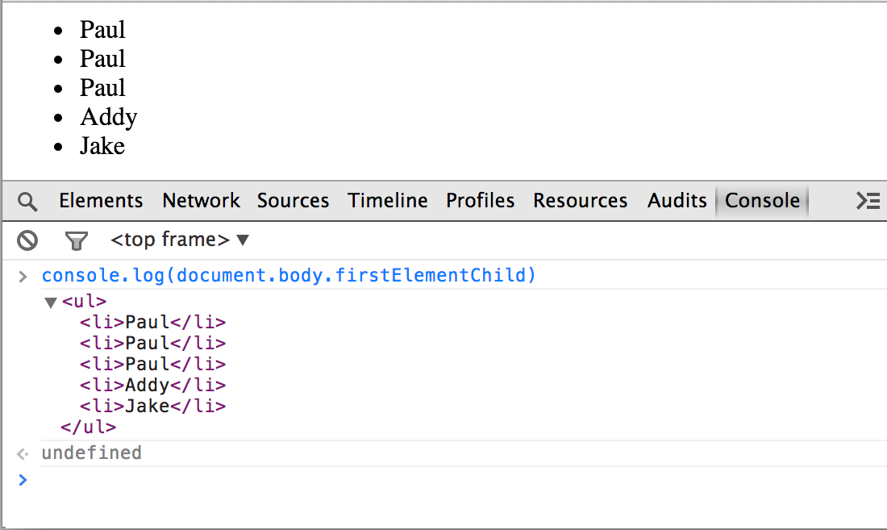
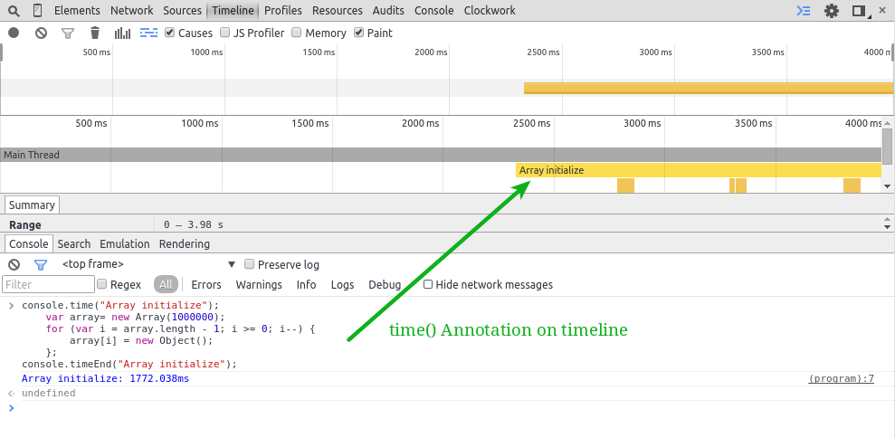

# 使用控制台

利用控制台可以让你：

* 日志诊断信息可以帮你分析 web 页面或者应用上的错误
* 输入命令来与文档以及 Chrome 开发者工具进行交互

你可能也会自己评估一般的 JavaScript 表达式。这个文档提供了一个控制台的预览和常规使用的概述。你可以浏览 [Console API](https://developer.chrome.com/devtools/docs/console-api) 和 [Conmmand Line API](https://developer.chrome.com/devtools/docs/commandline-api) 引用材料来理解更多的功能。

## 基础操作

### 打开控制台

Javascript 控制台可以在两个地方打开。控制台面板是主要的进入点。它同样也可以在其他任何面板中通过使用抽屉来打开。打开控制面板，用下面的选择下面提供的一种方式：

* 使用键盘快捷键 `Command` + `Option` + `J`（Mac） 或者 `Control` + `Shitf` + `J`（Windows/Linux）。
* 选择  > More Tools > JavaScript Console.


一个干净的控制台界面

要打开抽屉式控制台，你需要在键盘上按下 `Esc` 键或者点击开发者工具窗口右上角的 Show Drawer 按钮。


在元素面板上的抽屉式控制台

### 清除控制台历史信息

要清除控制台历史信息，你需要这么做：

* 在控制台中右键或者按住 Ctrl 点击然后从上下文菜单中选择 *Clear Console*
* shell 提示符中输入 [clear()](https://developer.chrome.com/devtools/docs/commandline-api#clear) 命令行 API。
* 在 Javascript 中执行 [console.clear()](https://developer.chrome.com/devtools/docs/console-api#consoleclear) 调用控制台 API。
* 使用键盘快捷键 `Cmd` + `K`,`^` + `L`(Mac)`Ctrl` + `L`（ Linux 和 Windows ）。

### 信息栈

控制台会将以栈的形式持续输出相同的信息。这使得提供给你的信息会尽可能的简短。

| 禁止时间戳（默认）| 允许时间戳 |
| -------------- | --------- |
|  | 
两种栈状态的例子

测试控制台模式的简单代码

```
msgs = ['hello', 'world', 'there'];
for (i = 0; i < 20; i++) console.log(msgs[Math.floor((i/3)%3)])

```

### 选择帧

控制台可以在页面的不同帧中运行。主页是文档的最外层帧。以 **iframe** 元素为例，它将会创造出它自己的上下文框架。你也可以通过使用在过滤按钮旁边的下拉框来指定这个帧。


选择一个次要的帧


这张图片展示了窗口源在顶级帧和选中的次要帧中改变。

## 使用控制台 API

控制台 API 是一组方法的集合，它由开发者工具定义的全局 `console` 对象提供。API 的其中一个主要目的就是在你的应用运行的时候输出日志信息到控制台中。你也可以在控制台中为输出信息分组，以减少视觉混乱。

### 向控制台输出

[console.log()](https://developer.chrome.com/devtools/docs/console-api#consolelogobject-object) 方法会使用一个或者多个表达式来作为参数，之后会将他们当前的值输出到控制台中。

一个简单的向控制台输出的例子：

```
var a = document.createElement('p');
a.appendChild(document.createTextNode('foo'));
a.appendChild(document.createTextNode('bar'));
console.log("Node count: " + a.childNodes.length);

```


一个在控制台中输出的例子

多个参数会串联到有限行中。

多个参数的 **console.log()**

```
console.log("Node count:", a.childNodes.length, "and the current time is:", Date.now());

```


多重参数的 console.log() 的输出。

### 错误和警告

错误和警告就跟一般的日志信息的显示一样。不同的地方在于 **error()** 和 **warn()** 通过它们自己样式来吸引注意力。**console.error()** 方法展示的是一个红色的图标并且伴有红色的信息文字。**console.warn()** 方法展示的是黄色的图标和黄色的信息文字。

使用控制台 warn 和 error 方法。

使用 error() 方法。

```
function connectToServer() {
    console.error("Error: %s (%i)", "Server is  not responding",500);
}
connectToServer();

```


**connectToServer()** 如何在控制台中显示。

使用 **warn()** 方法

```
if(a.childNodes.length < 3 ) {
    console.warn('Warning! Too few nodes (%d)', a.childNodes.length);
}

```


警告输出的例子。

### 断言

<a href="https://developer.chrome.com/devtools/docs/console-api#consoleassertexpression-object">console.assert()</a> 方法仅仅只当它的第一个参数为 false 时才显示一个错误信息字符串（它的第二个参数）

一个简单的断言并且如何展示的例子。

在下面的代码中，如果在列表中的子节点的数量超过 500，将会在控制台中引起错误信息。

```
console.assert(list.childNodes.length < 500, "Node count is > 500");

```


一个失败断言如何在控制台中显示。

### 过滤控制台的输出

你可以通过过滤器选项中的安全级别来过滤控制台的输出。通过控制面板的左上角的过滤器图标来激活过滤器。下面的过滤器选项是可以选择的：

| **ALL**		|显示所有控制台输出 |
| -------		|--------------- |
| **Errors**	|只显示 console.error() 输出的信息 |
| **Warnings**  |只显示 console.warn() 输出的信息 |
| **Info**   		|只显示 console.info() 输出的信息 |
| **Logs**		|只显示 console.log() 输出的信息 |
| **Debug**		|只显示 console.timeEnd() 和 console.debug() 输出的信息 |


过滤器只显示错误级别的信息。

### 输出分组

你可以通过分组命令把相关联的输出信息分在一起。[group](https://developer.chrome.com/devtools/docs/console-api#consolegroupobject-object) 命令通过一个字符串的参数来给你的组命名。控制台将会把所有所有的输出信息组合到一块。要结束分组，你只需要调用 [groupEnd](https://developer.chrome.com/devtools/docs/console-api#consolegroupend) 即可。

一个分组的例子

示例代码：

```
var user = "jsmith", authenticated = false;
console.group("Authentication phase");
console.log("Authenticating user '%s'", user);
// authentication code here...
if (!authenticated) {
    console.log("User '%s' not authenticated.", user)
}
console.groupEnd();

```

示例输出


日志信息的分组可能还会相互嵌套，这对于在一个狭小空间一次性看大量信息来说非常有用。

这个示例代码展示了一个登录程序中验证阶段的日志分组。

代码如下:

```
var user = "jsmith", authenticated = true, authorized = true;
// Top-level group
console.group("Authenticating user '%s'", user);
if (authenticated) {
    console.log("User '%s' was authenticated", user);
    // Start nested group
    console.group("Authorizing user '%s'", user);
    if (authorized) {
        console.log("User '%s' was authorized.", user);
    }
    // End nested group
    console.groupEnd();
}
// End top-level group
console.groupEnd();
console.log("A group-less log trace.");

```


控制台中的嵌套分组输出信息。

当你对输出信息进行多次分组以后，你就不用直接看到全部的输出信息了，这是非常有用的。你可以通过调用 <a href="https://developer.chrome.com/devtools/docs/console-api#consolegroupcollapsed">groupCollapsed()</a>，代替之前使用的 **group()** 来自动为信息分组。

console.groupCollapsed() 的使用方式

示例代码：

```
console.groupCollapsed("Authenticating user '%s'", user);
if (authenticated) {
    ...
}
console.groupEnd();

```


groupCollapsed() 输出信息

### 浏览结构化数据

**table()** 方法提供一个简单的方法来查看相似数据对象。这将给一个数据提供属性并且创建一个头。行数据将会从每一个索引属性值中获取。

控制台中一个使用 2 个数组的示例的显示。

示例代码：

```
console.table([{a:1, b:2, c:3}, {a:"foo", b:false, c:undefined}]);
console.table([[1,2,3], [2,3,4]]);

```

输出的示例代码的结果：



**table()** 中的第二个参数是可选项。你可以定义任何你想显示的属性字符串数组。

一个使用了对象集合的控制台输出表。

示例代码：

```
function Person(firstName, lastName, age) {
  this.firstName = firstName;
  this.lastName = lastName;
  this.age = age;
}

var family = {};
family.mother = new Person("Susan", "Doyle", 32);
family.father = new Person("John", "Doyle", 33);
family.daughter = new Person("Lily", "Doyle", 5);
family.son = new Person("Mike", "Doyle", 8);

console.table(family, ["firstName", "lastName", "age"]);

```

示例代码的输出:



### 字符串的替换和格式化

任何日志方法的第一个参数可能都会包含一个或者多个格式说明符。一个说明符由一个 **%** 符号和后面跟着的字符组成，这个字符用来定义用于格式化的值。这个参数跟随的字符串就是占位符中所要显示的。

下面的例子使用了字符串和数字格式来插入要输出的字符串。你将会看到在控制台中 Sam 有 100 个点。

```
console.log("%s has %d points", "Sam", 100);

```

完整的格式化说明符如下：

| **%s**		|		格式化成 string |
| ----------|-------------------- |
| **%i** 或者 **%d** | 格式化成 integer |
| **%f** 			|	格式化成一个浮点类型 |
| **%o**			|	格式化成一个可扩展的 DOM 元素。就跟在元素面板中看到的一样 |
| **%o**			| 格式化成一个可扩展的 JavaScript |
| **%c**			| 通过第二个参数来申请一个 CSS 风格的输出字符串 |

这个例子使用了数字占位符来格式化 document.childNodes.length 的值。它也同样使用了浮点类型的占位符来格式化 Date.now();

代码如下：

```
console.log("%s has %d points", "Sam", 100);

```

```

示例替代的输出

```
示例代码的输出预览

### 将 DOM 元素格式化成 JavaScript 对象

当你想要在控制台中记录一个 DOM 元素，就显示成了 XML 格式。在元素面板中也会是同样的显示。要显示 JavaScript 格式的信息，你可以使用 **dir()** 方法或者是在 **log()** 中使用占位符来替换成你的 JavaScript。

两种不同显示的区别：

| log() 视图 |  dir() 视图 |
| -------|-------- |
|   |  |

### 使用 CSS 样式来更改控制台输出形式

CSS 格式说明符可以修改在控制台中输出的样式。以你要修饰的文字配上占位符开始，然后在第二个参数中写上你要展示的风格。

更改日志样式

示例代码：

```
console.log("%cThis will be formatted with large, blue text", "color: blue; font-size: x-large");

```


示例代码的输出结果。

### 计算时间开销

通过 <a href="https://developer.chrome.com/devtools/docs/console-api#consoletimelabel">time()</a> 方法可以启动一个计时器。你必须输入一个字符串来识别时间的标记。当你要结束计算的时候，使用 <a href="https://developer.chrome.com/devtools/docs/console-api#consoletimeendlabel">timeEnd()</a> 方法，并且传递一个相同的字符串给构造器。控制台会在 **timeEnd()** 方法结束的时候，记录下标签以及时间的花销。

关于 JavaScript 执行时间的示例代码以及输出：

示例代码：

```
console.time("Array initialize");
    var array= new Array(1000000);
    for (var i = array.length - 1; i >= 0; i--) {
        array[i] = new Object();
    };
console.timeEnd("Array initialize");

```

在控制台上的输出结果：


当 time() 方法正在执行期间，将会生成一个 <a href="https://developer.chrome.com/devtools/docs/timeline">时间轴</a> 记录并为其做出注解。这对于追踪应用的使用以及其来源非常有用。


time() 执行时间轴上的注解是如何显示的。

### 制作时间轴

[时间轴面板](https://developer.chrome.com/devtools/docs/timeline)提供了关于引擎时间开销的完整概述。你可以在控制台中调用 <a href="https://developer.chrome.com/devtools/docs/console-api#consoletimestamplabel">timeStamp() </a>添加一个标记到时间轴中。这是将你的应用的事件和其他事件相关联的一个简单的办法。

>
注意：只有在时间轴记录正在运行的时候 timeStamp() 方法才能使用。


timeStamp() 在下面的地方给时间轴做注解：

* 在时间轴的总结和详细视图中的黄色垂线处
* 在事件列表中添加了一个记录

示例代码如下：

```
function AddResult(name, result) {
    console.timeStamp("Adding result");
    var text = name + ': ' + result;
    var results = document.getElementById("results");
    results.innerHTML += (text + "<br>");
}

```


时间轴中的时间戳

### 在 JavaScript 中设置断点

[调试器](https://developer.chrome.com/devtools/docs/console-api#debugger) 声明将会开启一个调试会话。这就相当于在这一行中的脚本上设置一个断点。

使用 **brightness()** 开启调试会话。

示例代码：

```
brightness : function() {
    debugger;
    var r = Math.floor(this.red*255);
    var g = Math.floor(this.green*255);
    var b = Math.floor(this.blue*255);
    return (r * 77 + g * 150 + b * 29) >> 8;
}

```

示例代码的输出：


### 记录语句的执行

**count()** 方法将会记录提供的字符串以及该字符串在一段时间内的出现次数。这个字符串可能含有动态的内容。当已经传给 **count()** 一个完全相同的字符串时，计数就会增加。

使用动态内容的 **count()** 例子：

示例代码：

```
function login(user) {
    console.count("Login called for user " + user);
}

users = [ // by last name since we have too many Pauls.
    'Irish',
    'Bakaus',
    'Kinlan'
];

users.forEach(function(element, index, array) {
    login(element);
});

login(users[0]);

```

示例代码使出的内容：


## 使用命令行 API

命令行比一个简单的日志输出目录要强大的多。它在当前网页中，同样是一个全终端的提示。[命令行 API](https://developer.chrome.com/devtools/docs/commandline-api)有以下的一些特征：

* 方便选择 DOM 元素的函数
* 用来控制 CPU 检测的函数
* 一些控制台 API 的匿名方法
* 显示器事件
* 给一个物体注册视图事件的监听

### 计算表达式

当你按下 `Enter`  的时候，控制台将会计算任何你提供的 JavaScript 表达式。有两种完成方式，一种是全自动，一种是使用tab。只要你输入一个表达式，就会提供名称提示。如果有多个匹配的选项，使用 `↑` 和 `↓` 来在它们之间循环。按下 `→` 将会选择当前的选项。如果只有一个选项，按下 `Tab` 键也会选中当前的选项。


一些示例表达式在控制台的显示

### 选择元素

有一些选择元素的快捷键。相比普通的使用方式，这些快捷键为你节省了大量时间。

| [$()](https://developer.chrome.com/devtools/docs/commandline-api#selector)	| 返回第一个匹配 CSS 选择器的元素。这也是 [document.quertSelector()](https://docs.webplatform.org/wiki/css/selectors_api/querySelector) 的快捷方式 |
| --------------- | -------------------- |
[$$()](https://developer.chrome.com/devtools/docs/commandline-api#selector-1)	|	返回包含所有匹配 CSS 选择器的一个数组。这是 [document.querySelectorAll()](https://docs.webplatform.org/wiki/css/selectors_api/querySelectorAll) 的一个别名。 |
| [$x()](https://developer.chrome.com/devtools/docs/commandline-api#xpath)	|	返回一个匹配特定 [XPath](https://en.wikipedia.org/wiki/XPath) 的数组 |

目标选择的例子：

```
$('code') // Returns the first code element in the document.
$$('figure') // Returns an array of all figure elements in the document.
$x('html/body/p') // Returns an array of all paragraphs in the document body.

```

### 检查 DOM 元素和 JavaScript 堆对象

[inspect()](https://developer.chrome.com/devtools/docs/commandline-api#inspectobject)函数可以让 DOM 元素或者是 JavaScript 引用作为一个参数。如果你提供一个 DOM 元素，开发者工具将会跳转到元素面板并且显示那个元素。如果你提供一个 JavaScript 引用，那么将会转到概述面板。

当这段代码在你的页面上执行，它将会抓取数字，然后将其显示在元素面板。这是采取了 $_ 属性的优点来估算这个输出的表达式。

```
$('[data-target="inspecting-dom-elements-example"]')
inspect($_)

```

### 使用最近选择的元素和对象

控制台存储了最近的 5 个元素和对象。一旦你在元素面板中选中了元素，或者是在概述面板中选中了一个对象，就会被记录在历史栈中。[$x](https://developer.chrome.com/devtools/docs/commandline-api#0-4) 提供了一个进入历史栈的入口。要注意的是计算机是从 0 开始计数的。这就意味着最先选中的是 $0,而最后选中的是 $4。

### 监听事件

[monitorEvents()](https://developer.chrome.com/devtools/docs/commandline-api#0-4) 方法让开发者工具记录特定目标的日志信息。第一个参数是监听的对象。如果第二个参数没有提供参数，则所有事件都返回。为了具体说明你要监听的事件，你需要提供一个字符串或者一个字符串数组作为第二个参数。

在页面的 body 上监听点击时间。

```
monitorEvents(document.body, "click");

```

如果开发者工具支持的某个事件类型映射到了标准事件名称上，那么该类型的时间会被监听。[控制台 API](https://developer.chrome.com/devtools/docs/commandline-api#monitoreventsobject-events) 有一个完整的从事件到*事件类型*上的映射。

停止对 *body* 对象的监听，可以调用 unmonitorEvents() 方法并且告诉它要停止监听的对象。

停止对 body 对象的监听

```
unmonitorEvents(document.body);

```

### 控制 CPU 检测

**profile()** 函数会开启 JavaScript CPU 检测。你也可以通过输入一个字符串来为检测命名。要停止检测就调用 **profileEnd()** 方法。

创建一个没有命名的检测。

```
profile()
profileEnd()

```

示例检测：


如果你提供了一个标签，该标签会被当做标题。如果你创建了多个配置文件，并且它们用的是同一个标签，那么它们将会被分到统一组下。

示例代码：

```
profile("init")
profileEnd("init")
profile("init")
profileEnd("init")
```

在配置面板上的结果：


多个 CPU 配置文件可以同时操作。并且，你不需要按照创建顺序关闭它们。

按照相同的顺序嵌套的关闭语句：

```
profile("A")
profile("B")
profileEnd("A")
profileEnd("B")

```

按照交替的顺序嵌套的关闭语句：

```
profile("A")
profile("B")
profileEnd("B")
profileEnd("A")

```

## 设置

在开发者工具的设置窗口中的常规选项卡里你可以修改四个控制台设置。

| **Hide network message**		|		让控制台不输出有关网路问题的日志信息。比如： 404 和 500 系列的问题将不会被记录。 |
| ------------------------------|------------------- |
| **Log XMLHTTPRequests**	| 决定控制台是否要记录每一个 XMLHttpRequest。 |
| **Preserve log upon navigation**	|	决定在导航到其他页面的时候控制台历史记录是否要删除 |
| **Show timestamps**		|	如果有一个语句调用了控制台，该选项将会显示每个调用的时间戳。这同时也会使 [message stacking](#messagestack) 失效 |

## 总结

Chrome 开发者工具提供了一个强大的控制台。现在你应该已经知道了如何开始使用这个工具来存储信息以及获取元素。该工具的实用性为你提供了无限的可能性，以此工具为基石，你可以构筑你的 web 乐园。

以上内容适用于 [CC-By 3.0 license](http://creativecommons.org/licenses/by/3.0/)