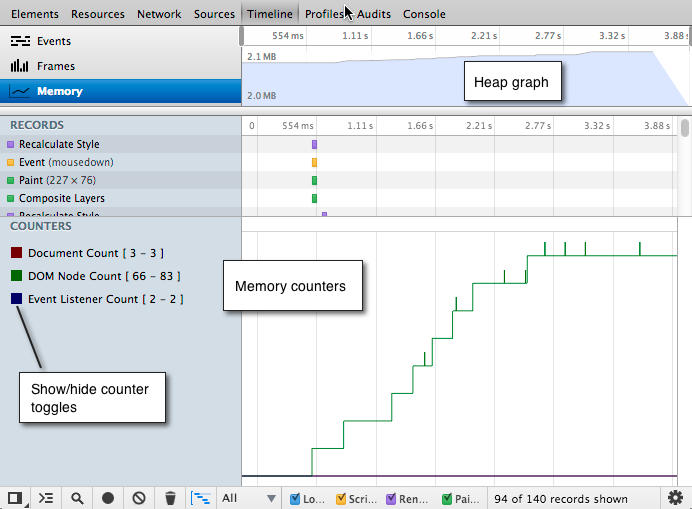
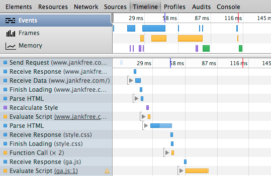
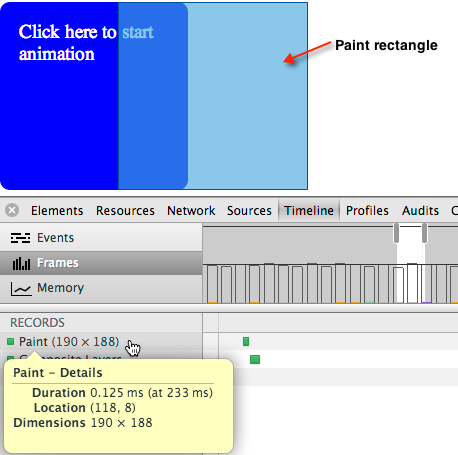
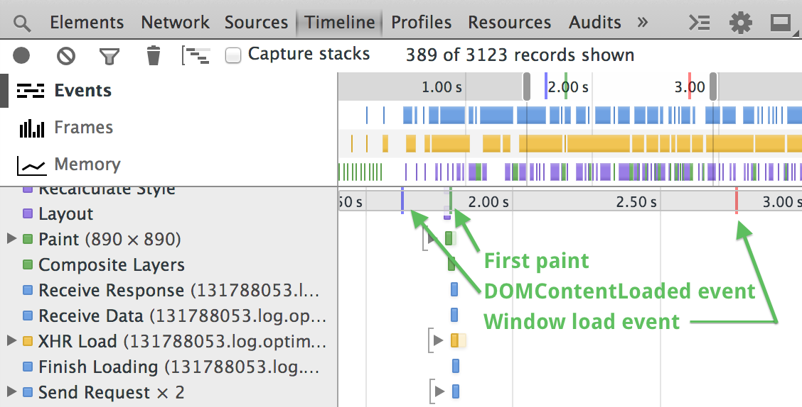
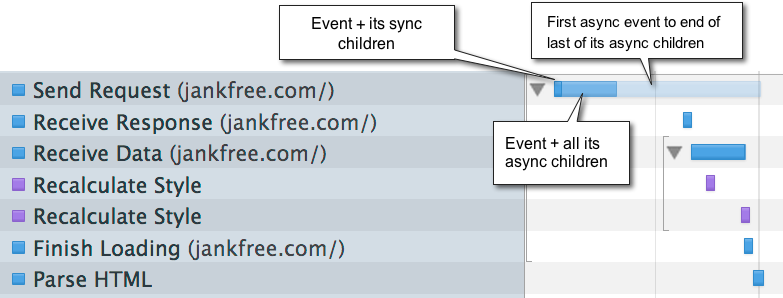
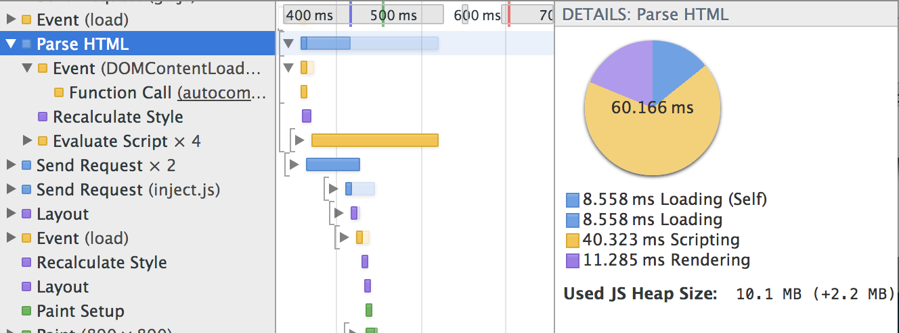
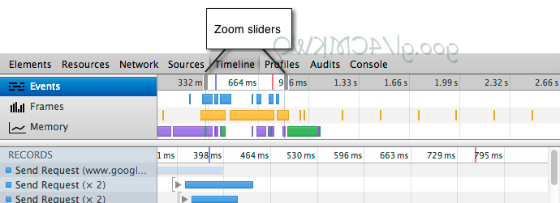
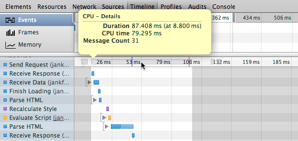

# 性能分析与时间轴

时间轴面板可让你记录和分析在你的的应用程序运行的所有活动。它开始于你的应用程序感知调查性能问题的最佳场所。

## 时间轴面板概述
时间轴有三个主要部分：顶部的概述部分，记录视图和工具栏。

+ 要启动或停止录音，按下录制按钮切换（见[制作录音](https://developer.chrome.com/devtools/docs/timeline#making-a-recording)）。
+ 按清除记录按钮从时间轴清除记录。
+ 胶水异步事件模式，让你更轻松地关联的异步事件的原因（请参阅关于[嵌套事件](https://developer.chrome.com/devtools/docs/timeline#about-nested-events)）。
+ 你可以根据自己的类型或持续时间（见[过滤和搜索记录](https://developer.chrome.com/devtools/docs/timeline#filtering-and-searching-records)）过滤时间轴显示的记录。

记录过程中，被添加到记录中的每个事件记录的“瀑布”演示视图。记录被分为四个：加载，脚本，渲染和绘画。这些记录被颜色编码，如下所示：

例如，下面的记录是被加载到浏览器的HTML页面的。第一个记录（发送请求）是用于在网页浏览器的HTTP请求，随后接收的响应记录（用于相应的HTTP响应），一些接收数据记录（用于实际页数据），然后一个完成加载记录。对于记录时间表及其说明事件的完整列表，请参阅[时间轴事件](https://developer.chrome.com/devtools/docs/timeline#timeline-event-reference)引用。

当你在一个时间轴记录悬停，将出现一个弹出与有关关联事件的详细信息。例如，下面的截图中显示的信息与图像资源相关联的完成加载记录。[时间轴事件](https://developer.chrome.com/devtools/docs/timeline#timeline-event-reference)的参考说明可用于每个记录类型的详细信息。

除了详细的记录来看，你可以检查录音三种模式之一：
+ **活动模式**显示所有记录的事件按事件类别。
+ **帧模式**显示页面的渲染性能。
+ **内存模式**显示一段时间内你的页面的内存使用情况。

## 活动模式

该活动模式提供按类型组织的录制过程中被抓获的所有事件。一目了然，你可以看到你的应用程序花费最多的时间在什么类型的任务。在此视图中每个水平条的长度对应于时间的事件发生来完成。

当你从事件视图（请参阅在[时间轴部分拉近](https://developer.chrome.com/devtools/docs/timeline#zooming-in-on-a-timeline-section)）选择一个时间范围，该记录视图限制为只显示那些记录。

## 帧模式
帧模式提供了洞察应用程序的渲染性能。 “帧”代表了浏览器必须做绘制的内容显示，运行JavaScript的单个帧，处理事件，更新DOM和改变风格，布局和油漆的网页的工作。我们的目标是为你的应用程序，以每秒60帧（FPS）的运行，其对应于大多数（但不是全部）视频显示器的60Hz的刷新速率。因此，你的应用程序有大约16.6毫秒（1000毫秒/ 60）对每一帧做准备。

整个框架水平线代表观看了60 FPS和30 FPS帧速率的目标。一帧的高度对应于所花费的渲染帧的时间。颜色填充每一帧显示的时间对每种类型的任务类型而采取的百分比。

渲染一帧时间显示在顶部视图中记录的。如果通过所显示的时间悬停，附加信息显示有关帧，包括用在每种类型的任务，CPU时间，并计算出的FPS的时间。

见[时间轴演示：诊断和修复同步被迫布局使用框架模式](https://developer.chrome.com/devtools/docs/demos/too-much-layout/)的示范。

## 关于透明或浅灰色的框

你可能会注意到一个框架是浅灰色或透明（中空）的区域。这些区域分别表示：

+  不是由DevTools仪表活动
+  显示刷新周期之间的空闲时间。

下面，在记录帧同时显示配备工具活动和空闲时间。

<code>
想在酒吧内的空白空格更多的细节？如果你碰到GPU瓶颈，阅读[浏览器工程师纳特杜卡的解释](https://plus.google.com/+NatDuca/posts/BvMgvdnBvaQ?e=-RedirectToSandbox)，它描述了如何评估。
</code>

## 关于绿柱

画的是一个两步过程，包括：绘制调用和光栅扫描.

+ **绘制调用**。这是你要画一个列表，它来源于应用到元素的CSS。抽奖的名单和打电话没有什么不同，Canvas元素：MOVETO，了lineTo和fillRect。虽然，他们在[Skia](https://code.google.com/p/skia//)的，Chrome的绘画后端不同的名字，这是一个类似的概念。

+ **光栅化**。通过这些绘制调用步进和填写实际像素转换成可以被上传到GPU进行合成缓冲器。

因此，与背景有什么稳定的绿色条和空的绿色条之间的区别？

+ **绿色实酒吧**记录铬抽奖电话。这发生在主线程JavaScript的旁边，计算风格和布局上。合成器线程获取传递的绘制调用的数据结构的分组。

+ **空绿色条**是光栅化。由合成器催生了一个工作线程来处理这些。

两者都是油漆，他们只是表示该作业的不同子任务。如果您有性能问题，你可以看看什么样的属性你改变。然后，查看是否有一个合成器，只有这样才能达到同样的目的。[ CSS触发器](http://csstriggers.com/)可以帮助确定一个解决这个。

## 查看帧率统计

平均帧速率，其标准差为代表的显示沿着时间轴面板所选帧范围的底部。如果您在平均帧数徘徊，似乎与有关帧选择的更多信息的弹出：

+ **选定范围** - 该选定的时间范围，并在选择的帧的数目。
+ **最小时间** - 所选定镜架的最低时间，以及在括号中的相应的帧速率。
+ **平均时间** - 所选择的帧的平均时间，并且在括号中的相应的帧速率。
+ **最大时间** - 最大时间选定范围，并在括号中的相应的帧速率。
+ **标准偏差** - 所计算的平均时间变化的量。
+ **按类别时间** - 花费在每个类型的处理的时间量，颜色编码按类型。

## 记忆模式

内存视图显示了随着时间的推移应用程序使用内存的图形和维护的文档数量的计数器，DO节点和事件侦听器在内存中保存的（也就是还没有被垃圾回收）。

内存模式不能告诉你到底是什么原因造成内存泄漏，但它可以帮助你确定哪些事件在你的应用程序可能会导致内存泄漏。然后，您可以使用[堆探查](https://developer.chrome.com/devtools/docs/heap-profiling.html)，以确定引起泄漏的特定代码。

## 一种制造记录

要进行录音，开始录制工作，与应用程序交互，然后停止录制。它有助于预先知道那种你想要录制的活动 - 例如，页面加载，滚动图像列表的性能，等等，然后坚持该脚本。

**录音**：
1.  打开你想要录制的页面。
2.  打开时间轴面板，并开始录制执行下列操作之一：
  +  单击时间轴面板底部的圆形录制按钮。
  +  按键盘快捷键Ctrl + E，或者Cmd的+ E在Mac上。
3.  录制按钮录制过程中变成红色。
4.  执行任何必要的用户操作记录所需的行为。
5.  按现在的红色录音按钮，或重复的快捷键停止录制。

## 录制页面加载

一个常见的任务是记录从最初的网络请求的页面加载。键盘快捷键是有用的在这种情况下，因为他们让你快速启动录音，重新加载页面，并停止录制。

**录制页面加载：**

1. 在新标签或窗口中打开的任何网页。
2. 打开时间轴和按CMD + E（Mac）或按Ctrl + E（在Windows / Linux）的开始录制。
3. 迅速按CMD + R或Ctrl + R重新载入浏览器页面。
4. 停车时，页面完成加载（外观为红事件标记）的记录。

你的记录看起来应该像下面这样。所述firstrecord（发送请求）是用于在网页浏览器的HTTP请求，随后对相应的HTTP响应一个接收的响应的记录，接着是一个或多个接收数据的记录，一个完成载入记录和解析的HTML记录。

请参阅有关每个记录类型的详细信息[时间轴事件](https://developer.chrome.com/devtools/docs/timeline#timeline-event-reference)引用。

## 提示录音制作

以下是录音制作一些提示：

+ **保持记录尽可能短**。较短一般录像进行分析更容易。
+ **避免不必要的动作**。尽量避免那些多余的你想记录和分析活动的行动（鼠标点击，网络负载等等）。举例来说，如果你想记录发生的事件，你点击“登录”按钮后，不滚动页面，加载图像等等。
+ **禁用浏览器的缓存**。当录制网络操作，这是一个好主意，禁止在DevTools设置面板中的浏览器的缓存。
+ **禁用扩展**。 Chrome扩展可以添加无关的噪音到应用程序的时间安排录音。您可以执行下列操作之一：
   -  在[隐身模式](http://support.google.com/chrome/bin/answer.py?hl=en&answer=95464)下打开一个浏览器窗口
   -  创建用于测试一个新的[浏览器的用户配置文件](http://support.google.com/chrome/bin/answer.py?hl=en&answer=142059)。

## 分析时间轴记录

本节提供了分析时间轴录音提示。

### 查看有关记录的详细信息

当您在时间轴中选择一条记录，详细信息窗格显示有关该事件的其他信息。

某些细节中存在的所有类型，例如持续时间和CPU时间的事件，而有些只适用于某些事件类型。有关那些各种记录的信息细节包括，看到[时间轴事件](https://developer.chrome.com/devtools/docs/timeline#timeline-event-reference)引用。

当你选择一个画图记录，DevTools强调了与蓝色半透明的矩形更新，如下图所示画面的区域。

## DOMContentLoaded和Load事件标记

时间轴标注每个记录用蓝色和红色的线指示，分别由[DOMContentLoaded](http://docs.webplatform.org/wiki/dom/events/DOMContentLoaded)和[负载事件](http://docs.webplatform.org/wiki/dom/events/load)浏览器发出。该DOMContentLoaded事件被触发时，所有的页面的DOM内容已加载和分析。加载事件一次烧成的所有文档的资源（图像和CSS文件，等等）已经被完全装载。

## 定位强迫同步布局

布局是由铬计算页面上的所有元素的位置和大小的过程。通常情况下，Chrome浏览器在执行从您的应用程序响应CSS或DOM更新布局“懒洋洋地”。这使得Chrome浏览器批量的风格和布局的变化，而不是反应到每个需求。但是，应用程序可以强制铬通过查询特定布局依赖元件性能如element.offsetWidth的值立即和同步地执行布局。这些所谓的“强迫同步布局”可能是一个很大的性能瓶颈，如果经常重复或者大DOM树进行。

时间轴标识，当你的应用程序会导致强制异步布局和标记这些记录有黄色警告图标（！）。当您选择该记录，详细信息窗格中包含的问题的代码的堆栈跟踪。

如果记录中包含了强制的布局的[子记录](https://developer.chrome.com/devtools/docs/timeline#about-nested-events)，父记录标有一个稍微变暗黄色图标。展开父记录，以确定造成强迫布局的子记录。

[强制同步布局](https://developer.chrome.com/devtools/docs/demos/too-much-layout/index.html)演示了demonstrationof检测和修复这类性能问题。

## 关于嵌套事件

在时间轴记录的事件有时在视觉上嵌套下方另一个事件。展开“父”事件查看其嵌套的“子”事件。有两个原因时间轴事件：

+ 同步事件先前发生的事件的处理过程中发生。每个事件在内部产生两个原子事件，一个用于开始，一个用于结束时，被转换为一个单一的“连续”事件。这两个原子事件之间发生的其他事件成为外部事件的儿童。

下面的截图显示嵌套同步事件的一个例子。在这种情况下，浏览器被解析一些HTML（在解析HTML事件），当它发现需要被装载几个外部资源。镀铬前发了请求那些已经完成了解析，所以发送请求事件显示为解析HTML事件的孩子..

## 时间轴的着色与记录事件嵌套

时间轴条的颜色编码如下：

+ 该轴条的第一个，最黑暗的部分代表多久父事件及其所有的同步孩子了。
+ 接下来，稍白色表示该事件及其所有异步孩子们带的CPU时间。
+ 最白的条代表从第一异步事件的开始到最后它的异步儿童的结束时间。

选择一个父记录将显示在详细信息窗格中的以下内容：

+  文本事件类型总结和可视化的饼图。
+  二是JS堆大小在这一点上的记录，什么这个操作的效果是堆大小。
+  与事件相关的其他细节。

## 过滤和搜索记录

可以筛选根据其类型示出的记录（只显示载荷事件，例如），或仅显示记录长于或等于1毫秒或15毫秒。您还可以过滤视图以显示匹配的字符串的事件。

虽然看着所有的事件，你可能需要找一个，但保持一个什么样的周围环境。在这种情况下，你可以找到没有过滤。按Ctrl+ F（窗口/ Linux）或Cmd的+ F键（Mac），而时间轴具有焦点，以显示那些包含搜索词。

## 在时间轴部分放大

为了让分析记录更容易，你可以“放大”时间轴概述，从而降低相应时间尺度的记录视图的一部分。

要放大时间轴部分，执行下列操作之一：

+ 在概览区域，拖动时间轴选择与您的鼠标。
+ 调整标尺区域的灰色滑块。

下面是与时间轴选择工作多一些提示：

+  “磨砂”记录与当前选择通过拖动两个滑板条之间的区域。

+ 触控板的用户：

    - 刷卡向左或向右两个手指移动当前时间轴选择。
    - 刷卡向上或向下用两个手指扩张或收缩当前时间轴选择。

+ 滚动鼠标滚轮的同时向上或徘徊在一个时间轴选择向下扩展和收缩选择。

## 保存和载入记录

您可以保存一个时间轴记录作为一个JSON文件，后来在时间轴中打开它。

**要保存时间轴记录：**
1. 右键+单击或Ctrl+单击（仅限Mac）时间轴内，然后选择保存时间线数据...，或者按Ctrl + S键键盘shorcut。
2. 选择一个位置来保存文件，然后点击保存。

**要打开现有的时间轴记录的文件，请执行下列操作之一：**

1. 用鼠标右键单击或Ctrl+单击时间轴内选择Load时间轴数据...，或按下Ctrl+ O快捷键。
2. 找到JSON文件并单击打开。

## 用户产生的事件时间表

应用程序可以添加他们自己的事件到时间线录音。您可以使用[theconsole.timeStamp（）](https://developer.chrome.com/devtools/docs/console-api.md#consoletimestamplabel)方法来一个原子事件添加到记录，[theconsole.time（）](https://developer.chrome.com/devtools/docs/console-api.md#consoletimelabel)和 [console.timeEnd（）](https://developer.chrome.com/devtools/docs/console-api.md#consoletimeendlabel)methodsto标志着时间代码执行范围。例如，在下面的记录console.timeStamp（）已用于显示“添加结果”事件。查看[时间线](https://developer.chrome.com/devtools/docs/console.md#marking-the-timeline)中[使用控制台](https://developer.chrome.com/devtools/docs/console.md/)获取更多信息标记。

## 录像中查看CPU时间

你会看到上面出现在时间轴记录浅灰色条，表示当CPU很忙。徘徊在一个CPU吧突出时间轴地区在此期间，CPU是活动的（如下图所示）。一个CPU杆的长度通常是它下面所有的（高亮）事件在时间轴的总和。如果两者不匹配，这可能是由于以下之一：

+ 检查同一线程的页运行的其他页面（例如，两个标签从同一部位开放，同一个站点做一些在一个setTimeout（）调用）。
+ UN-仪表活动。

## 时间轴事件引用

本节列出并说明了各个类型的类型所举办的录制过程中生成的记录，和它们的属性。

## 常见的事件属性

某些细节存在于所有类型的事件，而有些只适用于某些事件类型。本节列出了常见的不同事件类型的属性。特定于某些事件类型性能列于对于那些遵循事件类型的引用。

* 时间汇总
   > 对于嵌套的事件事件，采取的每一类事件的时间。
* 调用栈
   > 对于有孩子的事件事件，采取的每一类事件的时间。
* CPU时间
   >  多少CPU时间记录的事件发生。
* 详细信息
   > 有关该事件的其他细节。
* 持续时间（在时间戳）
   > 过了多长时间的情况下与所有的孩子完成的;时间戳是时间事件发生，相对于记录时开始。
* 自我时间
  >   多久的事件发生，没有任何的孩子。
* 二手堆大小
  >  的内存量正在使用的应用程序时，被记录的情况下，和上次采样中使用的堆的大小的增量。（+/-）变化。

## 加载事件

本节列出属于类加载及其属性的事件.

| 事件 | 描述|
|--------|--------|
|  解析HTML      |  Chrome浏览器中执行它的HTML解析算法          |
|完成加载         |  完成了网络请求                            |
|接收数据         |  对数据的请求被接受,将有一个或多个接收数据的事件 |
|接收响应         |  从请求的初始HTTP响应                      |
|发送请求         |一个网络请求已发送。                         |

## 加载事件属性
+  资源
   > 所请求的资源的URL。
+ 预习
   > 预览所请求的资源（仅图像）。
+ 请求方法
   > 用于请求（GET或POST，例如）的HTTP方法。
+ 状态代码
   > HTTP响应代码
+ MIME类型
   > MIME类型所请求的资源的。
+ 编码数据长度
   > 以字节为单位请求资源的长度。

## 脚本事件

本节列出了属于脚本的类别和性质的事件。

|事件|说明|
|---|----|
|动画帧射击| A计划的动画帧解雇，其回调处理程序调用|
|取消动画帧| A计划的动画帧被取                |
|GC事件|垃圾收集发生|
|DOMContentLoaded |在DOMContentLoaded是由浏览器发射。此事件时，所有的页面的DOM内容已加载和分析解雇。|
|评估脚本|脚本进行了评价|
|事件| JavaScript事件（“鼠标按下”或“钥匙”，例如）|
|函数调用|顶级JavaScript函数调用作出（仅当浏览器进入的JavaScript引擎出现）|
|安装计时器|定时器用的setInterval（）或创建的setTimeout（）|
|请求帧动画| A requestAnimationFrame（）调用预定一个新的框架|
|删除定时器|以前创建的计时器清零|
|时间|脚本调用console.time（）|
|时间结束|脚本calledconsole.timeEnd（）|
|计时器所触发|定时器解雇了原定在使用setInterval（）或的setTimeout（）|
|XHR就绪状态变化| XMLHttpRequest对象的就绪状态发生变化|
|XHR加载|一个XMLHttpRequest完成载入|

## 脚本事件属性

+ 计时器ID
   > 计时器ID。
+ 暂停
   >由定时器规定的超时。
+ 重复
   >布尔值，指定当计时器重复。
+ 函数调用
   > 被调用的函数。

## 渲染事件

本节列出属于渲染类别及其属性的事件。

|事件|说明|
|---|--|
|布局无效|页面布局无效由DOM变化|
|布局|页面布局被执行死刑|
|重新计算样式|浏览器重新计算元素样式|
|滚动|嵌套视图的内容进行滚动。|

## 渲染事件属性

+ 布局无效
  >  对布局的记录，将被无效的代码的堆栈跟踪引起的布局。
+ 需要布局节点
  >  对于布局记录，节点被标记为需要布局的重新布局开始前的数量。这些通常是由开发者的代码是无效的，这些节点，再加上一个路径向上重新布局根。
+ 布局树的大小
  >  对布局的记录，节点下的重新布局根的总数（该节点铬启动重新布局）。
+ 布局范围
  >  可能的值是“部分”（重新布局的边界是DOM的一部分）或“整篇文档”。
+ 影响因素
  >  为重新计算样式记载，受风格重新计算元素的数量。
+ 样式无效
  > 对于重新计算的风格记录，提供导致无效样式代码的堆栈跟踪。

## 绘画活动

本节列出属于绘画类和它们的属性的事件。

|事件|说明|
|----|---|
|复合材料层|复合Chrome的渲染引擎图像层|
|图片解码|图像资源进行解码|
|图片调整|图像是从它的原生尺寸大小|
|油漆|复合层涂到该显示器的一个区域。徘徊在一个油漆纪录凸显已更新显示的区域|

## 绘画事件属性

+ 地点
   > 油漆事件，x和油漆矩形的y坐标。
+ 尺寸
   > 油漆的事件，该绘区域的高度和宽度。
